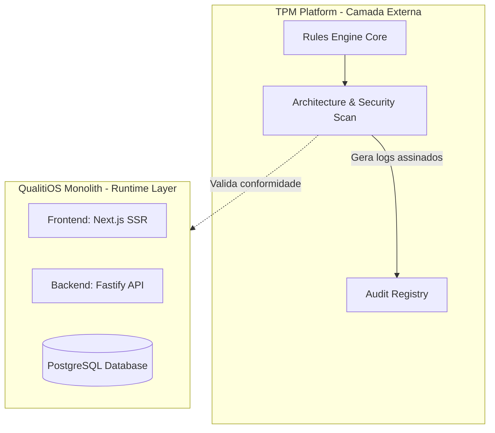

# Architecture Baseline v1 — QualitiOS & TPM

Este documento estabelece o congelamento oficial da linha de base de arquitetura (Architecture Baseline Freeze) do **QualitiOS** e da plataforma de governança **TPM (Trusted Cognitive Platform)**. A partir desta data, toda e qualquer alteração de design, infraestrutura, fluxos de dados ou regras de negócios deve ser formalmente registrada sob o processo de ADR (Architecture Decision Record) e validada pela esteira contínua do TPM.

---

## 1. OFFICIAL ARCHITECTURE BASELINE V1 (Linha de Base Oficial)

O ecossistema do QualitiOS baseia-se em um **Monolito Modular e Seguro** (Runtime) integrado a uma esteira de validação independente de integridade técnica (TPM).



### 1.1. Especificações Técnicas de Runtime do Ecossistema:
*   **Camada de Apresentação (Presentation Layer)**: Operando com renderização no lado do servidor (SSR) para segurança de dados e otimização de performance.
*   **Camada de Aplicação (Application Layer)**: Desenvolvida em linguagem estruturada sob camadas lógicas da Clean Architecture, isolando regras de aplicação e casos de uso de detalhes de entrega.
*   **Camada de Persistência (Persistence Layer)**: Persistência relacional com pooling de conexões, cache de leitura e suporte vetorial integrado para buscas semânticas.
*   **Tráfego de Sessões**: JSON Web Tokens (JWT) trafegados por meio de cookies seguros (`HttpOnly`, `Secure`, `SameSite=Strict`).
*   **CORS**: Bloqueio de wildcard (`*`) e liberação estrita para origens confiáveis definidas em arquivo de ambiente.

---

## 2. OFFICIAL ARCHITECTURE PRINCIPLES (Princípios Arquiteturais Oficiais)

1.  **Evolution over Rewrite (Evolução Modular)**: Toda refatoração ou nova funcionalidade deve evoluir a base de código typescript atual de forma incremental, rejeitando reescritas completas.
2.  **Core Domain Isolation (Isolamento de Governança)**: O domínio central (Governança) não deve ser contaminado por regras clínicas ou de negócio de verticais de suporte.
3.  **Strict Security by Default (Segurança por Padrão)**: Blindagem total de sessões, dados e tokens contra vazamentos e Cross-Site Scripting (XSS).
4.  **Asynchronous Communication (Orientação a Eventos)**: Comunicação entre Bounded Contexts via barramento assíncrono interno (`Internal Event Bus`), garantindo desacoplamento físico e tolerância a falhas.
5.  **Clean Architecture Alignment**: Novas evoluções e refatorações de código devem respeitar rigorosamente a separação das camadas formais (Presentation Layer ➔ Application Layer ➔ Domain Layer ➔ Persistence/Infrastructure Layer).

---

## 3. OFFICIAL DOMAIN MODEL (Modelo de Domínios Oficial)

O modelo de domínio do QualitiOS está estruturado sob a centralidade da **Governança** (Core Domain) orquestrando as áreas de suporte e serviços genéricos.

```text
Governança (Core Domain)
├── Estratégia (Supporting: OKRs & KPIs)
├── Compliance (Supporting: Acreditação ONA/ISO)
├── Educação (Supporting: Universidade LMS)
├── Conhecimento (Supporting: Biblioteca & Busca)
├── Processos (Supporting: BPM & SLAs)
├── Documentos (Supporting: ECM & Contratos)
├── Riscos (Supporting: Ocorrências & CAPA)
└── IAM / Auditoria / Notificações (Generic Domains)
```

### 3.1. Bounded Contexts & Data Ownership:
*   Cada um dos 8 contextos delimita formalmente suas fronteiras de escrita no PostgreSQL.
*   A comunicação é realizada via eventos de domínio assíncronos (ex: `IncidenteRegistrado`, `DocumentoAprovado`, `CertificadoEmitido`), isolando falhas transacionais.

---

## 4. OFFICIAL GOVERNANCE MODEL (Modelo de Governança)

O modelo de operação do QualitiOS apoia-se em quatro pilares funcionais:

1.  **Multi-Tenancy lógico**: Segregação estrita de dados por tenant via filtros automáticos de escopo atrelados à validação JWT.
2.  **Dinamismo Organizacional**: Hierarquia de setores e cargos parametrizada graficamente, com menus e atalhos de barra lateral carregados dinamicamente com base no perfil logado.
3.  **BPM como Executor**: A engine visual BPMN orquestra ativamente as transições de status de outras entidades (como POPs e ocorrências CAPA), impondo SLAs de prazos limits em background.
4.  **IA Transversal**: A Inteligência Artificial (OCR, RAG, Ishikawa) atua integrada de forma ubíqua como acelerador cognitivo dos fluxos do hospital, e nunca como módulo isolado.

---

## 5. OFFICIAL TPM PRINCIPLES (Princípios do TPM)

O **TPM (Trusted Cognitive Platform)** é a camada externa de governança que valida a confiança do ecossistema QualitiOS:

*   **Independência de Stack**: O TPM valida conformidade por meio de regras, asserções de Clean Architecture e checagens de vulnerabilidades de segurança, operando de forma desacoplada da stack técnica do runtime.
*   **Trusted Governance by Design**: Nenhuma evolução de arquitetura significativa será integrada ou colocada em produção sem passar pela validação e certificação contínua da esteira do TPM.
*   **Security by Validation**: Varreduras de segredos, CORS e cookies de sessão executadas automaticamente a cada pull request.
*   **AI by Governance**: Auditoria explícita e homologação de prompts, acurácia de RAG e esquemas MCP autorizados.

---

## 6. ARCHITECTURE DECISION REGISTRY (ADR Registry)

Catálogo de Decisões Arquiteturais oficiais aprovadas e congeladas nesta Baseline:

| ADR ID | Decisão Arquitetural | Status | Racional Técnico |
| :--- | :--- | :--- | :--- |
| **ADR-001** | **Monolito Modular e Seguro** | Aprovada | Camada de Apresentação e Camada de Aplicação desacopladas logicamente, comunicando via API local sob servidor web gateway. Evita overhead de microsserviços. |
| **ADR-002** | **HttpOnly Cookies para Sessão JWT** | Aprovada | Substitui localStorage por cookies protegidos contra roubos de sessões via ataques XSS. |
| **ADR-003** | **CORS Fechado por Origens** | Aprovada | Desativa CORS wildcard `*`, limitando acessos a origens cadastradas em arquivo de ambiente. |
| **ADR-004** | **Unificação de Persistência no PostgreSQL** | Aprovada | Consolida tabelas duplicadas no banco PostgreSQL e dropa tabelas obsoletas V1. |
| **ADR-005** | **pgvector para Embeddings de RAG** | Aprovada | Ativa extensão pgvector no Postgres para buscas semânticas de ONA sem dependências de bancos externos. |
| **ADR-006** | **Barramento Interno de Eventos Assíncronos** | Aprovada | Desacopla a execução das requisições permitindo processamento em background de ações secundárias. |
| **ADR-007** | **Esteira de Validação Contínua do TPM** | Aprovada | Build Pipeline integrado ao TPM com regras estritas de Clean Architecture, segurança de secrets e dependências bloqueantes. |
