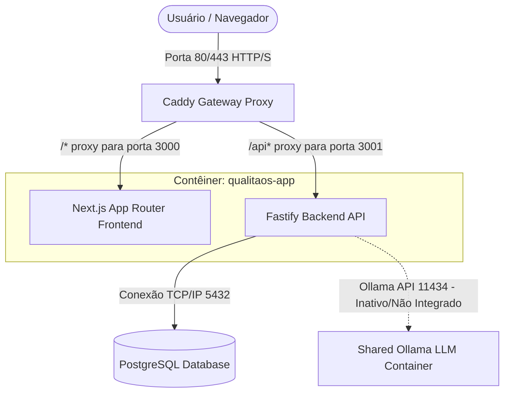

# Relatório de Análise Técnica — QualitiOS (AS-IS Analysis)

Este documento apresenta a análise técnica integral do código-fonte e da arquitetura física atual (AS-IS) do **QualitiOS**. A análise foi realizada por meio de engenharia reversa no repositório, mapeando o contexto do sistema, inventário de módulos, tabelas de banco de dados, catálogo de APIs, dependências de pacotes, avaliação de riscos (segurança e escalabilidade) e a conformidade da implementação real com a estratégia oficial do produto.

---

## 1. System Context (Diagrama de Contexto e Arquitetura Física)

O QualitiOS é executado sob um modelo de **Monolito Híbrido** em Node.js (TypeScript) que comporta tanto o frontend Next.js quanto o backend Fastify concorrentemente em um único contêiner Docker. O tráfego externo passa por um gateway proxy **Caddy** que direciona as requisições para as portas apropriadas de cada serviço. O banco de dados relacional **PostgreSQL** é compartilhado.

### Contexto de Sistema (System Context Diagram):
*   **Atores**: Administrador Geral (Qualidade), Colaborador Assistencial (Enfermeiro, Médico, RT) e Auditor Externo.
*   **Fronteira**: O contêiner de aplicação centraliza toda a renderização e regras de negócio.
*   **Interações Externas**: Conexão persistente com o banco PostgreSQL. A integração com o Ollama está declarada nas variáveis de ambiente, mas inativa no código (não há chamadas HTTP ativas para a porta 11434 nos arquivos de serviços).

---

## 2. Module Inventory (Inventário de Módulos)

O sistema é caracterizado por uma coexistência de dois padrões arquiteturais (Dual Architecture): rotas tradicionais legadas que interagem direto com o banco via SQL bruto, e módulos novos estruturados sob **Clean Architecture** (controllers, services, repositories).

Módulos identificados no frontend (`app/frontend/src/app/`) e backend (`app/backend/src/`):

1.  **Wizard (`wizard`)**: Setup inicial da instituição para cadastrar o primeiro tenant e a conta do administrador geral.
2.  **Autenticação e Sessão (`auth/users`)**: Autenticação baseada em JWT, controle de sessão via localStorage (`qualita_token`) e RBAC dinâmico baseado em cargos.
3.  **Documentos (`pops`)**: Gestão de POPs, versionamento de arquivos e aprovação de edições pendentes com disparos de notificações de SLA.
4.  **Processos (`bpm`)**: Engine visual BPMN para modelar workflows em diagramas JSON e acompanhar execuções.
5.  **Acreditação (`ona`)**: Questionários de requisitos ONA, diagnósticos por setor, gestão de evidências e cálculo de scores.
6.  **Incidentes (`incidents / core`)**: Registro de não conformidades operacionais e eventos adversos.
7.  **Estratégia (`okrs`)**: Controle de ciclos estratégicos de metas (OKRs) e resultados-chave (Key Results).
8.  **Educação (`education`)**: LMS corporativo com controle de trilhas, quizzes, progresso e emissão de certificados com SLA de 72 horas.
9.  **Interoperabilidade (`fhir`)**: Exposição de metadados clínicos e bundles sintéticos de pacientes.
10. **Painel Administrativo (`admin`)**: Módulo para parametrização dinâmica de setores, cargos, menus de acesso e formulários.

---

## 3. Database Inventory (Inventário do Banco de Dados)

O PostgreSQL possui dois ecossistemas paralelos de tabelas devido à migração incompleta para a arquitetura modular:

### 3.1. Tabelas Legadas (Monolito Inicial)
*   `instituicao`: Armazena os dados do tenant configurado.
*   `usuarios`: Registro de colaboradores (e-mail, role RBAC, cargo, hash de senha criptografada).
*   `funcoes_cadastradas` e `setores_config`: Cadastro dinâmico de hierarquias de setores e funções.
*   `cargos_config`: Matriz de mapeamento de cargos por setor e permissões de acesso.
*   `pops` e `pop_versoes`: Repositório de POPs e histórico linear de revisões de arquivos.
*   `bpm_fluxos` e `bpm_execucoes`: Modelagem e rastreabilidade de instâncias da engine de processos.
*   `ona_requisitos`: Checklists estáticos de acreditação.
*   `indicadores` e `indicador_coletas`: Estrutura de metas de KPIs e coletas históricas de dados.
*   `incidentes`: Registro simplificado de ocorrências.
*   `auditoria_logs` e `notificacoes`: Registros de log de auditoria técnica de acessos e fila de notificações internas.
*   `okrs`, `key_results`, `okr_cycles`, `okr_progress`: Tabelas de suporte ao planejamento estratégico.
*   `education_courses`, `education_modules`, `education_lessons`, `education_quizzes`, `education_progress`, `education_certificates`, `education_tracks`, `education_competencies`, `education_badges`, `education_library`: Tabelas que estruturam a Universidade Corporativa (LMS).
*   `dashboards_config`, `menus_config`, `document_workflows`, `document_templates`, `document_categories`, `document_types`, `document_forms`, `document_fields`, `document_slas`: Tabelas de parametrização dinâmica de interface e formulários low-code.

### 3.2. Tabelas Modulares (V2 Clean Architecture)
*   `core_ocorrencias`: Ocorrências inteligentes com campos de classificação simulada por IA.
*   `core_documentos`: Documentos com espaço reservado para embeddings vetoriais (OCR).
*   `core_auditorias` e `core_riscos`: Logs do auditor virtual e mapeamento de riscos preditivos.
*   `core_ai_logs`: Logs de prompts enviados aos agentes simulados.
*   `ona_diagnosticos`, `ona_evidencias`, `ona_checklists`, `ona_auditorias`, `ona_planos_action`, `ona_kpis`: Checklists e evidências estruturadas do novo módulo ONA V2.

---

## 4. API Inventory (Inventário de APIs)

Os endpoints expostos no backend Fastify (`app/backend/src/routes/` e `app/backend/src/modules/`):

| Método | Endpoint | Payload / Input | Resposta (200/201) | Descrição |
| :--- | :--- | :--- | :--- | :--- |
| **GET** | `/api/health` | - | `{ status: "ok", ... }` | Monitor de integridade da API. |
| **POST** | `/api/auth/login` | `{ email, password }` | `{ token, user }` | Autenticação via JWT (comparação segura por hash). |
| **GET** | `/api/auth/me` | *Header: Bearer JWT* | `{ id, email, role, ... }` | Decodifica e retorna a sessão do usuário. |
| **GET** | `/api/pops` | - | `Array<{ id, titulo, status }>` | Lista os documentos e POPs vigentes. |
| **POST** | `/api/pops` | `{ titulo, codigo, conteudo }` | `{ id, status: "Em Revisão" }` | Cria POP e agenda 3 notificações de SLA automáticas. |
| **POST** | `/api/pops/:id/approve-edit`| `{ aprovador_nome }` | `{ success: true, pop }` | Ativa a edição pendente como a nova versão vigente. |
| **GET** | `/api/bpm/fluxos` | - | `Array<{ id, nome, bpmn_json }>`| Retorna os workflows modelados. |
| **POST** | `/api/bpm/execucoes` | `{ fluxo_id, solicitante }` | `{ id, etapa_atual, status }` | Inicia uma instância de execução de processo. |
| **GET** | `/api/ona/v2/diagnosticos/gap-analysis`| `setor, nivel` | `{ total, score, gaps: [] }` | Retorna gaps de conformidade ONA por setor. |
| **POST** | `/api/ona/v2/evidencias` | `{ requisito_id, nome_arquivo }` | `{ id, ocr_texto, embeddings }` | Simula a extração OCR e embeddings vetoriais. |
| **POST** | `/api/ona/v2/ai/copilot` | `{ pergunta, usuario }` | `{ resposta, contexto }` | Resposta simulada por busca de palavras-chave. |
| **POST** | `/api/core/v2/ocorrencias` | `{ titulo, descricao, setor }` | `{ id, ia_criticidade, CAPA }` | Simula triagem IA de incidente e abre plano CAPA. |
| **POST** | `/api/core/v2/ai/agent` | `{ agente, prompt }` | `{ resposta, recomendacoes }` | Retorna respostas simuladas dos 6 agentes de IA. |
| **GET** | `/api/fhir/metadata` | - | `CapabilityStatement` | Manifesto de interoperabilidade FHIR (estático). |
| **GET** | `/api/fhir/Patient` | - | `Bundle (Patient List)` | Retorna dados sintéticos de pacientes (estático). |

---

## 5. Dependency Analysis (Análise de Dependências)

O repositório possui uma quantidade mínima de dependências externas no backend e frontend:

*   **Frontend (`frontend/package.json`)**: `next ^14.2.3`, `react ^18.3.1`, `lucide-react ^0.378.0`, `tailwindcss`.
*   **Backend (`backend/package.json`)**: `fastify ^4.26.2`, `@fastify/cors ^9.0.1`, `@fastify/jwt ^8.0.1`, `@fastify/swagger ^8.14.0`, `pg ^8.11.5`, `dotenv ^16.4.5`.

> [!WARNING]
> **Ausência de Bibliotecas Críticas de Processamento**:
> Não existem dependências para processamento de arquivos PDF (como `multer`, `pdf-parse`), geração de vetores ou embeddings (como `transformers`), comunicação com bancos vetoriais (como `pgvector` ou SDKs de Qdrant/Pinecone) ou SDKs oficiais de LLMs (`openai`, `ollama`). Toda a inteligência artificial do RAG, OCR e triagem cognitiva opera por simulações em arquivos locais TypeScript.

---

## 6. Technical Debt Analysis (Dívidas Técnicas)

1.  **Simulação Integral de Inteligência Artificial (Mocks de IA)**:
    Toda a lógica cognitiva de classificação de incidentes (`core/services.ts`), OCR de evidências ONA e o Copiloto RAG (`ona/services.ts`) baseia-se em **estruturas condicionais estáticas (`if/else`)** que escaneiam palavras-chave para retornar strings mockadas. O gerador de arrays vetoriais (`embeddingsMock`) utiliza `Math.random()` para criar valores falsos.
2.  **Duplicação de Estruturas no Banco de Dados**:
    As tabelas legadas coexistindo com as tabelas V2 criam redundâncias graves (ex: `pops` vs. `core_documentos`, `incidentes` vs. `core_ocorrencias`). Não há gatilhos ou sincronização nativa entre elas, o que gera risco imediato de desequilíbrio e inconsistência de dados.
3.  **Processamento Concorrente Síncrono (Ausência de Filas)**:
    Operações assíncronas como o monitoramento de SLAs e disparos de notificações ocorrem diretamente dentro do ciclo de requisições HTTP das rotas, sem o uso de um broker de mensageria (como RabbitMQ ou BullMQ), limitando a escalabilidade.
4.  **FHIR Estático e Hardcoded**:
    O módulo FHIR expõe dados estáticos em arquivos de mocks. Ele não consulta a tabela de pacientes da aplicação, inviabilizando qualquer interoperabilidade clínica real.
5.  **Ausência de Cobertura de Testes**:
    Não há testes automatizados (unitários, de integração ou E2E) no repositório.

---

## 7. Security Assessment (Avaliação de Segurança)

*   **Políticas CORS Permissivas**: A API no Fastify está configurada com `origin: '*'` (wildcard aberto), expondo os dados confidenciais do hospital a requisições Cross-Origin não autorizadas de qualquer domínio da internet.
*   **Falta de Rate Limiting**: Não há mitigação contra ataques de força bruta no endpoint `/api/auth/login` ou negação de serviço (DoS) nos endpoints de busca e IA simulada.
*   **Controle de Sessão Exposto no Frontend**: O token JWT é armazenado diretamente no localStorage do navegador (`qualita_token`) e manipulado em lógicas client-side, tornando-o suscetível a roubo de sessão via ataques de Cross-Site Scripting (XSS). O ideal seria a utilização de Cookies seguros (`HttpOnly`, `SameSite=Strict`).
*   *Nota de Conformidade*: O seed de dados no banco e o wizard de setup já salvam as credenciais em formato criptografado seguro (PBKDF2/SHA-512) graças à refatoração recente de segurança.

---

## 8. Scalability Assessment (Avaliação de Escalabilidade)

*   **Acoplamento Físico de Processos (FE/BE)**: Next.js e Fastify compartilham o mesmo contêiner físico. Em cenários de estresse de memória durante renderizações complexas no frontend, o processo mestre pode derrubar todo o contêiner, indisponibilizando a API de forma imediata.
*   **Falta de Pooling de Conexão Gerenciado e Cache**: A API realiza conexões diretas com o PostgreSQL a cada requisição. Sob alta concorrência assistencial (como trocas de turnos em hospitais), a falta de um gerenciador de pool de conexões (PG Bouncer) e de uma camada de cache de leitura (Redis) causará gargalo imediato no banco de dados.

---

## 9. Alignment Assessment (Avaliação de Alinhamento)

Comparativo entre a implementação técnica real do QualitiOS (código-fonte e tabelas) e os documentos oficiais de produto (*Product Charter V2*, *Capability Map*, *Context Map* e *Business Architecture*):

### Tabela de Alinhamento de Capacidades:

| Capacidade de Negócio | Status Atual no Código | Avaliação de Alinhamento com a Estratégia |
| :--- | :--- | :--- |
| **Governança (RBAC & Setores)**| **Parcial** | As tabelas e rotas dinâmicas de setores e controle RBAC JSON existem, mas o cálculo de score consolidado e auditoria preditiva são simulados. |
| **Estratégia (OKRs & KPIs)** | **Implementada** | Os OKRs e Key Results persistem em banco e possuem cálculo correto de progresso ponderado. KPIs e coletas estão funcionais. |
| **Compliance (ONA / ISO)** | **Parcial** | O fluxo de checklist ONA e associação de evidências está codificado, mas as inteligências de validação e OCR são totalmente simuladas. |
| **Educação (LMS & Trilhas)** | **Implementada** | LMS operacional com cursos, progresso do aluno, quizzes de notas, emissão de certificados e controle estrito de SLA de 72h. |
| **Conhecimento (Biblioteca)** | **Parcial** | A biblioteca armazena e expõe arquivos por busca estática, mas a busca semântica inteligente e integração automática de POPs estão ausentes. |
| **Processos (BPM Workflows)** | **Parcial** | A modelagem visual e instanciamento de processos existem, mas a automação de transição e gerenciamento de SLA não são assíncronos. |
| **Documentos (ECM POPs)** | **Implementada** | Ciclo de vida linear de documentos operacionais funcional, com rascunhos, revisões pendentes, aprovação e versionamento estrito. |
| **Riscos (Incidentes & CAPA)** | **Parcial** | O registro de incidentes e o diagrama de Ishikawa visual existem, mas a triagem cognitiva automática de causa raiz e criticidade é mockada. |
| **Interoperabilidade (FHIR)** | **Parcial** | Endpoints FHIR ativos, mas retornam bundles estáticos totalmente desacoplados dos dados de pacientes reais da plataforma. |
| **Inteligência Artificial (IA)** | **Ausente** | Toda a IA declarada é 100% simulada no backend TS por mapeamento de palavras-chave, sem integrações ou processamento LLM real. |
| **Notificações & Mensageria** | **Implementada** | O disparo interno de alertas e agendamento de e-mails de SLA estão operacionais de forma síncrona. |
| **Multi-Tenancy** | **Implementada** | O isolamento lógico de dados por organização/instituição está modelado no banco e nas lógicas de validação JWT. |
