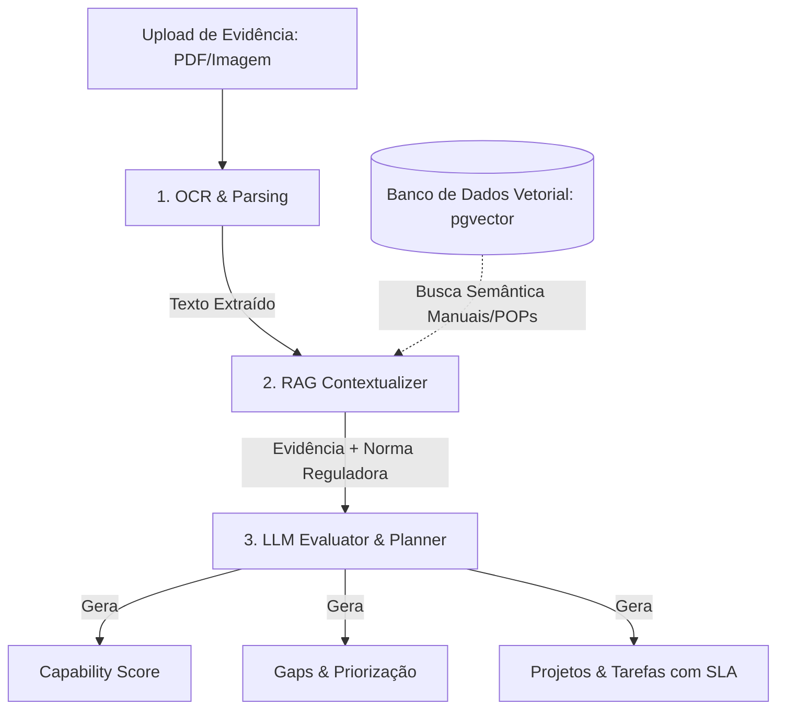

# Fase 07 — Arquitetura de Inteligência Artificial (AI Architecture) — ATE

Este documento especifica a arquitetura cognitiva, o fluxo de processamento e a integração de modelos de IA (OCR, RAG e LLM) como capacidades transversais ao módulo **Assessment & Transformation Engine (ATE)**.

---

## 1. INTEGRAÇÃO COGNITIVA DA IA

O ATE utiliza inteligência artificial não como um módulo isolado, mas de forma transversal para acelerar e conferir precisão técnica ao ciclo de diagnóstico e transformação:

---

## 2. PILARES DE PROCESSAMENTO COGNITIVO (AI CORE ENGINE)

### 2.1. OCR & Parsing (Extração e Leitura Documental)
*   **Papel**: Processar documentos anexados pelas equipes (evidências, imagens de relatórios, assinaturas digitais, atas) para extração de texto bruto estruturado e metadados.
*   **Comportamento**:
    1.  Recebe arquivos nos formatos PDF, DOCX, PNG ou JPEG.
    2.  Executa algoritmo de OCR para mapear caracteres, tabelas e assinaturas.
    3.  Extrai metadados essenciais (data de vigência, autores, identificação do tenant e validade jurídica).
*   **Casos de Uso**: Certificar se o POP anexado como evidência de enfermagem está assinado e dentro da data de validade de vigência regulatória.

### 2.2. RAG Contextualizer (Busca Semântica e Contextualização)
*   **Papel**: Comparar o conteúdo das evidências e respostas extraídas com os manuais oficiais de conformidade (ONA, ISO, RDC) e políticas do próprio tenant.
*   **Comportamento**:
    1.  Gera embeddings vetoriais das normas reguladoras oficiais e dos documentos internos (salvos usando `pgvector` na Persistence Layer).
    2.  Realiza busca semântica por proximidade de cosseno a partir do contexto da pergunta do assessment.
    3.  Recupera as diretrizes exatas da norma (ex: seção 2.3 do manual ONA) e anexa como contexto ao prompt do modelo.
*   **Casos de Uso**: Mapear se a resposta dada em "Segurança na Farmácia" está em total aderência à respectiva diretriz do manual ONA.

### 2.3. LLM Evaluator & Planner (Classificação e Planejamento)
*   **Papel**: Atuar como o cérebro orquestrador que computa scores, detecta inconformidades, prioriza gaps e desenha cronogramas.
*   **Comportamento**:
    1.  Analisa a evidência extraída pelo OCR e o contexto normativo provido pelo RAG.
    2.  **Scoring & Gap Analysis**: Classifica de 0 a 5 a aderência do pilar, apontando lacunas de conformidade e formulando justificativas claras.
    3.  **Roadmap Generator**: Seleciona as recomendações adequadas dos playbooks, mapeia dependências de capacidades e desenha as Waves do plano de transformação.
    4.  **PMO Automatizado**: Converte as recomendações em projetos e tarefas práticas com prazos estimados de SLA baseados na criticidade e esforço de mitigação.
*   **Casos de Uso**: Elaborar a redação das tarefas necessárias para implantar a dupla checagem de medicação e sugerir a devida trilha LMS de treinamento.

---

## 3. GOVERNANÇA E CONTROLE DE INJEÇÃO (AI GOVERNANCE)

Para manter o alinhamento com as diretrizes do **TPM (Trusted Cognitive Platform)**:
*   **Sandboxing de Prompts**: Todos os prompts utilizados para avaliação de compliance e scoring são congelados no repositório de infraestrutura e auditados periodicamente.
*   **Prevenção de Injeção (Prompt Injection)**: Filtros sintáticos de entrada impedem que o conteúdo das respostas e evidências do usuário contaminem as instruções operacionais de avaliação da IA.
*   **Validação Humana (Human-in-the-Loop)**: O score, gap e roadmaps sugeridos pela IA atuam como recomendações prévias na interface do Gestor de Qualidade. A plataforma requer aprovação humana explícita para ativar os planos de ação e as tarefas operacionais.
