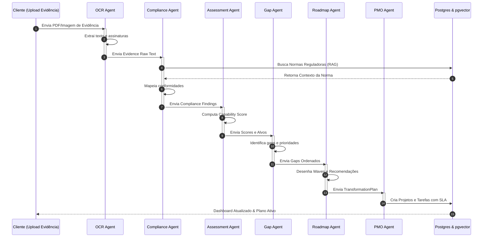

# Fase 13 — Modelo de Orquestração de IA (AI Orchestration Model) — ATE

Este documento especifica a arquitetura multiagente de inteligência artificial, o mapeamento de papéis, as interfaces de dados (entradas/saídas) e o fluxo de comunicação para a automatização dos processos de auditoria e transformação organizacional do ATE.

---

## 1. ARQUITETURA MULTIAGENTE (MULTI-AGENT WORKFLOW)

O ATE opera sob um modelo de **orquestração assíncrona orientada a eventos**, onde cada agente de IA atua de forma especializada em uma etapa do ciclo de vida da transformação.

---

## 2. ESPECIFICAÇÃO DOS AGENTES DE IA

### 2.1. OCR Agent (Agente de Extração Documental)
*   **Responsabilidade**: Processar arquivos anexados, limpando ruídos, digitalizando manuscritos e mapeando a estrutura lógica de dados textuais de comprovação.
*   **Entradas**: PDF, DOCX, PNG, JPEG de evidências.
*   **Saídas**: `EvidenceRawText` (JSON contendo texto extraído, tabelas tabuladas, carimbos detectados e metadados como autoria e data de assinatura).

### 2.2. Compliance Agent (Agente de Validação Regulatória)
*   **Responsabilidade**: Analisar se o texto bruto da evidência atende às cláusulas e critérios da certificação almejada (ex: ONA Nível 1), fazendo uma triagem inicial contra falhas críticas de conformidade.
*   **Entradas**: `EvidenceRawText` e contexto regulatório obtido via RAG (manuais ONA/ISO).
*   **Saídas**: `ComplianceFindings` (JSON contendo status de validação, trechos do documento que comprovam a conformidade, cláusulas não-atendidas identificadas e observações técnicas).

### 2.3. Assessment Agent (Agente de Avaliação de Maturidade)
*   **Responsabilidade**: Consolidar as respostas do usuário e os relatórios do Compliance Agent para calcular o score objetivo (0.0 a 5.0) de cada capability do tenant.
*   **Entradas**: `AssessmentAnswers` enviadas pelo usuário e `ComplianceFindings` gerados pela triagem.
*   **Saídas**: `CapabilityScore` atualizado para cada uma das 8 capabilities mapeadas.

### 2.4. Gap Agent (Agente de Detecção de Lacunas)
*   **Responsabilidade**: Detectar os desvios de desempenho entre scores atuais e metas e calcular o score de prioridade de intervenção.
*   **Entradas**: `CapabilityScore` processados e `TargetScore` definidos no playbook.
*   **Saídas**: Lista de entidades `Gap` instanciadas com nível de urgência (Crítico, Alto, Médio, Baixo), impacto de negócio computado e justificativas claras de causa-raiz.

### 2.5. Roadmap Agent (Agente de Planejamento de Metas)
*   **Responsabilidade**: Sequenciar e organizar de forma inteligente os gaps que necessitam de correção em ondas temporais de execução (Waves A a F), mitigando bloqueadores lógicos.
*   **Entradas**: Entidades `Gap` ativas e regras de dependência de maturidade do QualitiOS.
*   **Saídas**: Proposta de `TransformationPlan` com agrupamento de metas e recomendações por Wave de trabalho.

### 2.6. PMO Agent (Agente de Projetos e Tarefas)
*   **Responsabilidade**: Converter o plano de transformação abstrato em tarefas práticas e acionáveis para colaboradores do hospital, definindo responsáveis ideais baseados em cargos e calculando prazos limites de SLA.
*   **Entradas**: `TransformationPlan` estruturado.
*   **Saídas**: Registros de `TransformationProject` e `TransformationTask` (atribuídos a responsáveis com metas de prazos e checklists integrados).

---

## 3. PROTOCOLO E COMUNICAÇÃO DE DADOS (MCP INTEGRATION)

Os agentes comunicam-se de forma assíncrona por meio do **Model Context Protocol (MCP)**, usando mensagens padronizadas em formato JSON para passagem de contexto de trabalho. O TPM audita passivamente este protocolo, garantindo que nenhum agente altere o escopo ou alucine dados de conformidade sem rastreabilidade.
