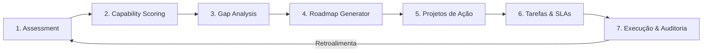

# Fase 06 — Arquitetura de Negócio (Business Architecture) — ATE

Este documento especifica a Arquitetura de Negócio e o fluxo de valor de ponta a ponta (Value Stream) do módulo **Assessment & Transformation Engine (ATE)**.

---

## 1. O FLUXO DE VALOR DA TRANSFORMAÇÃO OPERACIONAL

O ATE orquestra a evolução da qualidade da organização através de um fluxo linear e contínuo composto por sete etapas fundamentais:

---

## 2. ETAPAS DETALHADAS DO FLUXO (STAGES DETAILS)

### Stage 1: Assessment (Avaliação)
*   **Ação**: O tenant seleciona um Playbook de Transformação (ex: ONA Nível 1) ou cria uma avaliação personalizada. O sistema gera um conjunto de perguntas estruturadas cobrindo as capabilities aplicáveis.
*   **Entrada**: Playbook de objetivos escolhido pelo gestor de qualidade.
*   **Saída**: Instância de `Assessment` contendo `AssessmentAnswer` preenchidas e `Evidence` (POPs, links, arquivos) anexadas.

### Stage 2: Capability Scoring (Pontuação de Capacidades)
*   **Ação**: O motor de avaliação varre as respostas fornecidas, valida as evidências anexas (com auxílio de inteligência artificial ou aprovação humana) e calcula a pontuação real (0.0 a 5.0) para cada uma das 8 capabilities.
*   **Entrada**: Respostas e evidências enviadas no `Assessment`.
*   **Saída**: Registros de `CapabilityScore` associados a cada área.

### Stage 3: Gap Analysis (Análise de Lacunas)
*   **Ação**: O Gap Engine calcula a diferença entre o score computado (Maturidade Atual) e a meta definida no playbook (Maturidade Alvo). O motor aplica as fórmulas de criticidade, impacto e dependências para gerar o `Priority Score` de cada gap detectado.
*   **Entrada**: Scores calculados vs. alvos de maturidade.
*   **Saída**: Lista priorizada de `Gap` e suas respectivas `Recommendation` estratégicas.

### Stage 4: Roadmap Generator (Geração do Cronograma)
*   **Ação**: O planejador analisa os gaps e suas interdependências (ex: resolver gaps de documentação antes de disparar auditorias avançadas). A plataforma distribui as recomendações de mitigação em ondas de execução lógicas (Waves A a F).
*   **Entrada**: Gaps prioritários e matriz de dependência de capacidades.
*   **Saída**: `TransformationPlan` contendo o sequenciamento de `Roadmap`.

### Stage 5: Projetos de Ação (Transformation Projects)
*   **Ação**: O plano de transformação agrupa as recomendações afins e gera automaticamente projetos estruturados com escopo, metas de conformidade e responsáveis.
*   **Entrada**: Recomendações e fases aprovadas do roadmap.
*   **Saída**: Projetos do tipo `TransformationProject` criados e vinculados aos setores afetados.

### Stage 6: Tarefas & SLAs (Transformation Tasks)
*   **Ação**: Os projetos são decompostos em ações de trabalho imediatas para os colaboradores. O sistema calcula prazos automáticos de SLA baseado na criticidade do gap associado (ex: gaps críticos geram tarefas de 48h).
*   **Entrada**: Projetos de transformação ativados.
*   **Saída**: Atribuição física de `TransformationTask` nas filas de trabalho dos colaboradores.

### Stage 7: Execução & Auditoria (Execution & Continuous Audit)
*   **Ação**: Os colaboradores executam as tarefas (ex: criam um novo POP, participam de um treinamento no LMS) e anexam as evidências de conclusão. A plataforma verifica a conformidade da evidência e, em caso positivo, atualiza dinamicamente o score da capability, fechando o gap correspondente no painel geral de governança.
*   **Entrada**: Conclusão de tarefas e uploads de comprovação.
*   **Saída**: Fechamento de `Gap` e atualização em tempo real do score de conformidade organizacional.
