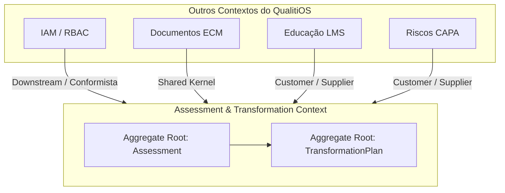

# Fase 05 — Context Map DDD (Domain-Driven Design) — ATE

Este documento define os limites de contexto, agregados, entidades e eventos de domínio para o Bounded Context do **Assessment & Transformation Engine (ATE)**.

---

## 1. BOUNDED CONTEXT: ASSESSMENT & TRANSFORMATION

*   **Tipo de Domínio**: Domínio de Suporte (Supporting Domain). Atua como orquestrador que consome dados de conformidade das outras verticais do QualitiOS para alimentar a governança estratégica global.
*   **Fronteira Física**: Camadas lógicas isoladas no monolito do QualitiOS, possuindo suas próprias tabelas de persistência no PostgreSQL e comunicando-se com outros contextos assincronamente através do barramento de eventos interno.

---

## 2. AGREGADOS E ENTIDADES (AGGREGATES & ENTITIES)

O contexto está estruturado sob dois grandes agregados chaves:

### 2.1. Agregado: Assessment
*   **Assessment (Aggregate Root)**: Representa uma rodada ou ciclo de avaliação de maturidade e conformidade de um tenant.
    *   *Atributos*: `id` (UUID), `tenant_id` (UUID), `playbook_id` (UUID), `status` (Enum: INICIADO, EM_ANDAMENTO, FINALIZADO), `criado_em` (Timestamp), `finalizado_em` (Timestamp), `avaliador_id` (UUID).
*   **AssessmentQuestion (Entidade)**: Questão ou item de avaliação individual mapeado a uma capability.
    *   *Atributos*: `id` (UUID), `assessment_id` (UUID), `capability` (Enum: GOVERNANCA, ESTRATEGIA, etc.), `nivel_alvo` (Int 0-5), `pergunta` (Text).
*   **AssessmentAnswer (Entidade)**: Resposta fornecida pelo usuário avaliado para a questão.
    *   *Atributos*: `id` (UUID), `question_id` (UUID), `resposta` (Text), `nivel_marcado` (Int 0-5), `justificativa` (Text), `respondido_por` (UUID).
*   **Evidence (Entidade)**: Arquivo ou indicador que comprova a resposta fornecida.
    *   *Atributos*: `id` (UUID), `answer_id` (UUID), `tipo_evidencia` (Enum: DOCUMENTO, INDICADOR, CURSO_LMS), `url_documento` (String), `status_validacao` (Enum: PENDENTE, APROVADO, REJEITADO), `analise_ia_summary` (Text).
*   **CapabilityScore (Entidade)**: O score de maturidade calculado para uma capabilidade no ciclo.
    *   *Atributos*: `id` (UUID), `assessment_id` (UUID), `capability` (Enum: GOVERNANCA, etc.), `score_calculado` (Decimal), `data_calculo` (Timestamp).
*   **Gap (Entidade)**: Inconformidade detectada a partir da diferença de score.
    *   *Atributos*: `id` (UUID), `assessment_id` (UUID), `capability` (Enum), `nivel_atual` (Int), `nivel_alvo` (Int), `priority_score` (Decimal), `status` (Enum: ABERTO, MITIGADO).
*   **Recommendation (Entidade)**: Recomendação técnica para sanar um gap.
    *   *Atributos*: `id` (UUID), `gap_id` (UUID), `recomendacao` (Text), `playbook_id` (UUID), `gerado_por_ia` (Boolean).

### 2.2. Agregado: TransformationPlan
*   **TransformationPlan (Aggregate Root)**: Plano de ação global para guiar a evolução de maturidade de um tenant.
    *   *Atributos*: `id` (UUID), `assessment_id` (UUID), `tenant_id` (UUID), `status` (Enum: RASCUNHO, EM_EXECUCAO, CONCLUIDO), `iniciado_em` (Timestamp), `concluido_em` (Timestamp).
*   **Roadmap (Entidade)**: Planejamento temporal de fases de transformação (Waves).
    *   *Atributos*: `id` (UUID), `plan_id` (UUID), `wave_classificacao` (Enum: WAVE_A, WAVE_B, etc.), `descricao` (Text).
*   **TransformationProject (Entidade)**: Projeto específico focado em mitigar um grupo de gaps semelhantes.
    *   *Atributos*: `id` (UUID), `plan_id` (UUID), `nome` (String), `descricao` (Text), `status` (Enum: NAO_INICIADO, EM_EXECUCAO, CONCLUIDO).
*   **TransformationTask (Entidade)**: Ação operacional unitária.
    *   *Atributos*: `id` (UUID), `project_id` (UUID), `descricao` (Text), `responsavel_id` (UUID), `prazo_limite` (Timestamp), `status` (Enum: PENDENTE, CONCLUIDA, ATRASADA).

---

## 3. EVENTOS DE DOMÍNIO (DOMAIN EVENTS)

Eventos assíncronos gerados pelo ATE para notificar o barramento da plataforma sobre mudanças de estado importantes:

1.  **AssessmentStarted**
    *   *Gatilho*: Disparado quando um novo ciclo de avaliação é iniciado por um tenant.
    *   *Payload*: `assessment_id`, `tenant_id`, `playbook_id`, `timestamp`.
2.  **AssessmentCompleted**
    *   *Gatilho*: Disparado quando a avaliação é finalizada e enviada para processamento de scores.
    *   *Payload*: `assessment_id`, `tenant_id`, `finalizado_em`.
3.  **CapabilityScored**
    *   *Gatilho*: Disparado após o cálculo da pontuação de maturidade de uma capability.
    *   *Payload*: `assessment_id`, `capability`, `score_calculado`, `timestamp`.
4.  **GapIdentified**
    *   *Gatilho*: Disparado quando um gap de maturidade (score atual < score alvo) é detectado.
    *   *Payload*: `gap_id`, `assessment_id`, `capability`, `priority_score`, `timestamp`.
5.  **RoadmapGenerated**
    *   *Gatilho*: Disparado quando a IA conclui a estruturação das Waves e do plano de transformação baseado nos gaps.
    *   *Payload*: `plan_id`, `assessment_id`, `total_projetos`, `timestamp`.
6.  **ProjectCreated**
    *   *Gatilho*: Disparado ao inicializar um projeto de transformação, ativando tarefas de colaboradores.
    *   *Payload*: `project_id`, `plan_id`, `nome`, `total_tarefas`, `timestamp`.
