# Item 11 — Business Architecture — Universal Integration Hub (UIH)

Este documento especifica a Arquitetura de Negócio e os Fluxos de Valor (Value Streams) de ponta a ponta do **Universal Integration Hub (UIH)**.

---

## 1. FLUXOS DE VALOR OPERACIONAIS DO HUB

O UIH atua como o elo de conexão do QualitiOS com o ecossistema de sistemas do cliente, estruturando quatro fluxos de valor principais:

```mermaid
graph TD
    subgraph Stream1 [Value Stream: Carga Histórica]
        A1[Configuração de Pipeline] --> A2[Teste de Conexão]
        A2 --> A3[Mapeamento de Schema]
        A3 --> A4[Carga Inicial Lote]
    end

    subgraph Stream2 [Value Stream: Sincronismo Contínuo]
        B1[Evento no HIS/ERP] --> B2[Ingestão Webhook/DB]
        B2 --> B3[Tradução Canônica ACL]
        B3 --> B4[Disparo de Evento de Domínio]
    end

    subgraph Stream3 [Value Stream: Gestão de Erros]
        C1[Falha de Validação] --> C2[Payload na DLQ]
        C2 --> C3[Alerta de Inconformidade]
        C3 --> C4[Ajuste de Regras & Replay]
    end
```

---

## 2. DETALHAMENTO DOS FLUXOS DE VALOR (VALUE STREAMS DETAILS)

### 2.1. Carga Histórica e Onboarding (Historical Load & Onboarding)
*   **Descrição**: Carga inicial de dados legados do cliente no momento da implantação da plataforma.
*   **Etapas**:
    1.  *Configuração*: O administrador cria o `IntegrationPipeline` e parametriza a `Connection` (credenciais criptografadas no Vault).
    2.  *Mapeamento*: Define as regras lógicas no `DataMapping` para associar o schema externo ao `CanonicalSchema`.
    3.  *Ingestão*: Aciona a carga em lote (`SyncJob`), lendo dados segmentados por chunks.
    4.  *Persistência*: Os dados validados alimentam as tabelas do QualitiOS de forma íntegra.

### 2.2. Sincronismo Incremental Realtime (Realtime Sync Flow)
*   **Descrição**: Manutenção da consistência de dados diários de forma passiva e assíncrona.
*   **Etapas**:
    1.  *Gatilho*: Ocorre uma ação no HIS do hospital (ex: médico reporta uma quase falha de cirurgia).
    2.  *Callback*: O HIS envia um payload de dados para a rota do `WebhookListener`.
    3.  *ACL Translation*: O Mapping Engine valida as credenciais e traduz o JSON para o `CanonicalOcorrencia`.
    4.  *Internal Bus*: Dispara o evento de domínio `ate.assessment.started` ou `core.ocorrencia.registrada`, atualizando os dashboards do hospital em tempo real.

### 2.3. Gestão de Erros e Conciliação (Error Remediation & DLQ)
*   **Descrição**: Capturar dados incorretos e processá-los de forma resiliente após correção estrutural.
*   **Etapas**:
    1.  *Filtro*: Um payload falha na validação sintática do JSON Schema Canônico.
    2.  *Isolamento*: A transação de persistência é abortada. O payload original é gravado em `event_dlq` e um alerta de falha de ingestão é enviado.
    3.  *Correção*: O analista de TI revisa o mapeamento de enums incorretos na interface gráfica do UIH.
    4.  *Replay*: Aciona a re-execução da mensagem da DLQ, persistindo os dados com sucesso.
