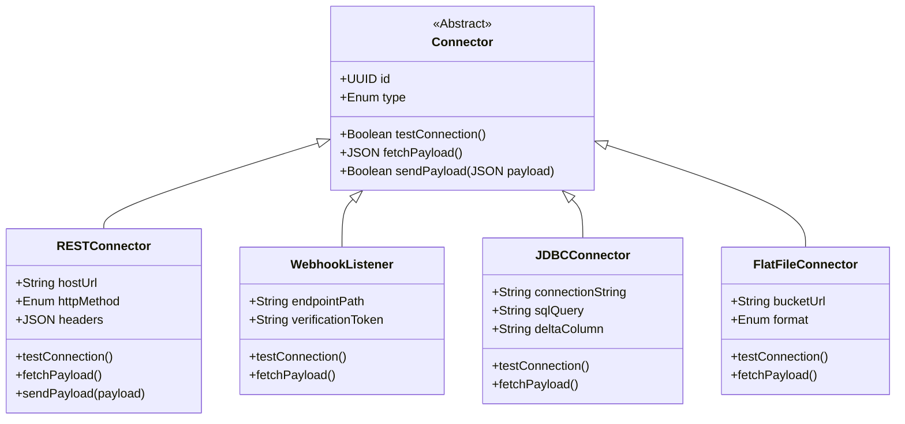

# Item 05 — Connector Framework — Universal Integration Hub (UIH)

Este documento especifica a arquitetura física e lógica do **Connector Framework** do UIH, definindo a estrutura de adaptadores de rede, drivers e a interface de conexões Inbound e Outbound.

---

## 1. ARQUITETURA GERAL DE CONECTORES

O Connector Framework do UIH baseia-se no padrão de design **Portas e Adaptadores (Hexagonal)**. Ele expõe uma interface abstrata comum para conexões físicas de rede, desacoplando o barramento de integração do tipo de protocolo de comunicação externa.

---

## 2. DRIVERS DE CONECTIVIDADE (CONNECTORS SPECIFICATION)

### 2.1. REST API Connector (Inbound & Outbound)
*   **Comportamento**: Realiza requisições HTTPS ativas a endpoints externos (Inbound/polling) ou envia payloads de eventos (Outbound/push).
*   **Parâmetros de Configuração**:
    *   `hostUrl`: Endereço base do sistema de destino (ex: `https://api.tasy.hospital.com/v1`).
    *   `authType`: Método de autenticação (Basic Auth, OAuth2 Bearer, API Key).
    *   `headers`: JSON de cabeçalhos dinâmicos.
    *   `pollingCron`: Cron de agendamento para requisições Inbound (ex: `0 */2 * * *` para rodar a cada 2 horas).

### 2.2. Webhook Listener Connector (Inbound)
*   **Comportamento**: Abre uma rota HTTPS pública e exclusiva por pipeline para escutar requisições de callback reativas enviadas por sistemas externos de forma passiva.
*   **Parâmetros de Configuração**:
    *   `endpointPath`: Rota exposta (ex: `/api/integration/inbound/webhook/{pipeline_id}`).
    *   `verificationToken`: Token estático de validação de assinatura (`HMAC-SHA256`) contido no cabeçalho `X-Qualiti-Signature` para certificar autenticidade.

### 2.3. JDBC/ODBC Database Connector (Inbound)
*   **Comportamento**: Estabelece conexão direta de banco de dados com bases legadas para ingestão em lote.
*   **Parâmetros de Configuração**:
    *   `connectionString`: String de conexão criptografada (ex: `jdbc:postgresql://host:port/database`).
    *   `sqlQuery`: Query SQL de extração (ex: `SELECT * FROM tbl_funcionarios WHERE dt_modificacao > :last_sync`).
    *   `deltaColumn`: Nome do campo de timestamp incremental (`dt_modificacao`) usado pelo Sync Engine para controlar o sincronismo diferencial (delta).

### 2.4. Flat File Connector (Inbound)
*   **Comportamento**: Monitora e realiza o download de arquivos de dados estruturados (CSV, XML, JSON) de pastas ou buckets de armazenamento em nuvem.
*   **Parâmetros de Configuração**:
    *   `bucketUrl`: URI do repositório (ex: `s3://hospital-integrations/import/`).
    *   `format`: Tipo de arquivo (`CSV`, `XML`, `JSON`).
    *   `delimiter`: Caractere separador (ex: `,` ou `;`) no caso de CSV.
    *   `fileRegex`: Expressão regular para filtrar nomes de arquivos (ex: `colaboradores_*.csv`).
