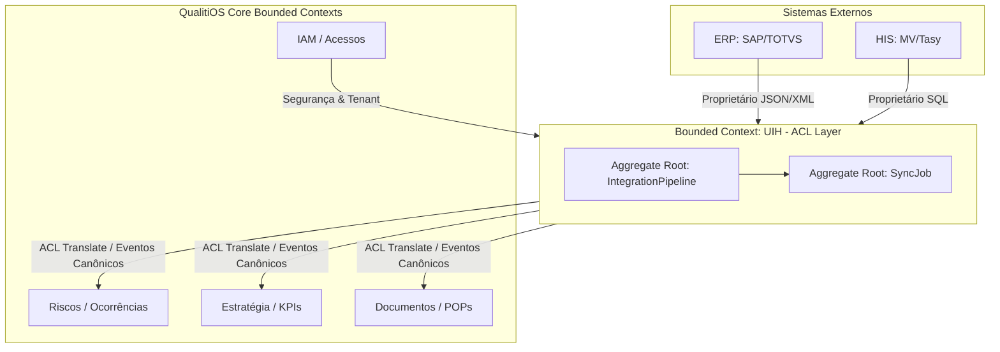

# Item 03 — Context Map DDD (Domain-Driven Design) — UIH

Este documento define os limites de contexto, agregados, entidades, eventos de domínio e os padrões de relacionamento do **Universal Integration Hub (UIH)**.

---

## 1. BOUNDED CONTEXT: INTEGRATION HUB & ACL PATTERN

*   **Tipo de Domínio**: Domínio Genérico (Generic Domain) que fornece infraestrutura de conexões para a plataforma.
*   **Padrão de Integração (Anticorruption Layer - ACL)**: O UIH atua como uma **Camada Anticorrupção (ACL)** para o QualitiOS. Ele impede que modelos de dados, tabelas legadas e jargões proprietários de sistemas externos (HIS, ERPs) poluam o modelo de domínio limpo do Core Platform. Toda entrada de dados externos é filtrada, mapeada e traduzida no UIH antes de disparar atualizações no sistema operacional.

---

## 2. AGREGADOS E ENTIDADES (AGGREGATES & ENTITIES)

### 2.1. Agregado: IntegrationPipeline
*   **IntegrationPipeline (Aggregate Root)**: Pipeline configurado de ingestão ou exportação de dados para um tenant.
    *   *Atributos*: `id` (UUID), `tenant_id` (UUID), `nome` (String), `status` (Enum: ATIVO, INATIVO), `tipo_fluxo` (Enum: INBOUND, OUTBOUND), `criado_em` (Timestamp).
*   **Connection (Entidade)**: Credenciais e parâmetros de conexão física.
    *   *Atributos*: `id` (UUID), `pipeline_id` (UUID), `tipo_driver` (Enum: REST, WEBHOOK, JDBC, S3), `endpoint_host` (String), `auth_config_vault_key` (String).
*   **CanonicalSchema (Entidade)**: Definição estruturada do modelo canônico visado pela integração.
    *   *Atributos*: `id` (UUID), `entity_type` (Enum: COLABORADOR, OCORRENCIA, INDICADOR, DOCUMENTO), `schema_json` (JSONB).
*   **DataMapping (Entidade)**: Regras de mapeamento e tradução campo a campo.
    *   *Atributos*: `id` (UUID), `pipeline_id` (UUID), `source_jsonpath` (String), `target_field` (String), `enum_translations` (JSONB).

### 2.2. Agregado: SyncJob
*   **SyncJob (Aggregate Root)**: Execução ou execução em andamento de um sincronismo.
    *   *Atributos*: `id` (UUID), `pipeline_id` (UUID), `status` (Enum: PENDENTE, EM_EXECUCAO, SUCESSO, ERRO), `records_processed` (Int), `started_at` (Timestamp), `completed_at` (Timestamp).
*   **IntegrationEventLog (Entidade)**: Log transacional de eventos importados/exportados.
    *   *Atributos*: `id` (UUID), `sync_job_id` (UUID), `event_name` (String), `payload` (JSONB), `status` (Enum: SUCESSO, FALHA).
*   **DeadLetterQueueEntry (Entidade)**: Tabela de retenção de mensagens com erro para correção e reprocessamento.
    *   *Atributos*: `id` (UUID), `sync_job_id` (UUID), `payload_original` (JSONB), `error_message` (Text), `attempts` (Int), `status` (Enum: PENDENTE, REPROCESSADO, DESCARTADO).

---

## 3. EVENTOS DE DOMÍNIO (DOMAIN EVENTS)

O UIH interage com o barramento de integração disparando e escutando eventos de domínio:

1.  **ConnectionValidated**
    *   *Gatilho*: Disparado quando um teste de conexão externa é executado com sucesso.
    *   *Payload*: `connection_id`, `pipeline_id`, `driver`, `timestamp`.
2.  **SyncJobStarted**
    *   *Gatilho*: Disparado ao iniciar uma carga (Batch ou Delta) de dados externos.
    *   *Payload*: `sync_job_id`, `pipeline_id`, `started_at`.
3.  **SyncJobCompleted**
    *   *Gatilho*: Disparado ao finalizar com sucesso o processamento de uma carga.
    *   *Payload*: `sync_job_id`, `records_processed`, `completed_at`.
4.  **IngestionFailed**
    *   *Gatilho*: Disparado quando ocorre erro crítico de conexão ou validação lógica de dados.
    *   *Payload*: `sync_job_id`, `pipeline_id`, `error_details`, `timestamp`.
5.  **PayloadSentToDLQ**
    *   *Gatilho*: Disparado quando um registro de dados falha nas validações e é direcionado à DLQ.
    *   *Payload*: `dlq_id`, `sync_job_id`, `error_message`, `timestamp`.
6.  **EventBridged**
    *   *Gatilho*: Disparado quando um evento do barramento interno do QualitiOS é publicado com sucesso no barramento do cliente.
    *   *Payload*: `event_name`, `target_system`, `bridged_at`.
