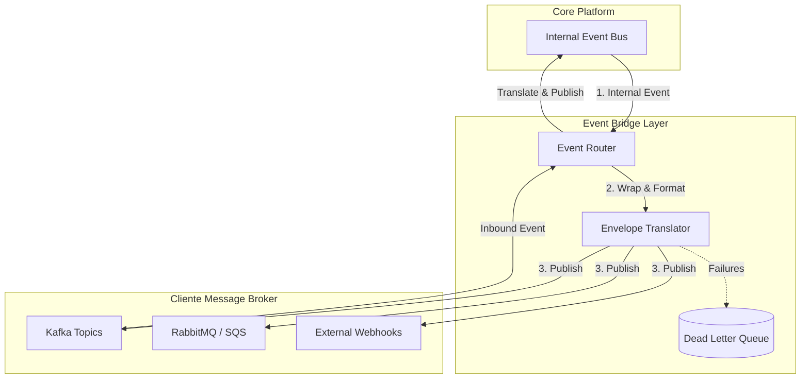

# Item 08 — Event Bridge — Universal Integration Hub (UIH)

Este documento especifica o design da **Ponte de Eventos (Event Bridge)** do UIH, responsável pelo tráfego de mensagens assíncronas e integração entre o barramento de eventos interno do QualitiOS e brokers de mensageria de terceiros.

---

## 1. FLUXO E ENVELOPE DE EVENTOS (EVENT ENVELOPE)

Toda mensagem trafegada pela Event Bridge deve seguir o padrão de envelope canônico abaixo para garantir consistência sintática:

```json
{
  "id": "UUID",
  "event_type": "STRING (ex: uih.colaborador.sincronizado)",
  "version": "STRING (ex: 1.0)",
  "tenant_id": "UUID",
  "timestamp": "STRING (ISO 8601)",
  "payload": {
    "description": "JSON de dados canônicos da entidade envolvida"
  }
}
```

---

## 2. PADRÕES DE ROTEAMENTO (ROUTING PATTERNS)

A Event Bridge opera com roteamento bidirecional desacoplado:



### 2.1. Outbound Event Bridging (Tráfego de Saída)
*   **Comportamento**: Escuta eventos de domínio publicados pelo QualitiOS (ex: `core.ocorrencia.registrada`) e os propaga para os brokers externos cadastrados no pipeline do tenant.
*   **Mecanismos**:
    *   **Event Filter**: O tenant configura quais tipos de eventos internos deseja exportar, evitando sobrecarregar o barramento com mensagens irrelevantes.
    *   **Envelope Wrap**: O payload de domínio interno é envelopado no formato JSON canônico de integração.

### 2.2. Inbound Event Routing (Tráfego de Entrada)
*   **Comportamento**: Assina tópicos de brokers externos (Kafka, RabbitMQ, AWS SQS) ou recebe webhooks ativamente, convertendo-os em eventos internos.
*   **Mecanismos**:
    *   **ACL Translation**: O payload de terceiros é transformado pelo Mapping Engine no Modelo Canônico.
    *   **Bus Trigger**: O evento canônico traduzido é disparado no barramento de eventos interno do QualitiOS.

---

## 3. RESILIÊNCIA E REPLAY DE FALHAS (DLQ & REPLAY)

Para evitar perda de mensagens assíncronas em cenários de queda de servidores ou erros de validação lógica:

### 3.1. Dead Letter Queue (DLQ)
Toda mensagem inbound ou outbound que falhar no processamento após esgotar o limite de retentativas é gravada na tabela `event_dlq` contendo:
*   `payload` original completo.
*   `event_name` de origem.
*   `error_message` detalhado (ex: erro de validação do JSON schema).
*   `attempts` executadas.
*   `status` (`pending`, `replayed`, `discarded`).

### 3.2. Mecanismo de Replay (Reprocessamento)
O UIH expõe endpoints administrativos seguros no API Gateway para gerenciamento de falhas:
*   **Auto-Replay**: O administrador pode acionar um reprocessamento em lote de mensagens na DLQ após corrigir a regra de mapeamento incorreta na Mapping Engine.
*   **Manual Edit & Replay**: Possibilidade de editar payloads específicos contendo erros sintáticos e re-enfileirá-los diretamente pelo console de administração de TI do tenant.
