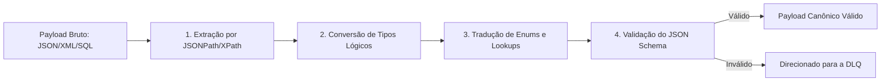

# Item 06 — Mapping Engine — Universal Integration Hub (UIH)

Este documento especifica o funcionamento técnico do **Motor de Mapeamento (Mapping Engine)** do UIH, responsável por traduzir payloads heterogêneos de terceiros em entidades válidas do Modelo Canônico.

---

## 1. PIPELINE DE TRANSFORMAÇÃO E MAPEAMENTO

O Mapping Engine atua em memória antes da persistência física do dado. Ele processa o payload bruto extraído pelo Connector através de quatro etapas lógicas:



---

## 2. MECANISMOS DO MAPPING ENGINE

### 2.1. Extração por JSONPath ou XPath
*   **Comportamento**: Varre o payload bruto de origem usando seletores de caminhos para extrair valores específicos.
*   **Exemplo**:
    *   *Source JSON Path*: `$.data.employee.first_name` e `$.data.employee.last_name`.
    *   *Regra de Concatenagem*: `CONCAT($.data.employee.first_name, ' ', $.data.employee.last_name)`.
    *   *Target Field*: `nome` no Modelo Canônico.

### 2.2. Conversão de Tipos de Dados (Type Casting)
*   **Comportamento**: Coage os tipos do sistema de origem para os tipos primitivos estritos do Schema do QualitiOS.
*   **Regras**:
    *   *Datetime ISO 8601*: Converte strings timestamp variantes (ex: `DD/MM/YYYY HH:MM:SS` ou Epoch Unix milissegundos) para formato padronizado UTC `YYYY-MM-DDTHH:MM:SSZ`.
    *   *Numerics*: Converte strings numéricas (ex: `"1.250,50"`) em decimais de alta precisão (`1250.50`).
    *   *Booleans*: Trata valores de origem variados (ex: `1`/`0`, `"Y"`/`"N"`, `"true"`/`"false"`) como booleanos nativos (`true`/`false`).

### 2.3. Tradução de Enums (Lookup Tables)
*   **Comportamento**: Traduz termos e códigos de fornecedores específicos para os enums restritos da Ubiquitous Language do QualitiOS.
*   **Exemplo de Configuração de Lookup JSON**:
    ```json
    {
      "mapping_rules": {
        "tipo": {
          "source_path": "$.incident_type_code",
          "lookups": {
            "ADVERSE_EVENT": "Evento Adverso",
            "NEAR_MISS": "Quase Falha (Near Miss)",
            "NON_CONFORMITY": "Inconformidade"
          }
        },
        "severidade": {
          "source_path": "$.risk_level",
          "lookups": {
            "1": "Leve",
            "2": "Moderada",
            "3": "Grave",
            "4": "Sentinela"
          }
        }
      }
    }
    ```

### 2.4. Validação de Schemas
*   **Comportamento**: Roda o payload transformado final contra a especificação do JSON Schema Canônico correspondente (definido na Fase 4).
*   **Tratamento de Exceções**:
    *   Se faltar algum campo obrigatório ou se houver incompatibilidade de tipo insolúvel, a execução é interrompida, o status da carga é marcado como `FALHA` e o payload original é enviado à **Dead Letter Queue (DLQ)** com o relatório de erros de validação sintática.
