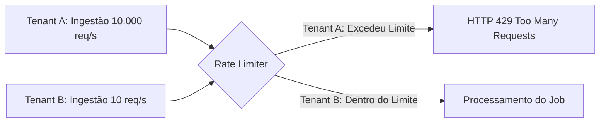

# Item 10 — Multi-Tenant Integration Model — Universal Integration Hub (UIH)

Este documento especifica o modelo de particionamento lógico, isolamento de recursos, rate-limiting e governança de dados multi-tenant do **Universal Integration Hub (UIH)**.

---

## 1. SEGREGACÃO LÓGICA DE DADOS (DATA SEGREGATION)

O UIH opera de forma nativa no modelo **Multi-Tenancy lógico com banco compartilhado**. Todas as tabelas críticas possuem o campo `tenant_id: UUID` indexado e condicionado:

```text
Segregação Lógica
├── Tabelas Relacionais: ate_connection, ate_pipeline, event_dlq (filtradas por tenant_id)
├── Armazenamento de Arquivos: buckets separados logicamente (/buckets/{tenant_id}/*)
└── Redis: Chaves de cache com namespace prefixado (ex: cache:tenant_id:pipeline_id)
```

*   **Validação em Tempo de Execução**: O API Gateway do QualitiOS decodifica o token JWT contido no cookie protegido da sessão do usuário. O `tenant_id` obtido é propagado para o contexto de execução da Thread e injetado automaticamente como restrição de filtro de segurança nas transações do banco.

---

## 2. ISOLAMENTO DE FILAS E CONVERSORES DE MENSAGENS (QUEUE PARTITIONING)

Para evitar vazamento de dados assíncronos no barramento de eventos ou brokers de mensageria:
*   **Message Envelope Headers**: Toda mensagem que trafega pela Event Bridge ou filas de retentativas contém o `tenant_id` injetado nos metadados de cabeçalho do envelope.
*   **Segregação de Workers**: Os consumidores de filas (Workers) leem as mensagens de forma agnóstica, mas antes de processar o payload na Mapping Engine, atestam se as chaves criptográficas de descriptografia pertencem ao tenant identificado no cabeçalho, abortando em caso de inconsistência de escopo.

---

## 3. CONTROLE DE VAZÃO E GARANTIA DE RECURSOS (RATE-LIMITING)

Para evitar o cenário de "Vizinho Barulhento" (Noisy Neighbor), onde um tenant consome excessivos recursos de CPU, banco de dados ou largura de banda ao importar grandes volumes históricos:



### 3.1. Throttling por Tenant
*   **Webhook Inbound Rate-Limit**: Limite estrito de requisições por segundo por tenant no gateway (ex: no máximo 100 requisições/segundo por tenant). Requisições excedentes recebem código de erro `HTTP 429 Too Many Requests`.
*   **Limitação de Jobs Concorrentes**: O Sync Engine limita a concorrência de processamentos pesados em lote. Um tenant pode executar no máximo 2 jobs de sincronismo em lote (`SyncJob`) concorrentemente. Jobs adicionais são colocados em fila de espera em segundo plano.

### 3.2. Cotas de Armazenamento de Logs e DLQ
*   Para evitar que erros recorrentes ou loops de sincronismo de um tenant saturem o disco de armazenamento do banco de dados, o UIH implementa limpeza automática:
    *   **Logs normais** (`event_logs`) são arquivados ou limpos automaticamente após 15 dias.
    *   **DLQ** (`event_dlq`) possui limite máximo de 10.000 registros retidos por tenant. Atingido o limite, registros mais antigos são descartados ou consolidados em bucket offline.
