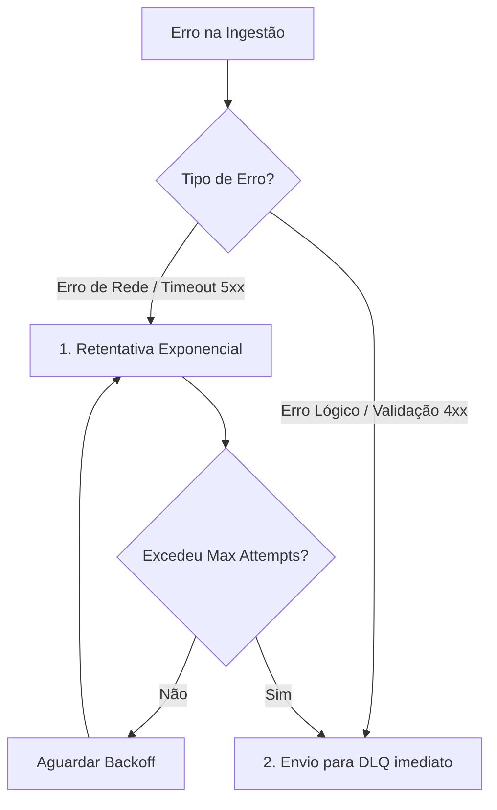

# Item 07 — Sync Engine — Universal Integration Hub (UIH)

Este documento especifica a arquitetura de sincronização de dados, tratamento de concorrência, retentativas e conciliação do **Sync Engine** do UIH.

---

## 1. MÉTODOS DE SINCRONISMO (SYNC MODE)

O Sync Engine suporta dois modos fundamentais de sincronização de dados:

```text
Sincronismo
├── Realtime (Webhook Push / Barramento) ➔ Eventos isolados integrados imediatamente.
└── Batch Delta (Polling / SQL / S3)   ➔ Cargas volumosas incrementais agendadas.
```

### 1.1. Sincronismo em Tempo Real (Realtime Sync)
*   **Trigger**: Acionado reativamente por requisições de entrada (Webhook Listener ou eventos da Event Bridge).
*   **Comportamento**: O payload unitário é imediatamente processado em memória, validado e convertido em evento de domínio do QualitiOS (ex: abrindo um chamado de incidente na hora em que ele é salvo no prontuário).
*   **Latência Alvo**: $< 2$ segundos de ponta a ponta.

### 1.2. Sincronismo Diferencial em Lote (Batch Delta Sync)
*   **Trigger**: Acionado por cronogramas baseados em Cron executados em tarefas de background.
*   **Comportamento**: O motor realiza a leitura de dados do sistema de origem utilizando o timestamp do último sincronismo bem-sucedido (`last_sync_at`) persistido por pipeline. A query recupera apenas registros criados ou alterados após esta marca temporal:
    $$\text{ WHERE data\_modificacao} > \text{last\_sync\_at}$$
*   **Processamento em Lotes (Chunking)**: Os dados volumosos são lidos em páginas/lotes fechados de tamanho parametrizável (ex: chunk de 500 registros) para evitar estouro de memória (Out-Of-Memory) e concorrência excessiva no PostgreSQL.

---

## 2. GESTÃO DE ERROS E POLÍTICA DE RETENTATIVAS (RETRIES & BACKOFF)

Se ocorrer uma falha durante a execução de um sincronismo, o Sync Engine aplica uma classificação estrita de erro para determinar a política de tratamento:



### 2.1. Erros Temporários (Rede / Timeout / Servidor Ocupado - 5xx)
*   **Ação**: O Sync Engine enfileira o job para reprocessamento aplicando **Recuo Exponencial com Jitter (Exponential Backoff with Jitter)** para evitar sobrecarga (efeito manada) no servidor de destino.
*   **Fórmula de Tempo de Espera ($T_{wait}$)**:
    $$T_{wait} = \min\left(T_{max}, T_{base} \times 2^{\text{attempt}}\right) \pm \text{random\_jitter}$$
    *   *Padrão*: $T_{base} = 5$ segundos, $T_{max} = 300$ segundos, Máximo de 5 tentativas.

### 2.2. Erros Lógicos (Incompatibilidade de Tipos / Validação Sintática - 4xx)
*   **Ação**: Nenhuma retentativa é feita. O payload original é direcionado imediatamente para a **Dead Letter Queue (DLQ)** com as mensagens de erro detalhadas. O administrador do tenant é alertado no dashboard.

---

## 3. MECANISMO DE CONCILIAÇÃO (RECONCILIATION)

Para garantir a higienização contra falhas silenciosas de rede ou transações corrompidas:
*   **Conciliação Periódica (Full Sync de Limpeza)**: Uma vez por semana (em horário de baixo uso operacional), o Sync Engine desconsidera o delta incremental e executa uma carga completa (*Full Sync*) para checar discrepâncias físicas de ID, alteração de status órfãos e reprocessar falhas remanescentes.
*   **Controle de Concorrência (Locking)**: O sistema utiliza travas lógicas por tenant (`tenant_lock`) no Redis ou banco de dados durante a execução de uma carga em lote. Isso impede que dois sincronismos do mesmo pipeline rodem concorrentemente caso uma carga atrase e ultrapasse o horário do próximo agendamento cron.
