# OMOC 05 — Arquitetura de Negócio (Business Architecture) — OMOC

Este documento especifica os fluxos de valor de Recursos Humanos (Contratação, Movimentação, Promoção, Transferência, Desligamento) no domínio OMOC e mapeia seu impacto automatizado nos outros módulos do QualitiOS (BPM, ECM, LMS, Compliance).

---

## 1. FLUXOS DE VALOR OPERACIONAIS (HR VALUE STREAMS)

```mermaid
flowchart TD
    subgraph hiring [Contratação]
        H1[Cadastrar Employee] --> H2[Vincular a Position]
        H2 --> H3[Criar IAM User]
        H3 --> H4[Matrícula LMS]
    end

    subgraph transfer [Promoção / Transferência]
        T1[Alterar Position] --> T2[Recalcular RBAC]
        T2 --> T3[Reencaminhar Tarefas BPM]
        T3 --> T4[Ajustar Trilhas LMS]
    end

    subgraph offboarding [Desligamento]
        D1[Desativar Employee] --> D2[Bloquear IAM Login]
        D2 --> D3[Redirecionar Fila BPM]
        D3 --> D4[Vagar Cargo]
    end
```

---

## 2. DETALHAMENTO DOS FLUXOS DE VALOR

### 2.1. Contratação (Hiring)
*   **Ação**: Ocorre quando um novo colaborador é admitido na organização.
*   **Gatilho**: Evento `omoc.employee.hired` recebido via integração de RH pelo UIH.
*   **Fluxo**:
    1.  Cria o registro de `Employee` associado a uma vaga de cargo (`Position`) ativa.
    2.  O sistema dispara a criação automática do usuário de login no IAM/RBAC.
    3.  O LMS detecta o novo cargo e realiza a matrícula automática na trilha obrigatória de onboarding (com SLA de 72 horas).

### 2.2. Promoção & Transferência (Promotion & Transfer)
*   **Ação**: Alteração do cargo ou setor do colaborador.
*   **Gatilho**: Evento `omoc.employee.moved` publicado no barramento interno.
*   **Fluxo**:
    1.  Atualiza a `PositionAssignment` do colaborador, removendo a antiga e adicionando a nova.
    2.  O IAM recalcula as permissões baseadas no novo cargo.
    3.  O LMS remove o colaborador de trilhas de treinamento específicas do cargo antigo e o matricula nas trilhas exigidas pelo novo posto.
    4.  O BPM transfere tarefas de aprovação assistenciais pendentes do cargo antigo para o novo detentor.

### 2.3. Desligamento (Termination / Offboarding)
*   **Ação**: Demissão ou encerramento de contrato do colaborador.
*   **Gatilho**: Evento `omoc.employee.terminated`.
*   **Fluxo**:
    1.  O status do `Employee` é marcado como `Inativo` no banco e a vaga (`Position`) associada é marcada como vaga/aberta.
    2.  O IAM desativa instantaneamente as credenciais de login e invalida sessões ativas (tokens JWT) do colaborador desligado.
    3.  **Redirecionamento do BPM (Orquestração Crítica)**: Todas as tarefas pendentes na fila de trabalho pessoal do colaborador são automaticamente transferidas para o superior imediato (identificado pela `ReportingLine` direta da `Position` que ficou vaga), garantindo a continuidade operacional e o respeito aos SLAs.

---

## 3. MATRIZ DE IMPACTO MULTIDOMÍNIO (CROSS-DOMAIN MATRICES)

| Domínio Impactado | Mecanismo de Integração | Impacto Operacional Automatizado |
| :--- | :--- | :--- |
| **BPM (Workflows)** | Escuta `omoc.employee.terminated` e `omoc.employee.moved` | Reatribuição automática de tarefas de fluxogramas em andamento. Tarefas que estavam associadas a uma pessoa são redirecionadas para o novo ocupante do cargo ou escalonadas para o gerente imediato da `ReportingLine`. |
| **ECM (Documentos)** | Escuta `omoc.employee.moved` | Valida assinaturas eletrônicas históricas (mantendo a validade jurídica do POP assinado pelo colaborador no período em que ele ocupava o cargo de aprovação), mas transfere revisões futuras para o novo titular da vaga. |
| **LMS (Universidade)** | Escuta `omoc.employee.hired` e `omoc.employee.moved` | Matrícula e desmatrícula de cursos em lote baseado em tags de requisitos de cargos (`Position`). Disparo de relatórios semanais de adesão para os gerentes diretos (`ReportingLine`). |
| **Compliance & ATE** | Histórico de `ReportingLine` | Evidências de conformidade geradas em auditorias passadas mantêm a vinculação ao cargo que as gerou, garantindo a integridade histórica para fiscalizações externas da ONA ou ISO. |
