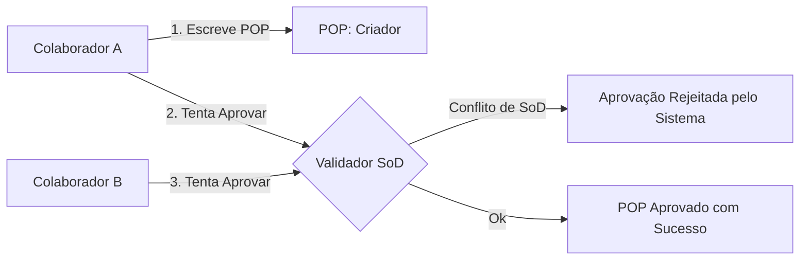

# OMOC 06 — Integração IAM & RBAC (IAM & RBAC Integration) — OMOC

Este documento especifica as regras de permissões hierárquicas, propagação de escopos de acessos e políticas de Segregação de Funções (SoD) integradas ao módulo IAM/RBAC.

---

## 1. PROPAGAÇÃO DE PERMISSÕES POR HERANÇA HIERÁRQUICA

O QualitiOS utiliza um modelo de **Controle de Acesso Baseado em Cargos (Role-Based Access Control - RBAC)** associado à estrutura dinâmica de subordinação do organograma:

*   **Acesso por Posição**: As permissões de sistema (ex: `pop.create`, `incident.approve`, `indicator.edit`) são atribuídas diretamente à entidade `Position` e não ao `Employee`. O colaborador herda as permissões do cargo que está ocupando ativamente.
*   **Herança Hierárquica Descendente**: Um cargo superior (ex: *Gerente Assistencial*) herda automaticamente a visibilidade de dados (permissão de leitura e relatórios) de todos os cargos que pertencem à sua árvore de subordinação direta e matricial (`ReportingLine`). 
    *   *Exemplo*: O *Diretor Técnico* consegue visualizar todos os incidentes abertos por enfermeiros de UTI, médicos do pronto socorro e farmácia, pois todos esses cargos reportam-se direta ou indiretamente à sua vaga no organograma.
*   **Contenção de Escopo (Data Boundaries)**: Colaboradores sem cargos de gestão só visualizam dados de seu próprio setor ou de sua própria autoria. A escalada de visualização de registros de banco ocorre automaticamente navegando pelas chaves da `ReportingLine`.

---

## 2. SEGREGAÇÃO DE FUNÇÕES (SEGREGATION OF DUTIES - SOD)

A fim de atender às exigências de conformidade regulatória (ISO 9001, ONA) e evitar fraudes ou conflitos de interesse, o OMOC e o IAM impõem regras estritas de **Segregação de Funções (SoD)** em tempo de execução:

### 2.1. Regras de SoD do ECM (Gestão de POPs)
*   **Regra**: O colaborador que criou ou revisou o texto de um Procedimento Operacional Padrão (`pop.autor`) está terminantemente impedido pelo sistema de figurar como aprovador (`pop.aprovador`) do mesmo documento, mesmo que o seu cargo (`Position`) possua a permissão de aprovação geral do setor. O fluxo exige no mínimo duas assinaturas de CPF diferentes.

### 2.2. Regras de SoD de Riscos & Ocorrências (CAPA)
*   **Regra**: O colaborador que cadastrou uma ocorrência/incidente assistencial adversa (`incidente.relator`) ou esteve envolvido diretamente na falha não pode atuar como auditor responsável pela investigação de causa-raiz (Ishikawa) ou pela aprovação do plano de ação corretiva (CAPA).

### 2.3. Validação Dinâmica de Conflito de Cargos
*   O sistema impede que um colaborador acumule ocupações de cargo (`PositionAssignment`) conflitantes. 
    *   *Exemplo*: O colaborador não pode ocupar simultaneamente o cargo de *Técnico de Bancada Laboratorial* (Executor) e *Auditor Clínico Laboratorial* (Validador de sua própria entrega). O painel de RH barra o salvamento de acumulações que violem a matriz SoD corporativa parametrizada.
