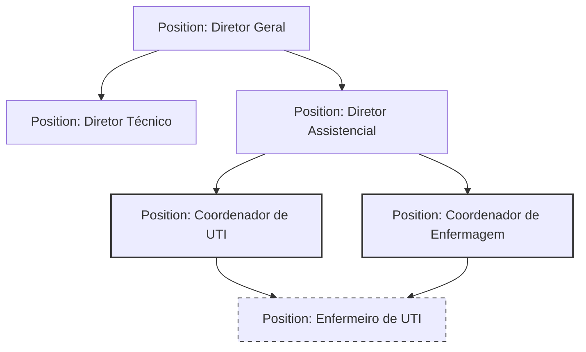

# OMOC 03 — Modelo de Organograma (Org Chart Model) — OMOC

Este documento especifica a modelagem da árvore de hierarquias, matriz funcional, substituições, interinidades e terceirizações no domínio OMOC.

---

## 1. ESTRUTURA DE HIERARQUIA & ÁRVORE ORGANIZACIONAL

A árvore hierárquica do organograma é baseada em nós de cargo (`Position`) e linhas de reporte (`ReportingLine`).

---

## 2. MECANISMOS AVANÇADOS DE REPORTES E MÚLTIPLAS UNIDADES

### 2.1. Hierarquia Direta vs. Matriz Funcional (Matrix Reporting)
O organograma suporta dois tipos de subordinação representados pela coluna `tipo_linha` em `ReportingLine`:
*   **DIRETA (Solid Line)**: Subordinação hierárquica e administrativa principal (ex: contratação, demissão, avaliação de metas e aprovação de férias). Uma `Position` só pode possuir **uma** linha de reporte direta para outra superior (estrutura de árvore estrita).
*   **MATRICIAL (Dotted Line)**: Subordinação funcional ou por projetos (ex: enfermeiro de UTI reporta-se tecnicamente ao coordenador de controle de infecção hospitalar). Uma `Position` pode possuir **múltiplas** linhas de reporte matriciais.

### 2.2. Atuação em Múltiplas Unidades (Multi-Unit Ocupation)
Um colaborador (`Employee`) pode estar vinculado a múltiplos departamentos ou unidades físicas.
*   *Mapeamento*: Em vez de duplicar o cadastro do colaborador, a arquitetura permite a criação de **Ocupações de Cargos (Position Assignments)**. O colaborador possui uma ocupação principal (Primary Assignment) e pode acumular ocupações secundárias (Secondary Assignments) em outros setores ou unidades.

---

## 3. SUBSTITUIÇÕES, INTERINIDADES E TERCEIRIZADOS

### 3.1. Substituições Temporárias (Delegation / Substitutes)
*   **Objetivo**: Evitar o congelamento de fluxos de aprovação do BPM e ECM quando um gestor se ausenta (férias, congressos, afastamentos).
*   **Modelo de Dados**: Entidade `PositionSubstitute`
    *   *Atributos*: `id` (UUID), `original_position_id` (UUID), `substitute_employee_id` (UUID), `data_inicio` (Date), `data_fim` (Date), `status` (Enum: AGENDADA, ATIVA, EXPIRADA), `escopo` (Enum: TOTAL, APENAS_BPM, APENAS_ECM).
*   **Comportamento**: Durante a vigência da substituição, as notificações e tarefas pendentes do cargo são enviadas tanto para o titular quanto para a fila de trabalho do substituto.

### 3.2. Interinidades (Interim Management)
*   **Objetivo**: Um colaborador assume interinamente um cargo de liderança vago ou com titular afastado por longo prazo, herdando as permissões e o reporting superior.
*   **Modelo de Dados**: Atribuição da ocupação de cargo (`PositionAssignment`) com a flag `interino = true`. O colaborador mantém seu cargo de origem, mas acumula ativamente o cargo interino. O sistema herda as permissões hierárquicas dinâmicas de aprovação associadas ao cargo superior enquanto durar a interinidade.

### 3.3. Colaboradores Terceirizados (Contractors)
*   **Objetivo**: Rastrear e gerenciar acessos de prestadores de serviço e cooperados, impondo limites rígidos de tempo de contrato.
*   **Regras de Domínio**:
    *   Colaboradores marcados com `tipo_vinculo = TERCEIRIZADO` ou `PRESTADOR` possuem data de término de contrato mandatória no banco de dados.
    *   Atingida a data de término sem renovação registrada, o status do colaborador é alterado automaticamente para `Inativo` por um processo de background, bloqueando o acesso de login (IAM/RBAC) e as tarefas associadas.
