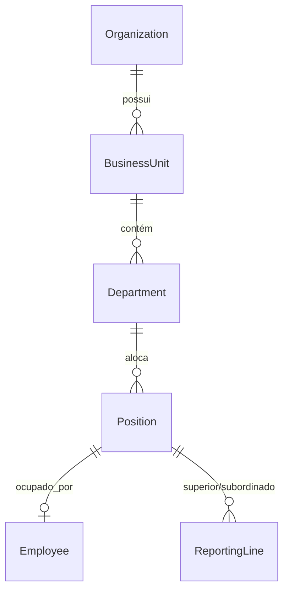

# OMOC 02 — Modelo Organizacional (Organization Model) — OMOC

Este documento especifica a modelagem relacional lógica, o zoneamento de agregados, a propriedade de leitura/escrita e os relacionamentos do domínio **Organization Management & Org Chart (OMOC)**.

---

## 1. ZONEAMENTO DE AGREGADOS (AGGREGATE BOUNDARIES)

A fim de garantir a consistência transacional da estrutura corporativa, o domínio OMOC divide-se em um único agregado principal liderado pela entidade raiz `Organization`:

```text
Agregado: Organization (Aggregate Root)
├── BusinessUnit (Entidade)
├── Department (Entidade)
├── Position (Entidade)
├── Employee (Entidade)
└── ReportingLine (Entidade)
```

---

## 2. ESPECIFICAÇÃO DAS ENTIDADES

### 2.1. Organization
*   **Descrição**: Representa a corporação ou o cliente institucional (tenant principal).
*   **Atributos**: `id` (UUID), `nome_fantasia` (String), `razao_social` (String), `cnpj` (String), `tenant_id` (UUID), `criado_em` (Timestamp).

### 2.2. BusinessUnit (Unidade de Negócio)
*   **Descrição**: Representa as filiais físicas ou divisões geográficas (ex: Hospital Zona Sul, Ambulatório Norte).
*   **Atributos**: `id` (UUID), `organization_id` (UUID), `nome` (String), `cnpj_filial` (String), `cidade` (String), `status` (Enum: ATIVA, INATIVA).

### 2.3. Department (Departamento / Setor)
*   **Descrição**: Divisões funcionais e operacionais internas da unidade (ex: Enfermagem UTI, Farmácia Central, Financeiro).
*   **Atributos**: `id` (UUID), `business_unit_id` (UUID), `nome` (String), `codigo_setor` (String, unique), `centro_custo` (String).

### 2.4. Position (Cargo / Posto de Trabalho)
*   **Descrição**: A vaga ou função abstrata alocada a um departamento (ex: Coordenador de UTI, Técnico de Enfermagem). 
*   **Decisão de Arquitetura**: **O cargo (`Position`) é o detentor de permissões e relatórios, não o colaborador diretamente**. Se um colaborador se desliga, o organograma e os workflows do BPM não se quebram; apenas a ocupação daquela vaga fica em aberto.
*   **Atributos**: `id` (UUID), `department_id` (UUID), `titulo` (String), `cbo` (Código Brasileiro de Ocupação), `nivel_hierarquico` (Int), `limite_ocupantes` (Int).

### 2.5. Employee (Colaborador / Ocupante)
*   **Descrição**: A pessoa física que ocupa uma `Position`.
*   **Atributos**: `id` (UUID), `position_id` (UUID, nullable), `nome` (String), `cpf` (String, unique), `matricula` (String, unique), `email` (String, unique), `tipo_vinculo` (Enum: CLT, PRESTADOR, TERCEIRIZADO), `data_admissao` (Date).

### 2.6. ReportingLine (Linha de Subordinação)
*   **Descrição**: A ligação de dependência hierárquica no organograma.
*   **Decisão de Arquitetura**: **As linhas de subordinação ligam `Position` a `Position`** (ex: O cargo de *Enfermeiro Assistencial* reporta-se ao cargo de *Coordenador de UTI*).
*   **Atributos**: `id` (UUID), `parent_position_id` (UUID, superior), `child_position_id` (UUID, subordinado), `tipo_linha` (Enum: DIRETA, MATRICIAL).

---

## 3. RELACIONAMENTOS E INTEGRIDADE DE DADOS



*   **Organization ➔ BusinessUnit**: Cardinalidade 1-para-N. A exclusão de uma organização deleta em cascata suas unidades.
*   **BusinessUnit ➔ Department**: Cardinalidade 1-para-N.
*   **Department ➔ Position**: Cardinalidade 1-para-N.
*   **Position ➔ Employee**: Cardinalidade 1-para-N (um cargo de "Enfermeiro Assistencial" pode ser ocupado por múltiplos colaboradores).
*   **ReportingLine**: Tabela associativa auto-relacionada ligando duas `Position` para desenhar a árvore hierárquica.

---

## 4. OWNERSHIP E SEGREGACÃO MULTI-TENANT

*   **Escrita (Write)**: Exclusiva do domínio OMOC via controllers do backend. Sistemas de RH externos escrevem apenas através do UIH que traduz e dispara os casos de uso de OMOC.
*   **Leitura (Read)**: Permissão ampla para todos os domínios do QualitiOS (LMS consome setores e cargos para matricular alunos; BPM consome cargos para delegar tarefas; IAM consome cargos para aplicar herança de acessos).
*   **Multi-Tenancy**: A coluna `tenant_id` reside na tabela master `Organization`. Todas as tabelas dependentes (`ate_business_unit`, `ate_department`, `ate_position`, `ate_employee`) realizam JOIN implícito com `Organization` ou replicam a coluna `tenant_id` para filtragem segura e performática via banco.
