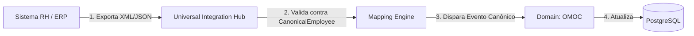

# OMOC 07 — Integração UIH (UIH Integration) — OMOC

Este documento especifica a integração do domínio OMOC com sistemas externos (ERP, RH, HIS, CRM) utilizando o **Universal Integration Hub (UIH)**.

---

## 1. PIPELINES DE INGESTÃO ORGANIZACIONAL (INBOUND PIPELINES)

O QualitiOS utiliza o UIH como gateway exclusivo para receber atualizações da estrutura corporativa do cliente, evitando o acoplamento direto com bancos de dados de RH ou sistemas proprietários de ERP (Senior, TOTVS, SAP).

---

## 2. MAPEAMENTO DE ENTIDADES EXTERNAS (UIH INBOUND MAPPING)

O UIH é configurado com pipelines específicos mapeados para as tabelas canônicas do OMOC:

### 2.1. Ingestão de Colaboradores e Cargos
*   **Entrada de Origem**: Payload JSON/XML exportado periodicamente pelo sistema de folha de pagamento do RH.
*   **Mapeamento Canônico**:
    *   `CanonicalEmployee` ➔ Cria ou atualiza registros de colaboradores (`Employee`).
    *   `CanonicalPosition` ➔ Cria vagas de postos de trabalho (`Position`), vinculando-as aos departamentos.
*   **Lógica de Sincronismo**: Executado em lote delta diário (Batch Delta) na madrugada, lendo apenas colaboradores modificados nas últimas 24 horas (`dt_modificacao > last_sync_at`).

### 2.2. Ingestão de Estruturas de Departamentos
*   **Entrada de Origem**: Cadastro de centros de custo e divisões contábeis vindos do ERP.
*   **Mapeamento Canônico**:
    *   `CanonicalDepartment` ➔ Atualiza a árvore de setores (`Department`).
*   **Lógica de Sincronismo**: Sincronismo semanal ou sob demanda (Webhooks), uma vez que a criação de novos departamentos na organização é de baixa frequência.

---

## 3. ORQUESTRACÃO DE EVENTOS DE TRANSIÇÃO (HR EVENTS TRIGGERS)

Quando o UIH processa e insere dados canônicos organizacionais, o barramento de integração do QualitiOS é acionado com eventos específicos de ciclo de vida de pessoal:

1.  `omoc.employee.hired` (Contratação)
    *   *Ação*: Dispara a rotina de criação de credenciais de login e e-mail no IAM/RBAC. Aciona o LMS para iniciar a trilha obrigatória de boas-vindas do novo setor.
2.  `omoc.employee.moved` (Promoção/Transferência)
    *   *Ação*: Atualiza as permissões de acesso do colaborador, remove-o de filas antigas do BPM e altera sua assinatura eletrônica no ECM.
3.  `omoc.employee.terminated` (Desligamento)
    *   *Ação*: Suspende o login do colaborador no mesmo segundo, limpa a ocupação da vaga (`Position`) e redireciona todas as pendências operacionais para o gerente imediato da `ReportingLine`.
