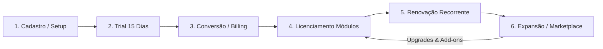

# PAL 09 — Arquitetura de Negócio (Business Architecture) — PAL

Este documento especifica a Arquitetura de Negócio e o Fluxo de Valor (Value Stream) SaaS do módulo **Platform Administration & Licensing (PAL)**.

---

## 1. O FLUXO DE VALOR DO CLIENTE SAAS (SAAS CUSTOMER VALUE STREAM)

O PAL gerencia a jornada de relacionamento comercial e operacional do cliente na plataforma QualitiOS desde o primeiro contato até a maturidade e expansão de consumo:

---

## 2. ETAPAS DETALHADAS DO FLUXO (STAGES DETAILS)

### Stage 1: Cadastro / Setup
*   **Descrição**: O cliente institucional realiza o cadastro inicial no portal público da Qualiti.
*   **Ações de Sistema**:
    1.  Cria o registro do `Tenant` definindo seu subdomínio exclusivo (ex: `santacasa.qualitios.com`).
    2.  Instancia a conta do `Customer Admin` inicial.
    3.  Aplica o script de semente de dados básico no PostgreSQL.

### Stage 2: Trial (Período de Teste)
*   **Descrição**: O tenant é inicializado em ambiente de testes gratuito por 15 dias.
*   **Ações de Sistema**:
    1.  Instancia a `Subscription` com status `TRIAL` associada ao Plano Básico.
    2.  Habilita Feature Flags básicas de funcionamento (`feature:governanca:core`).
    3.  Aplica limites de cotas de segurança (máximo de 5 usuários e 20 POPs).

### Stage 3: Conversão / Billing (Faturamento)
*   **Descrição**: O cliente insere os dados de pagamento antes ou no término do prazo de Trial.
*   **Ações de Sistema**:
    1.  Altera o status da `Subscription` para `ACTIVE`.
    2.  Registra o contrato de serviço (`Contract`) associado.
    3.  Gera a primeira fatura (`Invoice`) de cobrança recorrente.

### Stage 4: Licenciamento de Módulos (License Provisioning)
*   **Descrição**: Ativação dos recursos e produtos contratados na assinatura.
*   **Ações de Sistema**:
    1.  Grava registros na tabela `License` para cada módulo assinado (LMS, BPM, Riscos, etc.).
    2.  Atualiza as Feature Flags correspondentes no banco de dados (`is_enabled = true`).
    3.  A barra lateral de menus (sidebar) do usuário é reconstruída dinamicamente refletindo os novos módulos disponíveis.

### Stage 5: Renovação Recorrente (Recurrent Renewal)
*   **Descrição**: Manutenção da adimplência contratual mensal ou anual.
*   **Ações de Sistema**:
    1.  O motor de billing gera uma nova `Invoice` 7 dias antes do vencimento do período.
    2.  Confirmado o pagamento do gateway financeiro, a data de expiração da licença é prorrogada por mais um período.
    3.  Em caso de inadimplência superior a 5 dias, o status da assinatura muda para `SUSPENDED`, bloqueando acessos automaticamente.

### Stage 6: Expansão de Módulos / Marketplace
*   **Descrição**: O cliente adquire novos recursos avançados (Add-ons) ou estende cotas de usuários.
*   **Ações de Sistema**:
    1.  O `Customer Admin` entra na loja self-service e adquire o módulo *ATE* e o add-on de *Ishikawa Inteligente*.
    2.  Gera uma fatura avulsa proporcional (pró-rata) de cobrança.
    3.  As Feature Flags correspondentes (`feature:ate:core`, `feature:riscos:ishikawa`) são ativadas em tempo real sem interrupção de serviço.
