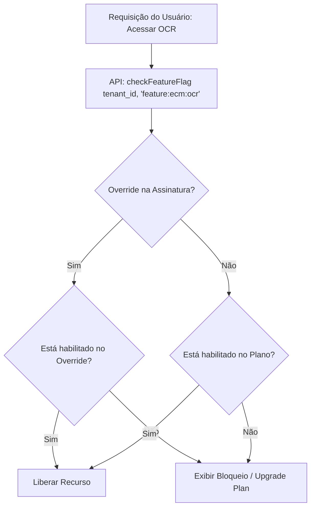

# PAL 04 — Controle de Recursos e Feature Flags (Module & Feature Management) — PAL

Este documento especifica a arquitetura técnica de ativação de recursos, modelagem de Feature Flags e herança de limitações por assinatura no QualitiOS.

---

## 1. MÓDULOS E FEATURES CONTROLADOS

O acesso a recursos da plataforma é granular, controlado por chaves lógicas de identificação de features configuradas nas tabelas de catalogo:

```text
Módulo: ECM (Gestão de Documentos)
├── feature:ecm:core          ➔ Acesso básico a POPs e biblioteca.
└── feature:ecm:ocr           ➔ Ingestão cognitiva de PDFs (Add-on).

Módulo: BPM (Processos & SLAs)
├── feature:bpm:core          ➔ Criação básica de workflows.
├── feature:bpm:sla           ➔ Monitoramento e alarmes de SLA (Add-on).
└── feature:bpm:integration   ➔ Callbacks HTTPS externos em transições (Add-on).

Módulo: ATE (Diagnósticos e Planos)
├── feature:ate:core          ➔ Questionários de capabilities.
└── feature:ate:roadmap       ➔ Geração autônoma de planos por IA (Add-on).
```

---

## 2. ARQUITETURA DE FEATURE FLAGS E OVERRIDES

As Feature Flags determinam se um recurso de código físico está habilitado ou bloqueado para o tenant em tempo de execução.



### 2.1. Tabela de Mapeamento de Configuração: `platform_feature_flags`
*   **Campos**: `id` (UUID), `tenant_id` (UUID), `feature_code` (String, unique key, ex: `feature:ecm:ocr`), `is_enabled` (Boolean), `custom_limits` (JSONB, ex: `{"max_uploads_per_month": 50}`).

### 2.2. Lógica de Herança e Sobrescrita (Override Priority)
Ao verificar se uma funcionalidade está ativa, a camada de aplicação executa a seguinte prioridade de busca:
1.  **Nível 1: Override por Tenant** (Tabela `platform_feature_flags` filtrada por `tenant_id`): Permite habilitar recursos de forma customizada ou vender add-ons isolados para clientes específicos sem alterar o plano base.
2.  **Nível 2: Limites do Plano** (Configuração do `Plan` vinculado à `Subscription` ativa do tenant): Se não houver override cadastrado para o tenant, as flags assumem o padrão definido no plano contratado.

### 2.3. Asserção Lógica de Código
A API utilitária expõe a assinatura para verificação rápida de acessos:
```typescript
function checkFeatureFlag(tenantId: string, featureCode: string): boolean
```
Se a flag retornar `false`, as controllers do backend barram a execução da rota de API retornando `HTTP 403 Forbidden` com a mensagem indicando a necessidade de contratação ou upgrade de plano.
