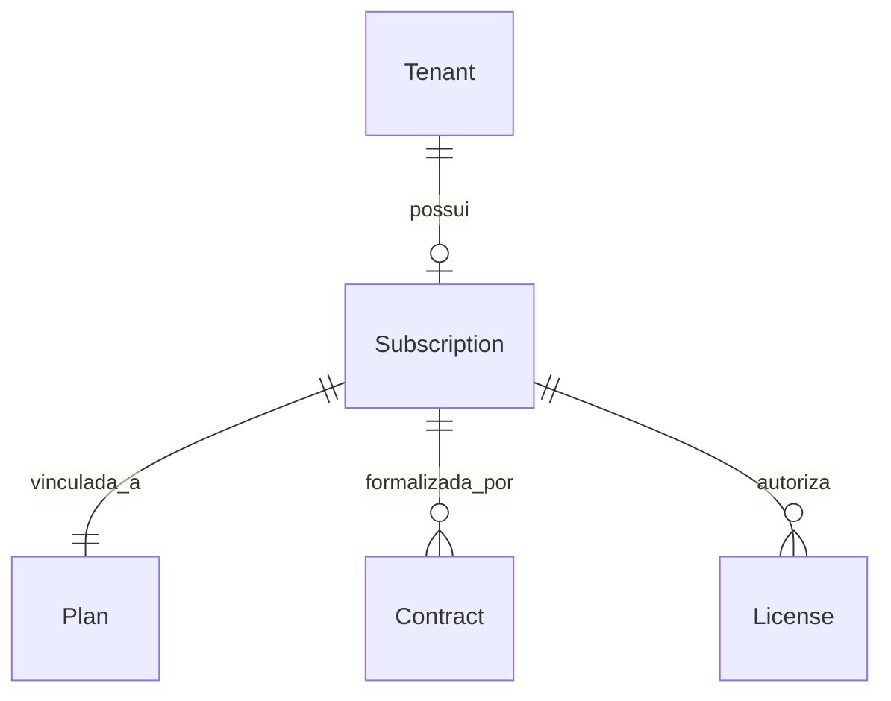
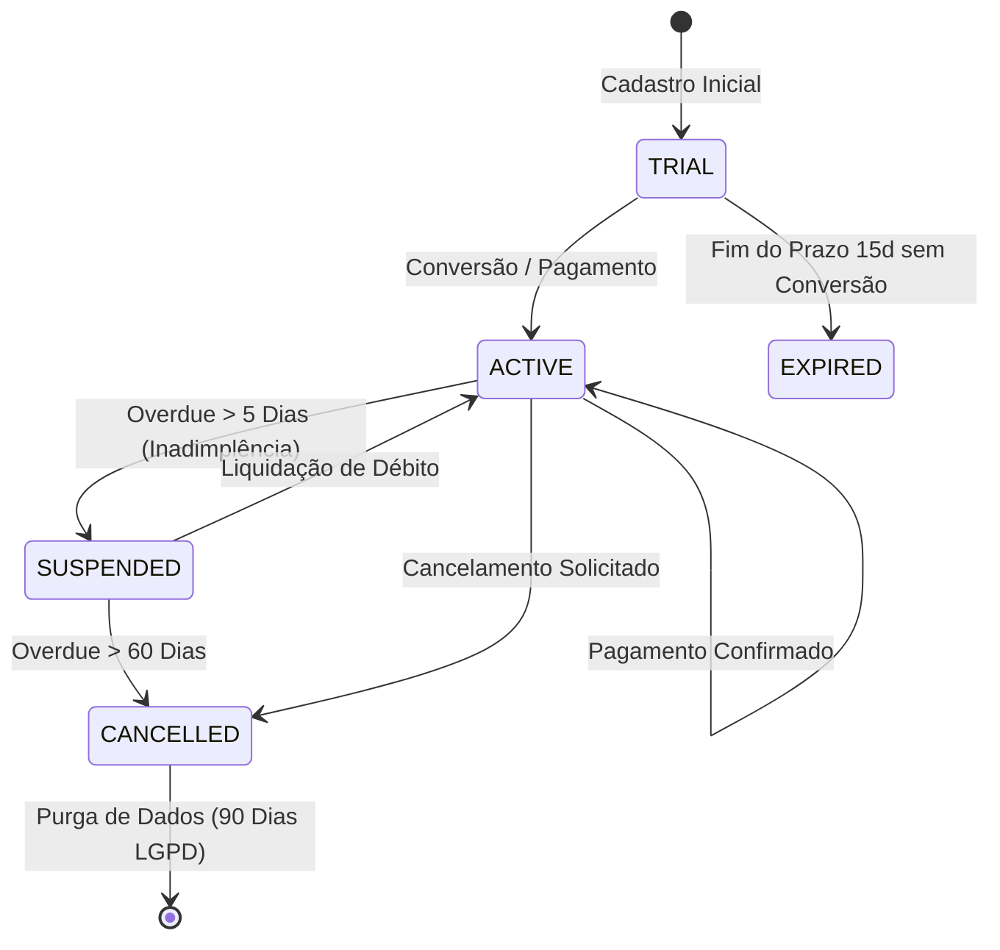

# PAL 03 — Assinaturas e Tenants (Tenant & Subscription Model) — PAL

Este documento especifica a modelagem relacional do ciclo de vida comercial dos tenants, planos de assinatura, contratos e licenças de software no QualitiOS.

---

## 1. ESPECIFICAÇÃO DAS ENTIDADES SAAS

### 1.1. Tenant
*   **Descrição**: O cliente institucional isolado na plataforma (ex: Rede Hospitalar Santa Rita).
*   **Atributos**: `id` (UUID), `identificador_subdominio` (String, unique, ex: `santarita.qualitios.com`), `status` (Enum: ATIVO, SUSPENSO, EM_DESATIVACAO, CANCELADO), `dados_faturamento` (JSONB), `criado_em` (Timestamp).

### 1.2. Plan (Plano de Assinatura)
*   **Descrição**: Modelo comercial que agrupa cotas, limites e preços base.
*   **Atributos**: `id` (UUID), `nome` (String, ex: Plano Premium Saúde), `preco_base` (Decimal), `limite_usuarios` (Int), `limite_documentos` (Int), `modulos_inclusos` (JSONB, array de UUIDs de módulos), `periodicidade` (Enum: MENSAL, ANUAL).

### 1.3. Subscription (Assinatura Ativa)
*   **Descrição**: A instância comercial que liga o Tenant ao seu Plano vigente.
*   **Atributos**: `id` (UUID), `tenant_id` (UUID), `plan_id` (UUID), `status` (Enum: TRIAL, ATIVA, SUSPENSA, EXPIRADA, CANCELADA), `data_inicio` (Date), `data_proxima_cobranca` (Date).

### 1.4. Contract (Contrato Jurídico)
*   **Descrição**: Metadados do contrato de prestação de serviços assinado entre a Qualiti e o cliente.
*   **Atributos**: `id` (UUID), `subscription_id` (UUID), `numero_contrato` (String), `url_documento_assinado` (String), `data_assinatura` (Date), `reajuste_indice` (String).

### 1.5. License (Licença de Software)
*   **Descrição**: Registro de autorização lido pelas controllers do backend do QualitiOS para validar acessos funcionais a módulos.
*   **Atributos**: `id` (UUID), `subscription_id` (UUID), `modulo_uuid` (UUID), `data_validade` (Date), `status` (Enum: ATIVA, INATIVA).

---

## 2. CICLO DE VIDA DA ASSINATURA (SUBSCRIPTION LIFECYCLE)

O status da `Subscription` dita o comportamento de acessos físicos do tenant ao QualitiOS através de transições automáticas de estados gerenciadas por rotinas diárias:

*   **TRIAL (Período de Teste)**:
    *   *Regra*: Duração estrita de 15 dias. Limitações operacionais ativas (máximo de 5 usuários ativos).
*   **ACTIVE (Ativa/Adimplente)**:
    *   *Regra*: Acesso total liberado conforme módulos e features contratados na licença.
*   **SUSPENDED (Suspensa)**:
    *   *Regra*: Ocorre automaticamente após 5 dias de atraso no pagamento da fatura. O sistema bloqueia o login de todos os colaboradores, exceto do `Customer Admin`, que é redirecionado exclusivamente à tela de faturamento para regularização.
*   **CANCELLED (Cancelada)**:
    *   *Regra*: Bloqueio total de logins. Os dados são mantidos em modo de leitura offline para o DPO por 90 dias (para cumprir obrigações legais da LGPD) e purgados em definitivo após este prazo.
