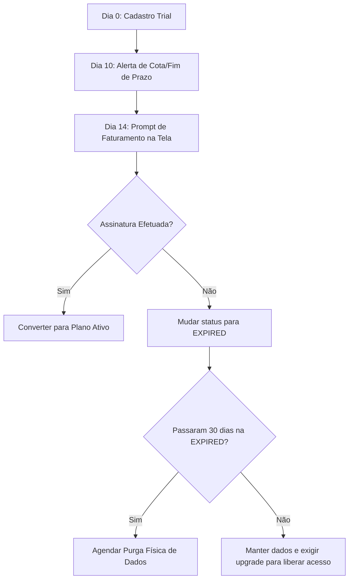

# PAL 07 — Programas de Trial, Freemium e Beta (Trial & Beta Program Model) — PAL

Este documento especifica a configuração de ambientes de demonstração (Trials), controle de programas Beta e modelos Freemium no QualitiOS, com foco na conversão automatizada de leads em clientes pagantes.

---

## 1. AMBIENTES DE SANDBOX E LIMITAÇÕES OPERACIONAIS

Para permitir a experimentação da plataforma mantendo controle de custos e infraestrutura:

| Parâmetro | Trial (Avaliação Grátis) | Freemium (Uso Básico) | Beta (Recursos Experimentais) |
| :--- | :--- | :--- | :--- |
| **Duração** | 15 dias corridos. | Indeterminada (Vitalícia). | Duração do programa de teste. |
| **Limite de Usuários** | Máximo de 5 ativos. | Máximo de 3 ativos. | Mapeado por programa (ex: 10). |
| **Limite de Documentos**| Máximo de 20 POPs. | Máximo de 10 POPs. | Conforme necessidade do teste. |
| **Limite de Processos**  | Máximo de 5 ativos. | Bloqueado (BPM inativo). | Mapeado por programa. |
| **Limite de Assessments**| Máximo de 1 concluído. | Bloqueado (ATE inativo). | Mapeado por programa. |
| **Módulos Avançados**  | Bloqueados (UIH, pgvector).| Bloqueados (UIH, ATE, IA). | Ativados se escopo do Beta. |
| **Frequência de Ingestão**| Bloqueada (Ingestão via UIH).| Bloqueada. | Mapeada por programa. |

---

## 2. PROGRAMAS BETA E REGRAS DE ADESÃO (BETA TESTING GOVERNANCE)

O programa **Beta** serve para validar novos módulos (ex: novas engines de IA ou integrações) com um grupo selecionado de clientes reais antes do lançamento comercial global.
*   **Adesão por Convite**: O Platform Owner ativa a flag `beta_enrollment = true` no cadastro do tenant convidado.
*   **Feature Flags Específicas**: Ativação de flags experimentais (ex: `feature:ai:predictive_audit_beta`).
*   **Monitoramento de Erros e Logs**: Ambientes Beta possuem gravação de logs de telemetria mais detalhados no ElasticSearch/PostgreSQL, permitindo que a engenharia identifique erros de performance ou timeouts de LLM de forma proativa.

---

## 3. O FLUXO DE CONVERSÃO AUTOMATIZADO (CONVERSION FUNNEL)

O PAL gerencia as comunicações e o status do tenant durante o período de Trial para incentivar a assinatura:

*   **Alerta do Dia 10**: O sistema envia e-mail automático e exibe banner no topo da barra de tarefas informando que faltam 5 dias para o término do Trial.
*   **Prompt do Dia 14**: A partir do 14º dia, a tela de login exibe de forma destacada o formulário para cadastro de dados de pagamento (Cartão de Crédito / Boleto).
*   **Bloqueio de Expiração (Dia 16)**: Se nenhuma assinatura for ativada até a meia-noite do 15º dia, o status da `Subscription` muda para `EXPIRED`. O login de colaboradores é bloqueado, restando acesso apenas ao `Customer Admin` para reativar a conta por meio do pagamento do plano.
*   **Purga LGPD (Dia 45)**: Após 30 dias no estado de `EXPIRED` sem manifestação de compra do cliente, os dados do tenant são enfileirados para purga total e exclusão física, em conformidade com as regras de higienização de banco.
