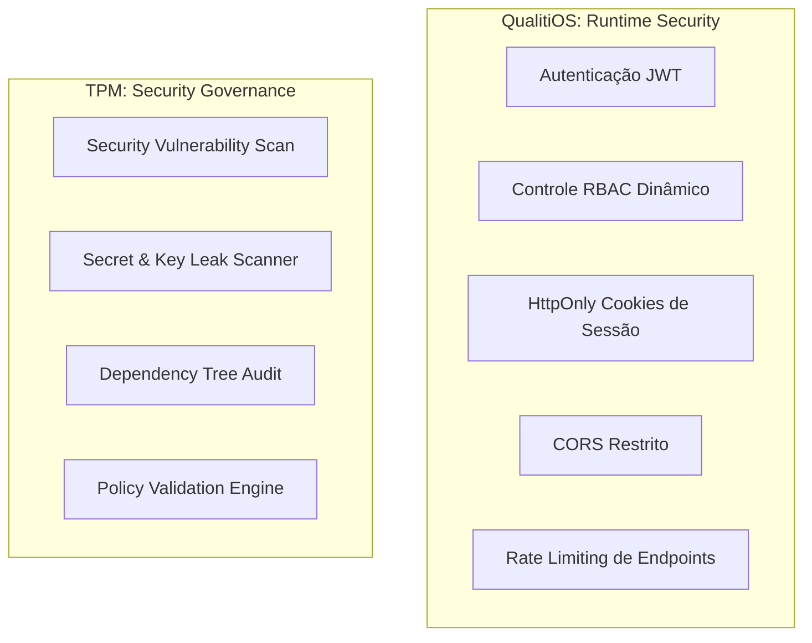
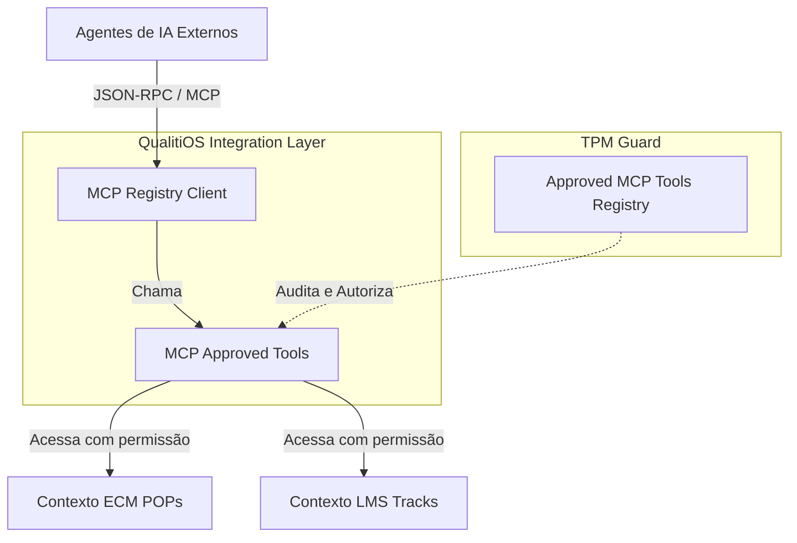

# Target Architecture & TPM Alignment (V2) — QualitiOS (TO-BE Architecture)

Este documento define a Arquitetura Alvo (TO-BE) do **QualitiOS** em alinhamento completo com o **TPM (Trusted Cognitive Platform)**. A arquitetura estabelece as diretrizes de evolução do produto para os próximos anos, pautada nos princípios de Domain-Driven Design (DDD), evolução incremental (*Evolution over Rewrite*) e governança de confiança externa baseada em conformidade contínua de engenharia e segurança.

---

## 1. ECOSYSTEM ARCHITECTURE (Arquitetura do Ecossistema)

O ecossistema de software é dividido em duas camadas conceituais e físicas totalmente independentes: a camada de execução de negócios (QualitiOS) e a camada de governança e validação de confiança (TPM).

```mermaid
graph TD
    subgraph TPM_Layer [Camada Externa: TPM Governance Platform]
        ArchGuard[Architecture Validator]
        SecGuard[Security & Secret Scanner]
        DepGuard[Dependency Inspector]
        AIGuard[AI Governance Validator]
        HygieneGuard[Hygiene Scanner]
        ComplianceGuard[Engineering Compliance]
        AuditRegistry[Audit Registry]
    end

    subgraph QualitiOS_Runtime [Camada de Execução: QualitiOS Runtime]
        NextFE[Next.js App Router Frontend]
        FastifyBE[Fastify Backend API]
        Postgres[(PostgreSQL Consolidado)]
    end

    %% Relações de Validação (TPM -> QualitiOS)
    ArchGuard -.->|Valida Bounded Contexts e Clean Arch| FastifyBE
    SecGuard -.->|Varre vulnerabilidades e CORS| FastifyBE
    DepGuard -.->|Audita dependências de terceiros| FastifyBE
    AIGuard -.->|Valida prompts, MCPs e LLMs| FastifyBE
    HygieneGuard -.->|Mapeia código morto e acoplamentos| FastifyBE
    ComplianceGuard -.->|Garante padrões de engenharia| QualitiOS_Runtime
    
    %% Relações de Escrita de Log no TPM
    ArchGuard & SecGuard & DepGuard & AIGuard & HygieneGuard & ComplianceGuard --> AuditRegistry
```



### 1.1. Responsabilidades da Camada TPM (Trusted Cognitive Platform)
O TPM atua estritamente como um **agente de governança externa**. Ele **não gera código-fonte** e **não participa da execução das regras de negócio do QualitiOS**. Sua responsabilidade exclusiva é analisar, auditar e certificar continuamente o repositório em busca de desvios técnicos, de conformidade, segurança e qualidade de software.

### 1.2. Responsabilidades da Camada QualitiOS
O QualitiOS é a **camada de execução em tempo real (Runtime)**. É o produto de negócio responsável por expor as interfaces visuais, processar regras de conformidade e governança hospitalar, persistir dados transacionais no PostgreSQL, rodar workflows (BPM), trilhas de LMS, OKRs, incidentes e gerenciar sessões e privilégios de acesso (RBAC).

---

## 2. TRUSTED GOVERNANCE ARCHITECTURE (Validação do TPM)

O TPM implementa sete pilares contínuos de validação de confiança sobre o ciclo de vida do QualitiOS:

1.  **Architecture Validation (Validação Arquitetural)**: Fiscaliza se o código respeita rigorosamente o desacoplamento de Bounded Contexts e as camadas de Clean Architecture na V2 do backend (Controllers ➔ Services ➔ Repositories), impedindo o surgimento de consultas diretas de banco (SQL Raw) em endpoints.
2.  **Security Validation (Validação de Segurança)**: Verifica a presença de credenciais expostas (secrets hardcoded), arquivos de chaves expostos no Git, configurações permissivas (como wildcard no CORS) ou pacotes vulneráveis conhecidos.
3.  **Dependency Validation (Validação de Dependências)**: Monitora a cadeia de suprimentos de software no `package.json`, bloqueando o uso de bibliotecas de terceiros que possuam falhas de segurança críticas ou licenças restritivas incompatíveis com o ambiente enterprise.
4.  **Hygiene Validation (Higiene de Código)**: Localiza e aponta código morto/órfão, duplicações de lógica, acoplamentos indevidos entre módulos e arquivos vazios sem lógica funcional (degradação arquitetural).
5.  **AI Governance (Governança de IA)**: Audita os prompts críticos enviados às LLMs, a parametrização de temperatura/segurança dos modelos, o uso do Model Context Protocol (MCP) e o alinhamento ético das respostas simuladas e reais.
6.  **Compliance Validation (Conformidade de Engenharia)**: Garante que diretrizes técnicas (padrões de codificação, nomenclatura de banco, etc.) sejam respeitadas, exigindo que nenhuma alteração arquitetural significativa suba para produção sem passar no crivo da esteira do TPM.
7.  **Audit Validation (Registro de Auditoria)**: Produz registros imutáveis e relatórios de auditoria que atestam a integridade e conformidade técnica da aplicação perante auditorias de regulação de mercado.

---

## 3. SECURITY ARCHITECTURE (Segurança: Runtime vs. Governança)

A segurança do ecossistema é dividida de forma clara entre a execução transacional (QualitiOS) e a validação contínua (TPM):



### 3.1. Runtime Security (Responsabilidade do QualitiOS)
Ações operacionais que rodam em tempo real para proteger a sessão e os dados dos usuários:
*   Autenticação por token assinado (JWT).
*   Segregação de privilégios de rotas e menus (RBAC) com base em cargos e setores.
*   Tráfego seguro de sessões através de **HttpOnly, Secure e SameSite=Strict Cookies**, blindando a sessão contra XSS.
*   Bloqueio de chamadas cross-origin através de políticas restritas de **CORS** parametrizadas no `.env`.
*   Middleware de **Rate Limiting** para prevenir negação de serviço (DoS) e ataques de força bruta.

### 3.2. Security Governance (Responsabilidade do TPM)
Ações externas de verificação de qualidade e regras de segurança na esteira de desenvolvimento:
*   *Security Scan*: Varredura em código em busca de injeções (SQL Injection, XSS no código).
*   *Secret Scan*: Bloqueio automático de commits contendo chaves privadas, senhas de banco ou secrets vazadas.
*   *Dependency Audit*: Varredura automatizada contra vulnerabilidades da cadeia de dependências NPM.
*   *Policy Validation*: Validação de políticas de segurança de infraestrutura (docker-compose, Caddyfile).

---

## 4. AI ARCHITECTURE & GOVERNANCE VISION (Evolução da IA)

```text
┌────────────────────────────────────────────────────────┐
│               TPM (AI GOVERNANCE LAYER)                │
│  Valida Prompts, Parâmetros, Acurácia de RAG e MCPs   │
└──────────────────────────┬─────────────────────────────┘
                           │ Valida e Audita
                           ▼
┌────────────────────────────────────────────────────────┐
│            QUALITIOS (AI CAPABILITIES LAYER)           │
│  Capacidades Transversais de IA nos Módulos de Negócio  │
│  ┌───────────┐ ┌───────────┐ ┌───────────┐ ┌─────────┐ │
│  │ Compliance│ │ Educação  │ │ Documentos│ │ Riscos  │ │
│  │ (OCR/ONA) │ │(Recomend.)│ │ (Resumos) │ │ (Ishik) │ │
│  └───────────┘ └───────────┘ └───────────┘ └─────────┘ │
└────────────────────────────────────────────────────────┘
```

### 4.1. IA como Capacidade Transversal (QualitiOS)
A inteligência artificial no QualitiOS não é um módulo isolado, mas sim uma **Capacidade Transversal** integrada nativamente às regras de negócios das verticais suportadas:
*   **Compliance**: OCR em PDFs de laudos sanitários e validação sintática automatizada de evidências com base nas matrizes da ONA.
*   **Educação**: Análise inteligente de notas dos quizzes do LMS e recomendação personalizada de trilhas de conhecimento para correção de gaps.
*   **Documentos (ECM)**: Análise de impacto regulatório e resumos automáticos de mudanças em POPs.
*   **Riscos (CAPA)**: Categorização de incidentes clínicos reportados e preenchimento sugestivo das causas no Ishikawa.

### 4.2. Governança de IA (Responsabilidade do TPM)
O TPM valida e audita o uso dessas inteligências transversais:
*   Verificação da integridade de prompts críticos de sistema para evitar injeções de prompt (*Prompt Injection*).
*   Avaliação da taxa de acurácia e viés de respostas do RAG (Retrieval-Augmented Generation) com base em dicionários de referência.
*   Monitoramento das conexões de LLMs a bancos vetoriais (`pgvector` no PostgreSQL).

---

## 5. MCP ARCHITECTURE (Model Context Protocol como Integração)

O **Model Context Protocol (MCP)** não representa a arquitetura de persistência ou controle do QualitiOS. O MCP é tratado estritamente como um **Mecanismo de Integração** bidirecional entre agentes cognitivos de IA e a plataforma:



### 5.1. MCPs Internos (Lógica da Plataforma)
Mecanismos que conectam o backend do QualitiOS a utilitários de IA internos da corporação para automação de tarefas, como leitura de arquivos locais de POPs em formato PDF.

### 5.2. MCPs Externos (Lógica de Interoperabilidade)
Conectores que permitem que agentes inteligentes interajam com APIs e sistemas externos (como os Prontuários Eletrônicos - EHR de mercado ou bases de dados de epidemiologia de saúde pública).

### 5.3. MCPs Aprovados pelo TPM (Segurança de Integração)
Toda ferramenta exposta via protocolo MCP pelo QualitiOS deve constar no registro de **MCPs Aprovados pelo TPM**. O TPM audita essas integrações para garantir:
*   Ausência de vazamento de credenciais ou tokens de API.
*   Restrição rígida de escrita, impedindo que agentes de IA realizem modificações diretas no banco de dados sem passar pelos fluxos e regras de validação transacionais do QualitiOS.
*   Aderência aos esquemas JSON-RPC definidos no manifesto de interoperabilidade.

---

## 6. Target Architecture Overview (Visão Geral da Arquitetura Alvo)

A arquitetura alvo evolui de forma modular, promovendo o desacoplamento de serviços e a consolidação de persistência no banco PostgreSQL:

*   **Frontend (Next.js)**: Focado estritamente em interfaces dinâmicas, renderização no lado do servidor (SSR) e comunicação segura via Cookies contra XSS.
*   **Backend (Fastify API)**: Estruturado sob Clean Architecture (módulos ONA, Core, Riscos), orquestrando chamadas e emitindo eventos de domínio de forma assíncrona.
*   **Banco de Dados PostgreSQL Consolidado**: Unificação de esquemas duplicados (tabelas legadas absorvidas pelas tabelas V2 modulares).

---

## 7. Migration Strategy ( KEEP, EVOLVE, CONSOLIDATE, RETIRE, CREATE )

*   **KEEP**: Motor de score de OKRs, quizzes e controle de progresso do LMS, setup inicial do Wizard.
*   **EVOLVE**: Transicionar auth JWT para HttpOnly Cookies, fechar CORS wildcard, implementar orquestração ativa do BPM de transição de status em documentos do ECM e CAPA, e conectar endpoints FHIR à base ativa.
*   **CONSOLIDATE**: Unificar tabelas duplicadas (`incidentes` migrada para `core_ocorrencias` e checklists ONA legados migrados para `ona_diagnosticos`).
*   **RETIRE**: Lógica de mocks de IA por palavra-chave no Fastify, retornos de rotas FHIR estáticas e armazenamento de sessão no localStorage do cliente.
*   **CREATE**: Conector MCP Registry Client, banco de dados vetorial (`pgvector` no Postgres) e barramento interno de eventos assíncronos (`Internal Event Bus`).

---

## 8. Architecture Principles (Princípios Arquiteturais)

1.  **Evolution over Rewrite**: Qualquer evolução técnica deve aproveitar a base de código TypeScript estável da aplicação, preferindo refatorações modulares a reescritas completas.
2.  **Strict Security by Default**: A proteção de dados assistenciais e confidenciais é prioridade absoluta. Dados de pacientes e tokens não devem ficar expostos.
3.  **Core Domain Isolation**: O domínio de Governança deve ser preservado de acoplamento direto com regras clínicas ou regras de negócio específicas das verticais.
4.  **Asynchronous Communication**: A integração entre contextos Bounded Contexts é orientada a eventos assíncronos (Internal Event Bus), evitando lentidão nas APIs.
5.  **Clean Architecture Alignment**: Endpoints novos e refatorações devem respeitar as camadas formais (Clean Architecture) da V2 (Controllers, Services, Repositories).
6.  **Trusted Governance by Design (TPM)**: Nenhuma evolução arquitetural significativa poderá ser aprovada ou integrada no ecossistema do QualitiOS sem passar pela validação e certificação contínua do TPM.
7.  **Security by Validation (TPM)**: Toda configuração de segurança crítica (CORS, HttpOnly Cookies, políticas RBAC e Docker configs) deve ser validada continuamente na esteira do TPM.
8.  **AI by Governance (TPM)**: Toda capacidade de inteligência artificial de RAG ou processamento de LLM e MCP exposta pelo QualitiOS deve possuir governança e auditoria explícita realizada pelo TPM.
