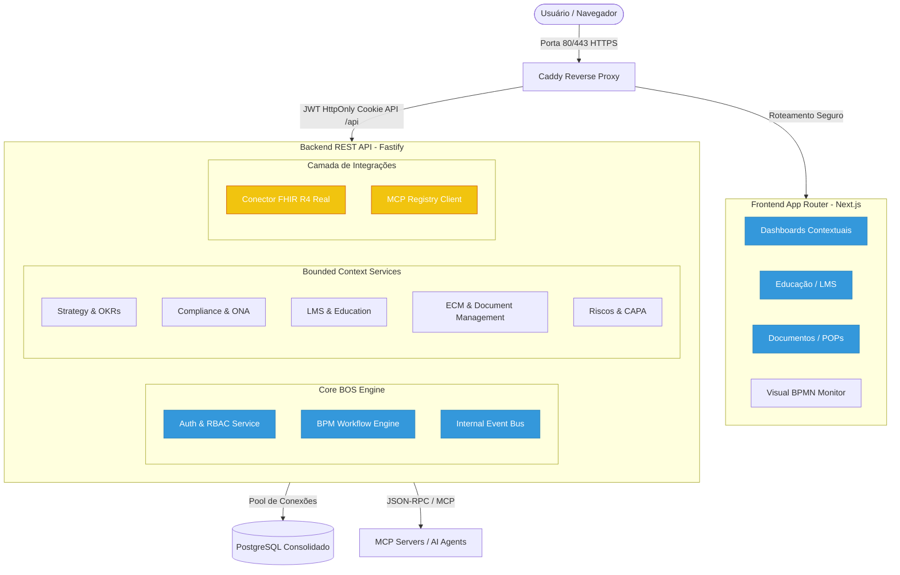
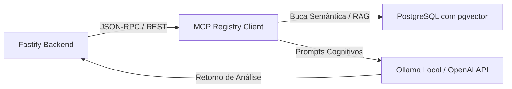
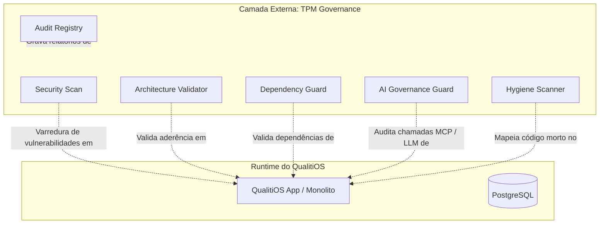

# Target Architecture — QualitiOS (TO-BE Architecture)

Este documento define a Arquitetura Alvo (TO-BE) do **QualitiOS**, estabelecendo as diretrizes de evolução do produto para os próximos anos. Alinhada aos princípios de Domain-Driven Design (DDD), a evolução prioriza a preservação de ativos de alto valor de negócios (LMS, ECM, OKRs) e a eliminação incremental de dívidas técnicas de segurança, acoplamento e redundância de banco de dados, sem requisições de reescrita completa (*Evolution over Rewrite*).

---

## 1. Target Architecture Overview (Visão Geral da Arquitetura Alvo)

A arquitetura alvo promove a transição de um monolito físico rígido com lógicas de dados duplicadas para um **Monolito Modular e Seguro**, desacoplando o frontend (Next.js) do backend (Fastify) de forma lógica, consolidando a persistência no PostgreSQL sob esquemas bem definidos e transicionando as lógicas simuladas de IA para serviços integrados de LLM via MCP (Model Context Protocol).



---

## 2. Domain Architecture (Arquitetura de Domínios)

A Governança permanece como o **Core Domain** da plataforma, atuando como o orquestrador geral das capacidades estratégicas de negócio.

*   **Core Domain (Governança)**: Define as regras de controle, controle de acesso dinâmico (RBAC), e consolidação de escores de conformidade.
*   **Supporting Domains (Estratégia, Compliance, Educação, Conhecimento, Processos, Documentos, Riscos)**: Fornecem capacidades focadas (OKRs, auditorias ONA, LMS, POPs, CAPA), operando como contextos independentes que interagem via barramento interno de eventos.
*   **Generic Domains (IAM, Mensageria, Logs)**: Oferecem suporte operacional e de segurança técnica.

---

## 3. Application Architecture (Arquitetura de Aplicação)

Estratégia de evolução dos módulos da aplicação para maximizar o reaproveitamento e a consistência técnica:

| Módulo | Classificação | Ação na Arquitetura Target |
| :--- | :--- | :--- |
| **Setup Wizard** | **Keep** | Manter o fluxo de instalação atual, apenas adequando à criptografia segura PBKDF2/SHA-512. |
| **Auth & Users** | **Evolve** | Substituir o armazenamento de tokens do localStorage para **HttpOnly Cookies** e desativar o CORS wildcard (`*`). |
| **Gestão de POPs (ECM)** | **Evolve** | Integrar o versionamento do ECM diretamente ao barramento de eventos para disparar reciclagens no LMS automaticamente. |
| **LMS / Trilhas** | **Evolve** | Manter a engine de quizzes e progresso, e evoluir a integração com a Governança para registrar certificados como evidências automáticas. |
| **BPM (Workflows)** | **Evolve** | Evoluir a engine visual estática para rodar processos assíncronos no backend, com controle automático de transições de estados. |
| **Acreditação (ONA)** | **Consolidate** | Migrar as tabelas de checklists legados (`ona_requisitos`) para o esquema unificado `ona_diagnosticos` da Clean Architecture. |
| **Incidentes & CAPA** | **Consolidate** | Unificar a tabela legada `incidentes` no esquema `core_ocorrencias`, eliminando a redundância estrutural. |
| **Interoperabilidade FHIR** | **Evolve** | Conectar os endpoints FHIR expostos às tabelas ativas do banco de dados (ex: tabela de usuários/colaboradores do hospital). |
| **IA / Copilot** | **Create** | Criar a camada de integração real de LLM conectada ao Ollama/OpenAI via protocolo MCP, substituindo os mocks baseados em strings estáticas. |

---

## 4. Capability Architecture (Arquitetura de Capacidades)

A transição de capacidades garante o crescimento operacional seguro da plataforma:

*   **Capacidades Atuais Preservadas**: OKRs funcionais, progresso do aluno no LMS, versionamento linear de documentos (POPs) no ECM, isolamento dinâmico multi-tenant, e criptografia PBKDF2.
*   **Capacidades Futuras Habilitadas**:
    *   *Automação de Evidências*: Associação automática de certificados e checklists a requisitos regulatórios.
    *   *SLA Assíncrono*: Monitoramento autônomo de prazos de processos e treinamentos com alerta e bloqueio de permissões.
    *   *Busca Semântica real*: Indexação vetorial de manuais ONA e POPs do ECM.
    *   *Triagem Inteligente de Ocorrências*: IA analisando a causa raiz e gerando o Ishikawa pré-preenchido.

---

## 5. BPM Evolution Strategy (Estratégia de Evolução do BPM)

A engine visual atual de modelagem em JSON será evoluída para uma **Engine de Orquestração Ativa**:
*   *Limitação Atual*: O frontend renderiza o workflow e as transições no banco, mas a validação de regras de SLA e restrições operacionais é feita de forma descentralizada.
*   *Evolução*: A engine de BPM será o motor de controle do ciclo de vida de transições de estados de outras entidades (ex: um documento no ECM só pode transicionar de "Rascunho" para "Vigente" após passar pelas etapas de revisão e aprovação monitoradas pelo BPM). O processamento de prazos de SLA será executado por um serviço agendado no backend de forma assíncrona, eliminando loops síncronos na API.

---

## 6. ECM Evolution Strategy (Estratégia de Evolução do ECM)

*   **Versionamento Linear**: Manutenção do modelo atual de histórico de versões no banco PostgreSQL, eliminando a tabela duplicada `core_documentos` em favor de `pops` e `pop_versoes`.
*   **Controle de Acessos granular**: Associação das permissões de visualização e edição de templates diretamente à matriz de RBAC dinâmica gerida pelo Core.
*   **Assinaturas e Aprovações**: Validação nativa das assinaturas digitais dos revisores e aprovadores na transição de vigência do documento.

---

## 7. LMS Evolution Strategy (Estratégia de Evolução do LMS)

*   **Integração de Onboarding**: Sincronização direta com a tabela de criação de usuários para início automático do prazo de 72 horas para treinamento crítico.
*   **Autocadastro de Evidência**: Ao concluir a trilha e emitir o certificado criptográfico, o LMS publica o evento `CertificadoEmitido`, que é consumido pelo módulo de Compliance para anexar o diploma como evidência direta do requisito regulatório correspondente.

---

## 8. AI Architecture Vision (Visão de Arquitetura de IA)

A IA deixa de ser simulada estaticamente e é implantada como uma **Capacidade Transversal integrada via API de LLM local/remota**:



*   **Compliance**: OCR real em PDFs enviados para evidências ONA e análise de conformidade sintática com base nas regras do manual ONA injetadas via RAG.
*   **Educação**: Análise de gaps de notas nos quizzes e recomendação preditiva de trilhas adicionais.
*   **Documentos (ECM)**: Geração automática de resumos executivos e análise de impacto operacional de alterações em POPs.
*   **Riscos (CAPA)**: Classificação semântica de ocorrências para triagem de criticidade e auto-preenchimento do Diagrama de Ishikawa.

---

## 9. Integration Architecture (Arquitetura de Integrações)

*   **FHIR Real**: Conexão do conector FHIR R4 às tabelas dinâmicas de colaboradores do banco principal, expondo metadados clínicos e bundles em tempo real.
*   **MCP (Model Context Protocol)**: Introdução de clientes MCP no backend Fastify para expor ferramentas e dados internos do QualitiOS para agentes de IA externos de forma segura.

---

## 10. Data Architecture (Arquitetura de Dados)

Consolidação e unificação dos domínios de dados do PostgreSQL, eliminando as redundâncias identificadas no AS-IS:

```text
PostgreSQL Consolidado (Tabelas Unificadas)
├── Esquema de Identidade (usuarios, cargos_config, setores_config)
├── Esquema Estratégico (okrs, key_results, okr_cycles, indicadores, indicador_coletas)
├── Esquema Documental (pops, pop_versoes, document_templates, document_slas)
├── Esquema de Riscos (core_ocorrencias unificada, ona_planos_action)
├── Esquema LMS (education_courses, education_progress, education_certificates)
└── Esquema de Compliance (ona_diagnosticos unificada, ona_evidencias)
```

*   **Ownership de Dados**: Cada contexto de negócio possui exclusividade de escrita sobre suas tabelas de domínio. O intercâmbio de dados entre contextos é feito via barramento de eventos, e nunca por escrita direta em tabelas de terceiros.

---

## 11. Event Architecture (Arquitetura de Eventos)

Implementação de um **Internal Event Bus** (barramento interno de eventos em memória/processo) para comunicação assíncrona desacoplada entre os Bounded Contexts:

*   `IncidenteRegistrado`: Emitido pelo módulo de Riscos ➔ Consumido pelo BPM para iniciar workflow.
*   `NovaVersaoDocumentoVigente`: Emitido pelo ECM ➔ Consumido pelo LMS para matricular equipes em reciclagens.
*   `CertificadoEmitido`: Emitido pelo LMS ➔ Consumido pelo Compliance como evidência.
*   `EstouroSLAOnboardingSinalizado`: Emitido pelo LMS ➔ Consumido pela Governança para rebaixamento de score de conformidade e alertas gerenciais.

---

## 12. Security Architecture Vision (Visão de Segurança Alvo)

*   **Hardening de CORS**: Desativação do wildcard `*` e restrição das origens permitidas estritamente para os domínios corporativos configurados no `.env`.
*   **Sessão Segura**: Transição dos tokens JWT do localStorage do cliente para **HttpOnly, Secure e SameSite=Strict Cookies**, blindando o QualitiOS contra roubo de sessão via ataques XSS.
*   **Rate Limiting**: Implementação de middleware de limitação de taxa (Rate Limiting) em endpoints críticos (Login, IA, Ingestão de POPs).

---

## 13. Scalability Architecture Vision (Visão de Escalabilidade Alvo)

*   **Desacoplamento Físico de Implantação**: Separação da build e hospedagem do frontend Next.js (sendo servido estaticamente/SSR) do backend Fastify. Isso garante que instabilidade de memória do renderizador não interrompa o funcionamento da API.
*   **Pool de Conexões Robusto**: Integração de pooling gerenciado no PostgreSQL (usando PG Bouncer) e ativação de cache em memória (Redis) para coletas de KPIs recorrentes.

---

## 14. Migration Strategy (Estratégia de Migração)

Classificação oficial dos componentes para a evolução da arquitetura:

### KEEP (Manter)
*   Motor de cálculo de score ponderado de OKRs.
*   Estrutura de quizzes e verificação de notas do LMS.
*   Setup Wizard inicial da instituição.

### EVOLVE (Evoluir)
*   **Autenticação**: Migrar JWT para HttpOnly Cookies.
*   **CORS**: Restringir wildcard para domínios parametrizados.
*   **BPM Engine**: Integrar fluxo de transição de status às tabelas do ECM e CAPA.
*   **FHIR**: Conectar endpoints à base de dados PostgreSQL ativa.
*   **Notificações de SLA**: Desacoplar processamento síncrono HTTP em favor de rotinas de background.

### CONSOLIDATE (Consolidar no Banco de Dados)
*   Unificar `incidentes` na tabela `core_ocorrencias`.
*   Unificar `ona_requisitos` na tabela `ona_diagnosticos`.
*   Eliminar `core_documentos` em favor do esquema central de `pops`/`pop_versoes`.

### RETIRE (Descontinuar)
*   Lógica de mocks de IA baseada em `if/else` estático por palavra-chave no Fastify.
*   Retornos estáticos hardcoded das rotas FHIR.
*   Armazenamento do token de sessão no localStorage do frontend.

### CREATE (Criar)
*   Camada de cliente de RAG e integração com LLM via Model Context Protocol (MCP).
*   Barramento interno de eventos assíncronos (`Internal Event Bus`).
*   Banco de dados de suporte vetorial (extensão `pgvector` no PostgreSQL).

---

## 15. Architecture Principles (Princípios Arquiteturais)

1.  **Evolution over Rewrite**: Qualquer evolução técnica deve aproveitar o código e as regras de negócio estáveis da aplicação, preferindo refatorações modulares a reescritas completas.
2.  **Strict Security by Default**: A proteção de dados confidenciais e assistenciais é prioridade absoluta. Nenhuma funcionalidade pode expor sessões, dados de pacientes ou credenciais.
3.  **Core Domain Isolation**: O domínio de Governança deve ser preservado de acoplamento direto com regras clínicas ou regras de negócio específicas das verticais.
4.  **Asynchronous Communication**: A integração entre contextos é orientada a eventos e processamento em background, evitando chamadas síncronas que geram acoplamento e lentidão na API.
5.  **Clean Architecture Alignment**: Novos serviços e evoluções de endpoints devem seguir rigorosamente o padrão de camadas (Clean Architecture) presente na V2 do QualitiOS.

---

## 16. Trusted Governance Architecture (Arquitetura de Governança de Confiança)

O **TPM (Trusted Cognitive Platform)** atua como a camada externa de governança e validação de confiança do ecossistema do **QualitiOS**. A plataforma TPM opera de forma desacoplada e independente, **não participando da execução das regras de negócio**, mas sim fiscalizando e atestando continuamente a integridade do ciclo de vida do software.



### 16.1. Capacidades do TPM

*   **Architecture Validation**: Análise contínua da estrutura física e lógica de pastas e diretórios, impedindo violações de fronteiras de contextos ou desvios do padrão de Clean Architecture estabelecido (ex: controllers acessando o banco diretamente sem repositórios).
*   **Security Validation**: Inspeção automatizada em busca de brechas de segurança, como chaves secretas ou credenciais vazadas em repositórios, exposição de variáveis de ambiente sensíveis e configurações inseguras (ex: ressurgimento de CORS wildcard `*`).
*   **Dependency Validation**: Rastreamento sistemático da árvore de dependências NPM (`package.json`), bloqueando a introdução de pacotes com vulnerabilidades conhecidas ou licenças impeditivas, protegendo a cadeia de suprimentos de software.
*   **AI Governance**: Validação e auditoria das chamadas aos modelos de linguagem (LLMs), contratos de API via Model Context Protocol (MCP) e comportamentos de agentes inteligentes, garantindo o alinhamento ético e técnico dos assistentes.
*   **Hygiene Validation**: Mapeamento e notificação de código órfão/morto, redundâncias em banco de dados, arquivos vazios e degradação arquitetural da base de código.
*   **Audit Validation**: Registro centralizado e imutável de evidências de conformidade técnica e arquitetural da plataforma, servindo como base formal para auditorias e certificações internas e externas.

> [!IMPORTANT]
> **Princípio Fundamental de Liberação**:
> **Nenhuma evolução significativa ou deploy do QualitiOS deve ser aprovado sem a validação e certificação prévia do TPM.**

