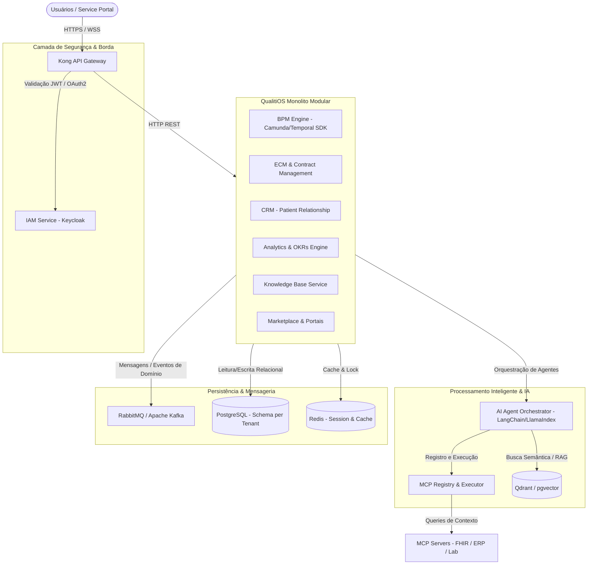
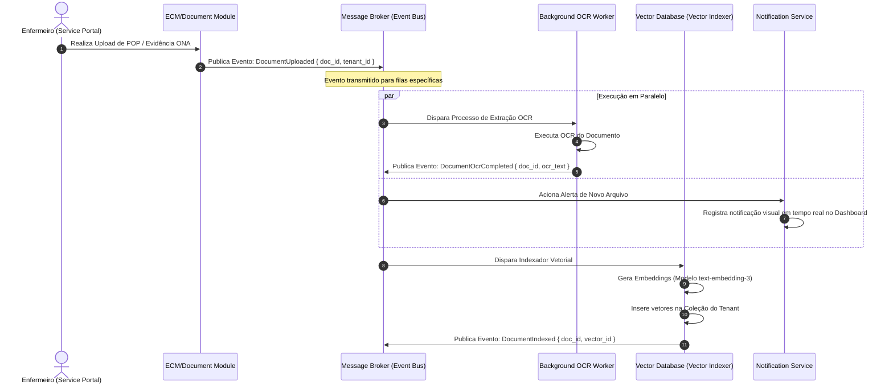
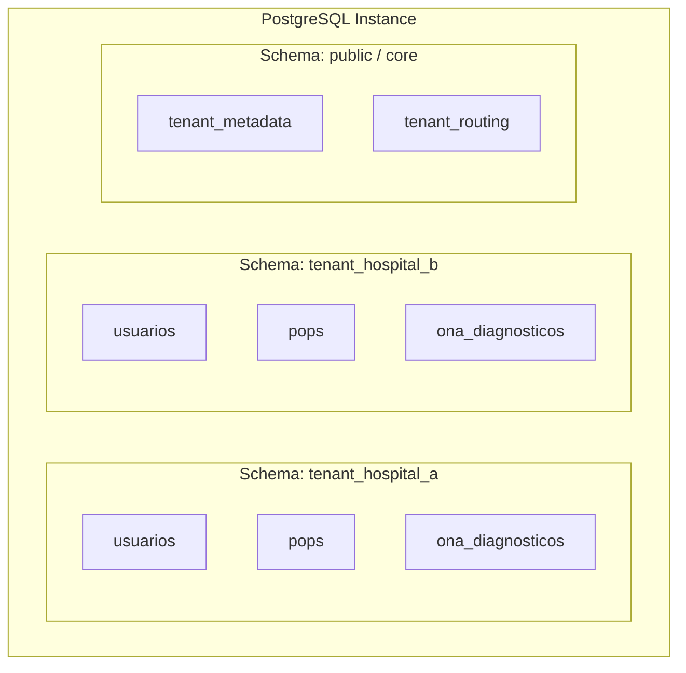
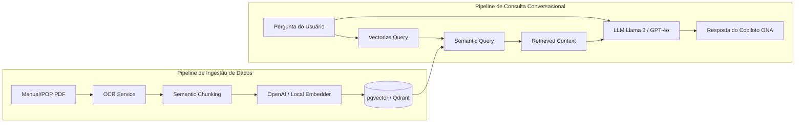
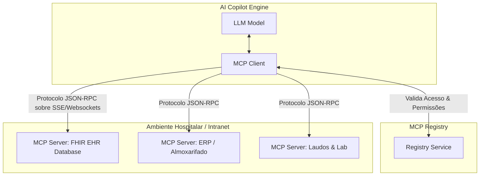
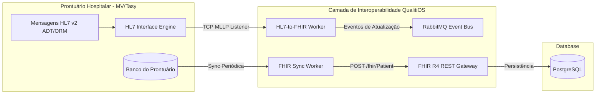

# Arquitetura de Software Alvo — QualitiOS (TO-BE Architecture)

Este documento define a especificação arquitetural alvo (TO-BE) para o **QualitiOS**, transformando a aplicação em uma plataforma **Enterprise AI-Native** resiliente, segura, baseada em eventos, multi-tenant e interconectada com padrões modernos de interoperabilidade na saúde.

---

## 1. Arquitetura Alvo (TO-BE Architecture)

A arquitetura TO-BE migra o atual monolito híbrido para uma abordagem de **Monolito Modular (Modulith)** com desacoplamento de serviços pesados de IA e processamento assíncrono. O tráfego de entrada é gerenciado por uma camada robusta de **API Gateway** responsável por roteamento, segurança (CORS, Rate Limiting) e autenticação de borda.

### Diagrama Físico do Sistema Alvo



---

## 2. Contextos Delimitados (Bounded Contexts - DDD)

Para garantir a coesão interna e o baixo acoplamento, o domínio do QualitiOS é dividido em 9 Contextos Delimitados:

```mermaid
stateDiagram-v2
    [*] --> IAM_Context: Autenticação
    IAM_Context --> Tenant_Context: Validação de Tenant
    
    state Tenant_Context {
        [*] --> SchemaResolution
    }
    
    state Core_Business_Flows {
        BPM_Context: BPM & Execuções
        ECM_Context: ECM & Contratos
        CRM_Context: CRM & Relacionamento
        Analytics_Context: KPIs & OKRs
    }
    
    state AI_Copilot_Flows {
        AI_Context: Agentes & Vector DB
        MCP_Context: MCP Registry & Servidores
    }

    state Integration_Flows {
        Interoperability_Context: FHIR R4 & HL7
    end
```

### 2.1. Tenant & Subscription Context
Gerencia a criação de novos Tenants (hospitais/unidades), quotas de consumo de IA, faturamento, provisionamento de esquemas de banco de dados e controle do ciclo de vida dos dados dos clientes.

### 2.2. Identity & Access Management (IAM) Context
Centraliza autenticação, RBAC (Role-Based Access Control), MFA (Multi-Factor Authentication), delegação de acessos para auditores ONA e emissão de tokens OAuth2 estruturados com claims de tenant.

### 2.3. Document & Content Management (ECM & Contracts) Context
Responsável pelo upload físico de arquivos (PDFs, imagens), versionamento, trancamento (locks), processos de OCR em background, assinaturas digitais ICP-Brasil de contratos e indexação vetorial de evidências.

### 2.4. Business Process Management (BPM) Context
Execução de workflows de controle de qualidade, roteamento de tarefas, monitoramento de SLAs com disparos de escalonamento assíncrono e conformidade com desenhos de processos BPMN.

### 2.5. Patient/Customer Relationship (CRM) Context
Mapeamento de interações com o paciente de internação, ouvidoria, gestão de incidentes, SAC/Pesquisas de NPS (Net Promoter Score) e painéis de satisfação integrados às auditorias de processos assistenciais.

### 2.6. Strategic Management & KPIs (Analytics) Context
Agregação e cálculo de indicadores hospitalares (semáforos de conformidade), OKRs corporativos, Key Results, histórico e painéis gerenciais executivos para tomadas de decisão.

### 2.7. AI & Copilot Context
Orquestração de LLMs, engenharia de prompts dinâmicos, pipelines de indexação (Ingestion) de arquivos para busca semântica, vetorização de dados e gerenciamento de memórias de chats.

### 2.8. MCP Registry & Marketplace Context
Registro dinâmico de conexões de Model Context Protocol (MCP), ativação e autorização de extensões de terceiros e barramento de plugins do marketplace.

### 2.9. Interoperability (FHIR) Context
Conversão bidirecional de mensagens legadas (HL7 v2, XML) e banco relacional para recursos FHIR R4, expondo APIs RESTful padronizadas para Prontuários Eletrônicos de mercado.

---

## 3. Módulos e Responsabilidades

Cada contexto é implementado por módulos específicos com fronteiras bem estabelecidas:

| Módulo | Responsabilidade Principal | Input Principal | Output Principal |
| :--- | :--- | :--- | :--- |
| **BPM Engine Module** | Orquestração do ciclo de vida dos processos do hospital. | Arquivo BPMN (XML/JSON), Gatilhos de Início. | Status da Etapa, Escalabilidade de SLA, Logs. |
| **ECM Module** | Gestão documental com auditoria completa. | PDF/DOCX de evidências, Metadados. | URL segura (S3), Texto OCR, Histórico de Versões. |
| **CRM Portal** | Gestão de reclamações, ouvidoria e incidentes. | Relatos de pacientes/médicos, pesquisas. | Tickets de ouvidoria, Pesquisa NPS consolidada. |
| **Analytics Module** | BI e agregação de performance de metas/OKRs. | Coletas de indicadores, metas de KRs. | KPIs recalculados, Alertas de desvio de OKRs. |
| **MCP Registry** | Armazenamento de metadados de conexões de IA. | Manifestos JSON de servidores MCP. | Endpoints autenticados disponíveis para o LLM. |
| **AI Copilot Core** | Interface conversacional inteligente e RAG. | Pergunta em Linguagem Natural, Contexto do Usuário.| Respostas textuais contextualizadas, Ações sugeridas. |
| **Service Portal** | Interface unificada web/mobile responsiva. | Interações do usuário no navegador. | Renderização SSR rápida, Chamadas HTTP seguras. |

---

## 4. Mapeamento de Dependências (Target Stack)

Substituição dos mocks sistêmicos por tecnologias de nível corporativo (Enterprise-grade):

*   **BPM Engine**: *Temporal.io SDK* ou *Camunda Node Client* (para execução real e confiável de state machines e tratamento de timeouts de SLA).
*   **Vector Database**: *Qdrant* ou *pgvector* no PostgreSQL (armazenamento real de vetores de alta dimensão para RAG e busca de documentos).
*   **Message Broker (Event-Driven)**: *RabbitMQ* (mensageria de alta confiabilidade) ou *Apache Kafka* (caso o volume de logs de auditoria assistencial em tempo real exija processamento distribuído).
*   **Orquestração de IA (Agents)**: *LangChain.js* ou *LlamaIndex.ts* (gerenciamento de prompts, chains, RAG e roteamento de agentes).
*   **OCR Pipeline**: *AWS Textract* ou *Tesseract.js* rodando em Worker Workers isolados (para processamento de PDFs e geração de logs sem bloquear o thread da API).
*   **Identity & Access**: *Keycloak* ou *Auth0* (gerenciamento federado de credenciais, MFA nativo e tokens padronizados).

---

## 5. Eventos de Domínio (Domain Events)

A comunicação entre os módulos no TO-BE é assíncrona, baseada em um **Event Bus** para garantir baixo acoplamento e resiliência.

### Diagrama de Sequência de Eventos (Event-Driven Pipeline)



### Principais Eventos de Domínio do QualitiOS

1.  **`TenantProvisioned`**: Disparado ao concluir o wizard, iniciando a criação física do banco/schema do cliente.
2.  **`DocumentUploaded`**: Emitido pelo ECM contendo o ID do arquivo e link de armazenamento temporário.
3.  **`DocumentOcrCompleted`**: Emitido pelo Worker de OCR após decodificar o PDF em texto legível.
4.  **`DocumentIndexed`**: Publicado após a vetorização dos embeddings no Qdrant/pgvector.
5.  **`WorkflowInstanceStarted`**: Disparado quando um processo BPM é iniciado.
6.  **`WorkflowTaskEscalated`**: Publicado de forma automatizada pelo motor BPM se o SLA da tarefa expirar sem ação.
7.  **`IncidentReported`**: Emitido no CRM ao registrar um evento adverso ou near miss.
8.  **`CapaPlanTriggered`**: Disparado após classificação automatizada de criticidade alta, iniciando a criação de planos corretivos.
9.  **`KpiGoalBreached`**: Emitido se um indicador sair da faixa de tolerância do semáforo ONA.
10. **`McpServerRegistered`**: Emitido ao ativar uma nova integração de Model Context Protocol.

---

## 6. Estratégia Multi-Tenant

Para atender à diretriz `confidential` e `multi_tenant` do `tpm.yaml` com alto nível de segurança e isolamento de dados assistenciais, o QualitiOS TO-BE adota a arquitetura **Schema-per-Tenant** (Isolamento Lógico por Esquema no PostgreSQL):



### Detalhes de Implementação:
1.  **Resolução de Tenant em Run-Time**: O API Gateway identifica o Tenant através do subdomínio (`hospital-a.qualitaos.com`) ou de um claim customizado no JWT (`tenant_id`).
2.  **Middleware de Conexão**: O backend Fastify intercepta a requisição, busca a string de conexão ou chave de esquema no Redis e define a rota do banco (`SET search_path TO tenant_x`).
3.  **Isolamento Vetorial**: No Qdrant, as coleções de embeddings usam chaves de particionamento baseadas em `tenant_id` nas consultas semânticas, impedindo o vazamento de informações confidenciais entre hospitais.

---

## 7. Estratégia de Inteligência Artificial (Enterprise AI Native)

Substituição completa das simulações por pipelines reais e automatizados:



1.  **Processamento de Evidências (OCR Real)**: Os uploads de PDF acionam Workers em Node.js (separados da API principal via RabbitMQ). O Worker extrai o texto usando *Tesseract* ou *AWS Textract* e salva o conteúdo decodificado.
2.  **Pipeline de Embeddings**: O texto é dividido em chunks de 500 caracteres com overlap de 10% (usando heurística de quebra de parágrafos). Cada chunk gera um vetor de 1536 dimensões via modelo `text-embedding-3-small` da OpenAI ou modelo local `nomic-embed-text` rodando no contêiner Ollama.
3.  **RAG e Memória Contextual**: Ao questionar o Copiloto ONA, a API realiza uma busca semântica K-Nearest Neighbors (KNN) na coleção de vetores do Tenant. O texto recuperado é inserido como contexto no prompt do LLM, garantindo respostas baseadas em evidências reais e vigentes.
4.  **Agentes Especializados**: Uso de frameworks de agentes autônomos que realizam chain-of-thought (CoT). Se uma ocorrência é classificada como alta gravidade, um agente avaliador sugere tarefas no BPM e notifica o farmacêutico responsável de forma autônoma.

---

## 8. Estratégia de Model Context Protocol (MCP)

O QualitiOS utiliza o **Model Context Protocol (MCP)** para permitir que os modelos de linguagem se integrem com segurança a fontes de dados de terceiros e ferramentas locais do hospital:



### 8.1. O que é o MCP no QualitiOS:
É o protocolo que unifica como o LLM lê dados operacionais. Em vez de criar integrações proprietárias para cada Prontuário do mercado, o Copiloto QualitiOS conecta-se a **MCP Servers** locais.

### 8.2. MCP Registry:
Uma tabela de registros (`mcp_servers`) armazena:
*   Nome do Servidor MCP.
*   Tipo de Conexão (SSE - Server-Sent Events, stdio, Websockets).
*   Tokens de Autorização.
*   Schema de Ferramentas expostas (ex: `get_patient_vitals`, `check_medication_stock`).

### 8.3. Fluxo de Execução do Copiloto via MCP:
1.  **Prompt do Usuário**: *"Copiloto, verifique se o lote do medicamento do incidente de ontem está com estoque baixo no almoxarifado."*
2.  **Identificação da Tool**: O LLM reconhece que precisa acessar o sistema de suprimentos e solicita a ferramenta `check_medication_stock` exposta pelo **MCP Server do ERP**.
3.  **Execução Local**: O **MCP Client** do QualitiOS formata uma requisição JSON-RPC contendo os parâmetros e envia para o servidor ERP.
4.  **Retorno Seguro**: O servidor ERP executa a query interna de estoque, retorna o resultado para o cliente e o LLM formula a resposta: *"Sim, o lote XYZ possui apenas 3 unidades no estoque central."*

---

## 9. Estratégia de Integração e Interoperabilidade

Para se consolidar como uma ferramenta Enterprise, o QualitiOS deve atuar como um concentrador interoperável de dados de saúde:



1.  **Barramento FHIR R4 Real**: O conector FHIR expõe recursos reais. As chamadas a `/api/fhir/Patient` realizam mapeamento relacional dinâmico das tabelas de colaboradores, médicos e pacientes reais da instituição.
2.  **HL7 v2 Interface Engine**: Um escutador TCP MLLP (Minimal Lower Layer Protocol) integrado lê dados brutos de admissão, alta e transferência de pacientes (mensagens ADT) e atualiza automaticamente os leitos e setores no QualitiOS para auditorias de prontuário em tempo real.
3.  **Webhooks Corporativos**: O módulo de incidentes publica webhooks toda vez que uma não conformidade grave é registrada, integrando-se com ferramentas de gerenciamento externas (Jira, ServiceNow, Slack).
4.  **Decoupling via Filas**: Toda a transação de APIs externas é processada de forma enfileirada via RabbitMQ/Kafka, blindando o banco de dados principal de picos de carga gerados por sincronizações de HIS legados.
