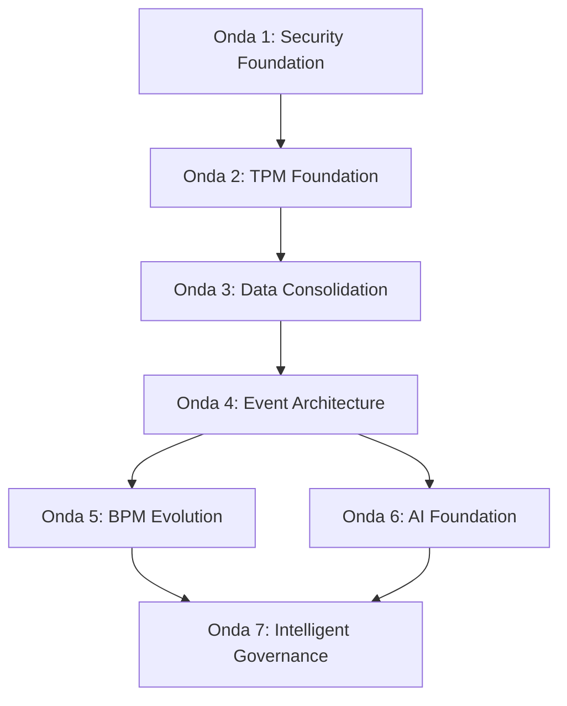

# Product & Architecture Roadmap — QualitiOS

Este documento define o Roadmap de Evolução de Produto e Arquitetura do **QualitiOS** em conjunto com a esteira do **TPM (Trusted Cognitive Platform)**. A estratégia de transformação está dividida em 7 ondas incrementais, orientadas pelos princípios de segurança em primeiro lugar (*Security First*), governança antecipada (*TPM First*) e continuidade operacional (*Business Continuity*), evitando reescritas de código.

---

## 1. EXECUTIVE ROADMAP (Visão Geral das Ondas)

A jornada de transformação evolui o sistema do estado atual monolítico e simulado para um ambiente desacoplado, auditável e cognitive-first:

```text
Onda 1: Security Foundation ➔ Onda 2: TPM Foundation ➔ Onda 3: Data Consolidation
                                                                │
Onda 6: AI Foundation 🢠 Onda 5: BPM Evolution 🢠 Onda 4: Event Architecture
  │
  ▼
Onda 7: Intelligent Governance (Estado Alvo)
```

*   **Onda 1: Security Foundation**: Mitigação de vulnerabilidades imediatas (CORS, HttpOnly Cookies, Rate Limiting).
*   **Onda 2: TPM Foundation**: Implantação da esteira externa de validação contínua (Architecture, Dependency, Security scans).
*   **Onda 3: Data Consolidation**: Unificação de esquemas de banco de dados, eliminando duplicações e assegurando integridade.
*   **Onda 4: Event Architecture**: Implementação do barramento interno de eventos para comunicação assíncrona.
*   **Onda 5: BPM Evolution**: Transição do BPM para orquestrador ativo de estados operacionais e SLAs.
*   **Onda 6: AI Foundation**: Integração real de LLM local (Ollama) e suporte vetorial no banco (`pgvector`).
*   **Onda 7: Intelligent Governance**: Fusão de IA, BPM e Compliance para auditorias autônomas governadas pelo TPM.

---

## 2. WAVE 1 — SECURITY FOUNDATION (Base de Segurança)

Focada na resolução das vulnerabilidades de maior impacto à integridade transacional do QualitiOS (GAP-SEC-01).

*   **Objetivos**:
    *   Substituir o armazenamento de sessão do localStorage do frontend por **HttpOnly, Secure e SameSite=Strict Cookies**.
    *   Desativar o CORS wildcard (`*`) e restringir as conexões HTTP estritamente aos domínios definidos no `.env`.
    *   Implementar middleware de **Rate Limiting** para rotas sensíveis (Login e IA).
*   **Resultados Esperados**: Blindagem completa contra sequestro de sessão via Cross-Site Scripting (XSS) e bloqueio de requisições maliciosas cross-origin.
*   **Critérios de Conclusão**:
    *   Token JWT trafegando exclusivamente via cabeçalho Set-Cookie protegido.
    *   Testes manuais comprovando que a API Fastify rejeita requisições CORS de origens não autorizadas.
    *   Chamadas de login sequenciais rápidas excedendo a taxa configurada retornando HTTP 429 (Too Many Requests).

---

## 3. WAVE 2 — TPM FOUNDATION (Fundações de Governança TPM)

Implantação do TPM como validador externo contínuo, blindando o repositório antes do início das evoluções de regras de negócios (GAP-TPM-01).

*   **Objetivos**:
    *   Configurar a esteira externa de análise de código e auditoria estática do TPM.
    *   Ativar varreduras de aderência à Clean Architecture e acoplamentos (Architecture Validation).
    *   Ativar verificação automática de chaves e segredos em repositórios (Security Validation).
    *   Ativar monitoramento de segurança de dependências NPM (Dependency Validation).
*   **Resultados Esperados**: Garantia de que novos commits e deploys respeitam as fronteiras arquiteturais e não inserem códigos mortos ou pacotes vulneráveis.
*   **Critérios de Conclusão**:
    *   CI configurada e bloqueando pull requests que violem as regras do padrão de Clean Architecture.
    *   Scan contínuo atestando 0% de segredos expostos no Git e 0% de dependências críticas desatualizadas.

---

## 4. WAVE 3 — DATA CONSOLIDATION (Consolidação de Dados)

Eliminação de tabelas duplicadas que geram inconsistências de dados e esforço de manutenção no PostgreSQL (GAP-DB-01).

*   **Objetivos**:
    *   Executar scripts de migração para unificar dados de tabelas legadas nas tabelas V2.
    *   Garantir integridade referencial com chaves estrangeiras robustas e regras `ON DELETE`.
    *   Impor ownership exclusivo de escrita nos repositórios correspondentes por Bounded Context.
*   **Estratégia**:
    *   Unificar `incidentes` na tabela `core_ocorrencias`.
    *   Unificar checklists legados ONA em `ona_diagnosticos`.
    *   Eliminar a tabela `core_documentos` em favor de `pops`/`pop_versoes`.
*   **Dependências**: Conclusão das varreduras de arquitetura da Onda 2 para garantir que nenhuma query SQL Raw órfã aponte para tabelas deletadas.
*   **Critérios de Conclusão**:
    *   Tabelas duplicadas dropadas com sucesso do PostgreSQL.
    *   Acessos do backend normalizados sob o esquema unificado sem quebras de integridade relacional.

---

## 5. WAVE 4 — EVENT ARCHITECTURE (Arquitetura de Eventos)

Implementação da comunicação assíncrona para desacoplamento de contextos de negócio (GAP-EVT-01).

*   **Objetivos**:
    *   Substituir acoplamento síncrono nos controladores por publicação/inscrição de eventos de domínio.
    *   Criar o barramento de eventos internos em memória do backend (`Internal Event Bus`).
*   **Eventos Prioritários**:
    *   `IncidenteRegistrado`: Emitido por Riscos ➔ Consumido por BPM para abrir plano CAPA.
    *   `NovaVersaoDocumentoVigente`: Emitido por ECM ➔ Consumido por LMS para matricular setores em reciclagens.
    *   `CertificadoEmitido`: Emitido por LMS ➔ Consumido por Compliance como evidência ONA.
*   **Contextos Impactados**: Governança, Documentos (ECM), Educação (LMS), Riscos (CAPA) e Compliance.
*   **Critérios de Conclusão**:
    *   Aprovação de POP no ECM retornando sucesso ao usuário instantaneamente, enquanto a geração de notificações e envio de e-mails processam-se em background.
    *   Garantia de que a falha de envio de notificação não aborta a ativação física do documento.

---

## 6. WAVE 5 — BPM EVOLUTION (Evolução do Processo)

Evolução do BPM visual estático para um mecanismo ativo de orquestração de integridade (GAP-BPM-01).

*   **Objetivos**:
    *   Integrar o motor de workflows às lógicas transacionais do ECM e Riscos.
    *   Implementar processador de background assíncrono para monitoramento de prazos e SLAs.
*   **Capacidades**:
    *   BPM forçando a transição de status das entidades no banco (ex: bloquear uso de POP se sua revisão periódica estiver atrasada no BPM).
    *   Escalonamento automático de incidentes e envio de alertas em estouros de prazo do CAPA.
*   **Dependências**: Consolidação de dados da Onda 3 e barramento de eventos da Onda 4.
*   **Critérios de Conclusão**:
    *   Transições de status de POPs e CAPA ocorrendo estritamente em conformidade com o desenho do workflow BPMN correspondente.
    *   Processamento de SLAs rodando em background sem loops síncronos na API.

---

## 7. WAVE 6 — AI FOUNDATION (Fundação Cognitiva de IA)

Substituição de lógicas condicionais simuladas por processamento real de IA e suporte vetorial no banco (GAP-AI-01).

*   **Objetivos**:
    *   Integrar biblioteca de PDF/OCR no backend para extração de textos de laudos de evidências.
    *   Ativar suporte a vetores no PostgreSQL (extensão `pgvector`).
    *   Integrar o backend a um LLM local (Ollama) ou API remota para processamento cognitivo.
*   **Capacidades**:
    *   RAG real respondendo a perguntas baseadas nos manuais de conformidade da ONA.
    *   Análise semântica de incidentes para classificação automática de criticidade e preenchimento de Ishikawa.
*   **Dependências**: Barramento de eventos da Onda 4 e consolidação de dados da Onda 3.
*   **Critérios de Conclusão**:
    *   PostgreSQL armazenando arrays de embeddings reais de documentos e evidências.
    *   Respostas de IA do Copiloto ONA variando dinamicamente com base no contexto injetado pelo RAG, em vez de retornar strings estáticas.

---

## 8. WAVE 7 — INTELLIGENT GOVERNANCE (Governança Inteligente Alvo)

Fusão final de conformidade, processos, inteligência artificial e governança externa de confiança do TPM.

*   **Visão Final**: O QualitiOS opera como um BOS autossuficiente e seguro, onde dados são consolidados, processos são dinamicamente orquestrados pelo BPM, e a IA atua validando evidências regulatórias, enquanto o TPM avalia e chancela continuamente as atualizações do software.
*   **Capacidades Estratégicas**:
    *   *Auditoria Autônoma de Compliance*: Agentes inteligentes integrando-se passivamente a prontuários eletrônicos via FHIR real para extrair indicadores e autopreencher checklists ONA de leitos.
    *   *Reciclagem Autogovernada*: O LMS identifica furos operacionais relatados em ocorrências e matricula equipes automaticamente em cursos específicos de prevenção.
*   **Diferenciais Competitivos**: Solução que converte conformidade reativa em governança preditiva contínua, reduzindo o custo operacional de manutenção de acreditações sanitárias a zero.

---

## 9. DEPENDENCY MAP (Mapa de Dependências entre Ondas)

As ondas são encadeadas logicamente, garantindo que os alicerces técnicos suportem as capacidades de negócios seguintes:



*   **Onda 2 ➔ Onda 1**: A esteira de validação do TPM (Onda 2) exige que o código-fonte esteja saneado e livre de fallbacks sensíveis configurados na Onda 1.
*   **Onda 4 ➔ Onda 3**: A comunicação orientada a eventos assíncronos (Onda 4) necessita que os esquemas de dados estejam unificados e normalizados (Onda 3) para evitar replicação de eventos órfãos.
*   **Onda 7 ➔ Ondas 5 & 6**: A governança inteligente (Onda 7) funde as capacidades de workflows do BPM (Onda 5) com as análises cognitivas e vetoriais de IA (Onda 6).

---

## 10. RISK ASSESSMENT (Avaliação de Riscos de Implantação)

| Onda | Risco Identificado | Bloqueadores potenciais | Ação de Mitigação |
| :--- | :--- | :--- | :--- |
| **Onda 1** | Incompatibilidade do frontend com cookies HttpOnly em subdomínios. | Configurações incorretas de SameSite em produção. | Utilizar políticas estritas no Caddy Gateway para rotear no mesmo domínio sob prefixo `/api`. |
| **Onda 2** | Bloqueios excessivos de PRs pela esteira do TPM atrasarem entregas. | Regras muito estritas de Clean Arch na esteira inicial. | Configurar warnings na primeira quinzena, tornando as regras bloqueantes incrementalmente. |
| **Onda 3** | Perda de integridade ou registros históricos na migração das tabelas legadas. | Queries legadas invisíveis no código quebrando em runtime. | Executar varreduras de busca (`grep_search`) por referências a tabelas antigas antes do drop físico. |
| **Onda 4** | Sobrecarga de memória RAM do contêiner por acúmulo de eventos síncronos. | Falta de broker de mensageria externo no Docker Compose. | Iniciar com barramento interno em memória simples (`EventEmitter` otimizado) sob monitoramento do TPM. |
| **Onda 5** | Loops infinitos de transições de status no BPM travando entidades do banco. | Workflows com caminhos circulares desenhados por administradores. | Validar esquemas de grafos na importação de fluxos JSON. |
| **Onda 6** | Lentidão extrema nas requisições HTTP devido ao tempo de inferência da LLM. | Ausência de GPU no contêiner do Ollama. | Rodar inferências de triagem de incidentes e resumos estritamente em background assíncrono. |

---

## 11. CAPABILITY EVOLUTION MATRIX (Matriz de Evolução de Capacidades)

A evolução tática das capacidades de negócio ao longo das ondas do roadmap:

| Capacidade | Onda 1 | Onda 2-3 | Onda 4-5 | Onda 6-7 |
| :--- | :--- | :--- | :--- | :--- |
| **Governança** | Segura (JWT HttpOnly). | Saneada (sem tabelas duplicadas). | Monitorada (status de SLAs integrados). | Preditiva (Auditorias autônomas chanceladas pelo TPM). |
| **Estratégia** | OKRs funcionais. | KPIs conectados à base estável. | KRs atualizados por eventos de coletas. | Metas inteligentes sugeridas por IA. |
| **Compliance** | Checklists ONA funcionais. | Evidências limpas de registros órfãos. | Certificados integrados via barramento. | OCR e RAG real de evidências com auditoria de prompts. |
| **Educação** | LMS e quizzes vigentes. | LMS apontando para dados unificados. | Matrícula automática disparada por atualizações do ECM. | Recomendação cognitiva de cursos e reciclagens por incidentes. |
| **Conhecimento** | Biblioteca textual. | Biblioteca saneada. | Indexação automática de novos normativos. | Busca semântica inteligente baseada em linguagem natural. |
| **Processos** | BPMN visual na UI. | Mapeamento no banco estável. | Orquestrador ativo impondo transições e controle de SLA. | Otimização contínua de rotas de fluxos assistenciais. |
| **Documentos** | Versionamento de POPs. | Exclusão de tabelas duplicadas. | Notificações de SLA assíncronas em background. | OCR em contratos e resumos executivos automáticos. |
| **Riscos** | Ocorrências básicas. | CAPA operando em tabelas consolidadas. | Ações preventivas com monitoramento de SLA assíncrono. | Triagem inteligente de incidentes e preenchimento de Ishikawa. |

---

## 12. TPM EVOLUTION ROADMAP (Evolução da Camada TPM)

A evolução da governança externa do TPM se dará nas seguintes etapas de maturidade:

```text
TPM MVP (Scans de Segredos e CORS)
           │
           ▼
Architecture Validation (Aderência ao DDD e Clean Architecture)
           │
           ▼
Domain Validation (Auditoria de Eventos e Data Ownership)
           │
           ▼
AI Governance (Validação de Prompts e RAG)
           │
           ▼
Trusted Cognitive Platform (Certificação Autônoma e Auditorias de Confiança)
```

1.  **TPM MVP (Foco na Onda 1)**: Varredura de configurações de segurança críticas (bloqueio de CORS `*`, validação de HttpOnly Cookies e scan contra vazamento de segredos no Git).
2.  **Architecture Validation (Foco na Onda 2)**: Varredura contínua de código para impedir violações de camadas de Clean Architecture e de diretrizes de código limpo.
3.  **Domain Validation (Foco na Onda 3 e 4)**: Monitoramento de ownership de dados no banco de dados, impedindo escritas cruzadas e validando a integridade do barramento de eventos.
4.  **AI Governance (Foco na Onda 6)**: Auditoria e aprovação de schemas MCP e prompts de sistema, validando a segurança cognitiva das capacidades de IA.
5.  **Trusted Cognitive Platform (Foco na Onda 7)**: Certificação contínua e autônoma da integridade técnica da plataforma, fornecendo relatórios auditáveis para órgãos sanitários e acreditação externa.
