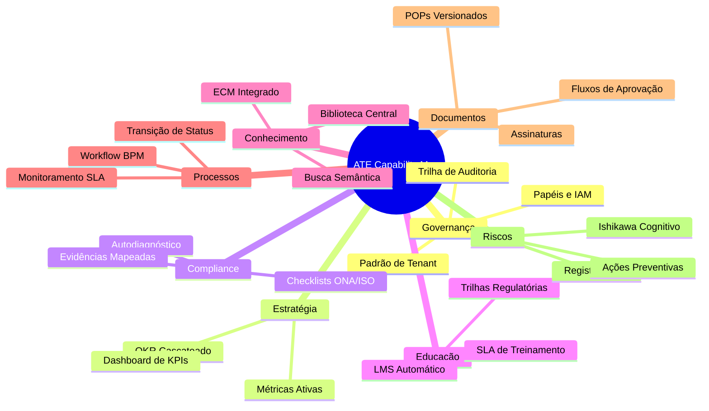

# Fase 02 — Modelo de Capacidades (Capability Model) — ATE

Este documento detalha o mapeamento das 8 capacidades organizacionais nativas do **QualitiOS** no escopo do módulo **Assessment & Transformation Engine (ATE)**. Para cada capacidade, são definidos sua descrição, os critérios específicos de maturidade no módulo e as evidências documentais necessárias para comprovação.

---

---

## 1. GOVERNANÇA (GOVERNANCE)

*   **Descrição**: Orquestração geral das diretrizes de controle, estrutura de papéis organizacionais (RBAC), multi-tenancy e rastreabilidade geral das ações do sistema.
*   **Critérios de Maturidade no ATE**:
    *   Existência de segregação de funções (SoD - Segregation of Duties) configurada.
    *   Painel executivo ativo mostrando o score consolidado de governança.
    *   Trilhas de auditoria imutáveis cobrindo acessos, mudanças de papéis e logs críticos do sistema.
*   **Evidências Necessárias**:
    *   Configuração do JSON de perfis e RBAC.
    *   Logs estruturados de auditoria do banco de dados de persistência.
    *   Atas digitais e relatórios gerenciais assinados eletronicamente.

---

## 2. ESTRATÉGIA (STRATEGY)

*   **Descrição**: Gestão de metas estratégicas através do desdobramento de OKRs (Objectives and Key Results) e acompanhamento em tempo real de indicadores de desempenho (KPIs).
*   **Critérios de Maturidade no ATE**:
    *   OKRs estratégicos corporativos desdobrados em OKRs táticos por setor.
    *   Key Results conectados a métricas dinâmicas e indicadores ativos de sistema, sem dependência de inserção manual de progresso.
    *   Histórico e semáforos de metas integrados aos painéis executivos.
*   **Evidências Necessárias**:
    *   Esquema de OKRs com KRs vinculados.
    *   Dashboards de KPIs integrados à governança estratégica.
    *   Relatórios de revisão de desempenho e reuniões de alinhamento tático.

---

## 3. COMPLIANCE

*   **Descrição**: Garantia de aderência e conformidade contínua a normas nacionais e internacionais de acreditação (ONA, ISO 9001, ESG).
*   **Critérios de Maturidade no ATE**:
    *   Existência de checklists periódicos ativos de conformidade.
    *   Vinculação sistemática de requisitos das normas às evidências e POPs internos.
    *   Rotinas de autodiagnóstico configuradas e rodando na plataforma.
*   **Evidências Necessárias**:
    *   Checklists preenchidos com referências e anexos de documentos.
    *   Certificados vigentes de acreditação.
    *   Relatórios de auditorias internas e auditorias de conformidade oficiais.

---

## 4. EDUCAÇÃO (EDUCATION)

*   **Descrição**: Capacitação dinâmica de colaboradores e ativação do conhecimento organizacional através da Universidade LMS (Learning Management System).
*   **Critérios de Maturidade no ATE**:
    *   Trilhas de integração (onboarding) obrigatórias configuradas com SLA de 72 horas para novos contratados.
    *   Microtreinamentos automáticos gerados a cada nova publicação ou alteração crítica de Procedimentos Operacionais Padrão (POPs).
    *   Quizzes de retenção e verificação de conhecimento automatizados pós-treinamentos.
*   **Evidências Necessárias**:
    *   Relatório de adesão e conclusão de trilhas de treinamento LMS.
    *   Histórico de conformidade de SLA de treinamento (tempo decorrido vs. prazo limite).
    *   Relatórios estatísticos de notas obtidas em quizzes regulatórios.

---

## 5. CONHECIMENTO (KNOWLEDGE)

*   **Descrição**: Biblioteca Centralizada de Conhecimento e controle do ECM para armazenamento, busca semântica e curadoria do acervo intelectual.
*   **Critérios de Maturidade no ATE**:
    *   Armazenamento centralizado de documentos institucionais com indexação e categorização automática.
    *   Motor de busca semântica ativo capaz de buscar informações dentro dos arquivos (PDFs, DOCX, Imagens) através de embeddings de IA.
    *   Políticas de retenção de conhecimento e taxonomia institucional aplicadas.
*   **Evidências Necessárias**:
    *   Estrutura de pastas da biblioteca e árvore taxonômica cadastrada.
    *   Logs de busca e acessos à biblioteca.
    *   Metadados atribuídos aos documentos controlados no repositório.

---

## 6. PROCESSOS (PROCESSES)

*   **Descrição**: Modelagem e execução de processos operacionais e de negócio via motor BPM (Business Process Management) integrado a SLAs ativos.
*   **Critérios de Maturidade no ATE**:
    *   Processos operacionais modelados formalmente de forma visual (low-code).
    *   Orquestração ativa do workflow gerenciando as transições de status das entidades de negócio.
    *   Monitoramento ativo de SLAs com disparo de alertas automáticos e escalonamento em caso de descumprimento de prazos.
*   **Evidências Necessárias**:
    *   Diagramas BPMN executáveis importados ou criados na plataforma.
    *   Logs de tempo de ciclo de instâncias de processos operacionais.
    *   Histórico de alertas emitidos por estouros de SLA.

---

## 7. DOCUMENTOS (DOCUMENTS)

*   **Descrição**: Gestão completa do ciclo de vida documental dos Procedimentos Operacionais Padrão (POPs) e contratos da plataforma.
*   **Critérios de Maturidade no ATE**:
    *   Controle rígido de versionamento linear de documentos (histórico de revisões, autores e data de vigência).
    *   Fluxos estruturados de aprovação com assinaturas eletrônicas integradas.
    *   Vinculação direta de POPs vigentes a trilhas obrigatórias do LMS e evidências de compliance.
*   **Evidências Necessárias**:
    *   Histórico de revisões físico (diffs de versão) dos POPs e contratos.
    *   Logs de assinaturas eletrônicas com autenticidade verificada.
    *   Configurações de fluxos de ciclo de vida de documentos.

---

## 8. RISCOS (RISKS)

*   **Descrição**: Identificação, reporte em tempo real e tratamento de riscos, incidentes organizacionais e planos de melhoria contínua (CAPA / Ishikawa).
*   **Critérios de Maturidade no ATE**:
    *   Formulário simplificado de registro de ocorrências disponível e acessível em todas as interfaces.
    *   Workflow de investigação de causa raiz (Diagrama de Ishikawa) integrado e de preenchimento obrigatório para incidentes graves.
    *   Planos de Ação Corretiva e Preventiva (CAPA - Corrective Action Preventive Action) gerando tarefas vinculadas no roadmap.
*   **Evidências Necessárias**:
    *   Relatórios de incidentes registrados na plataforma.
    *   Ishikawa gerados para incidentes analisados, contendo causa-raiz identificada.
    *   Planos de ação CAPA com rastreabilidade de execução de tarefas associadas.
