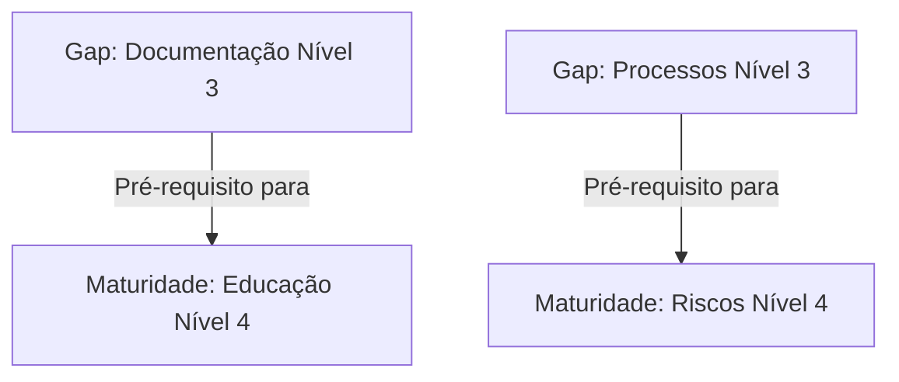

# Fase 04 — Mecanismo de Análise de Gaps (Gap Analysis Engine) — ATE

Este documento especifica o funcionamento lógico, as fórmulas e os critérios de priorização do **Mecanismo de Análise de Gaps (Gap Analysis Engine)** do ATE.

---

## 1. O ALGORITMO DE GAP (GAP CALCULATION ALGORITHM)

O ATE compara o estado de maturidade computado de cada capabilidade com o estado alvo desejado (definido pelo Playbook selecionado ou parametrizado manualmente).

A equação base do Gap operacional é:

$$\text{Gap} = \text{Maturidade Alvo} - \text{Maturidade Atual}$$

*   Se $\text{Gap} \le 0$: A capacidade está em **Conformidade** (sem plano de ação imediato necessário).
*   Se $\text{Gap} > 0$: A capacidade apresenta uma **Inconformidade/Lacuna** ativa.

---

## 2. AVALIAÇÃO DE PARÂMETROS DO GAP

Para cada Gap identificado, o motor calcula e atribui as seguintes métricas lógicas de negócio:

### 2.1. Criticidade (Criticality)
Representa a gravidade da lacuna no contexto normativo e de negócios da organização.
$$\text{Criticidade} = \text{Gap} \times \text{Peso Regulatório}$$

*   **Peso Regulatório**:
    *   *Peso 5 (Mandatório)*: Requisitos legais sanitários (RDC Anvisa) ou itens de segurança básica (ONA Nível 1).
    *   *Peso 3 (Importante)*: Itens de gestão de processos (ONA Nível 2 / ISO 9001).
    *   *Peso 1 (Desejável)*: Melhorias organizacionais gerais, sustentabilidade, ESG ou ONA Nível 3.

### 2.2. Impacto (Impact)
Calcula a extensão do dano organizacional caso o gap persista. Avaliado de 1 a 5 nas dimensões:
*   *Financeira* (Glosas, multas, interrupções).
*   *Reputacional* (Perda de prestígio, reclamações).
*   *Assistencial/Operacional* (Risco ao paciente, falhas de processos).

### 2.3. Esforço (Effort)
A estimativa do tempo, custo e recursos humanos necessários para sanar o gap. Mapeado de 1 a 5:
*   *1 (Muito Baixo)*: Ações simples de parametrização ou comunicação local.
*   *2 (Baixo)*: Criação ou atualização de um único POP.
*   *3 (Médio)*: Elaboração de novo fluxo de processos (BPM) ou treinamento obrigatório (LMS).
*   *4 (Alto)*: Integração técnica ou reestruturação de rotinas de múltiplos setores.
*   *5 (Muito Alto)*: Mudança cultural profunda ou aquisição de infraestrutura física.

### 2.4. Dependências Lógicas (Dependencies)
O motor impede a recomendação de tarefas sem respeitar os pré-requisitos lógicos de maturidade do QualitiOS:
*   *Exemplo*: Não é permitido gerar uma tarefa para "Criar Treinamento Automático de POP no LMS" (Maturidade Educação Nível 4) se a capacidade de "Controle de Versionamento e Vigência de POPs" (Maturidade Documentos Nível 3) apresentar um Gap ativo. O gap de Documentos deve ser resolvido antes na ordenação física do roadmap.

---

## 3. PRIORIZAÇÃO E CLASSIFICAÇÃO DOS GAPS

### 3.1. Fórmula do Priority Score
Para ordenar o Roadmap de forma automatizada, o ATE executa a seguinte fórmula de pontuação de prioridade para cada Gap:

$$\text{Priority Score} = \text{Criticidade} \times \text{Impacto} \times \text{Peso Estratégico}$$

*   **Peso Estratégico**: Multiplicador parametrizado pelo cliente (de 1.0 a 2.0) com base nos objetivos da diretoria para a transformação corporativa.

### 3.2. Classificação Lógica dos Gaps
Com base no Score resultante, o ATE classifica os gaps e define seu direcionamento operacional imediato:

| Faixa de Score | Classificação | Nível de Urgência | Direcionamento no Roadmap | SLA de Tratativa |
| :--- | :--- | :--- | :--- | :--- |
| **Score $\ge$ 80** | **Crítico** | **Imediata** | Alocado na primeira fase (Wave A) do Plano de Transformação. | Tarefa de Ação Corretiva gerada com SLA de 48h. |
| **Score 50 a 79** | **Alto** | **Alta** | Alocado na Wave B do Plano de Transformação. | Projeto/Tarefa com SLA de 15 dias. |
| **Score 25 a 49** | **Médio** | **Moderada** | Alocado nas fases intermediárias (Wave C ou D). | Projeto/Tarefa com SLA de 30 dias. |
| **Score $<$ 25** | **Baixo** | **Baixa** | Adicionado ao Backlog de Melhoria Contínua. | Tratado conforme a capacidade das equipes (SLA de 60 a 90 dias). |
