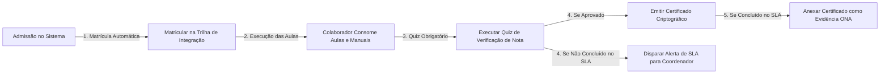
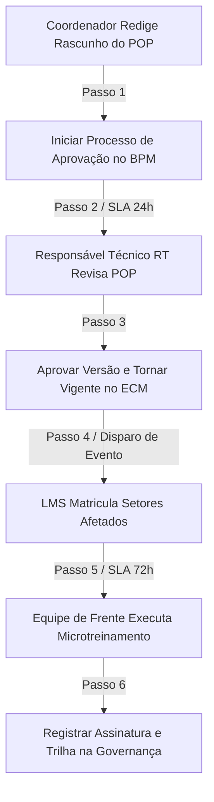
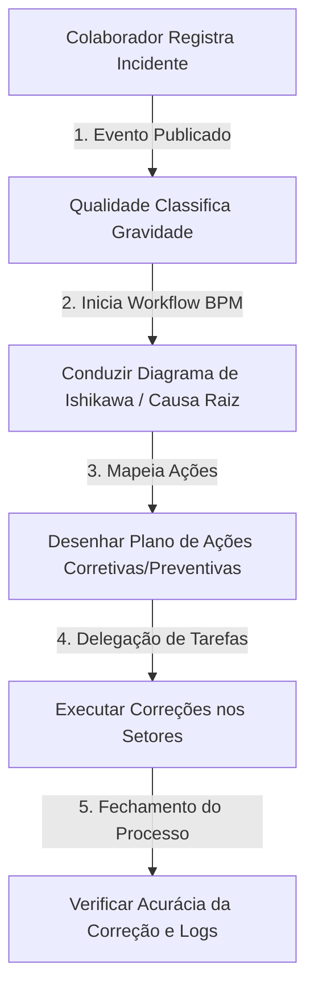
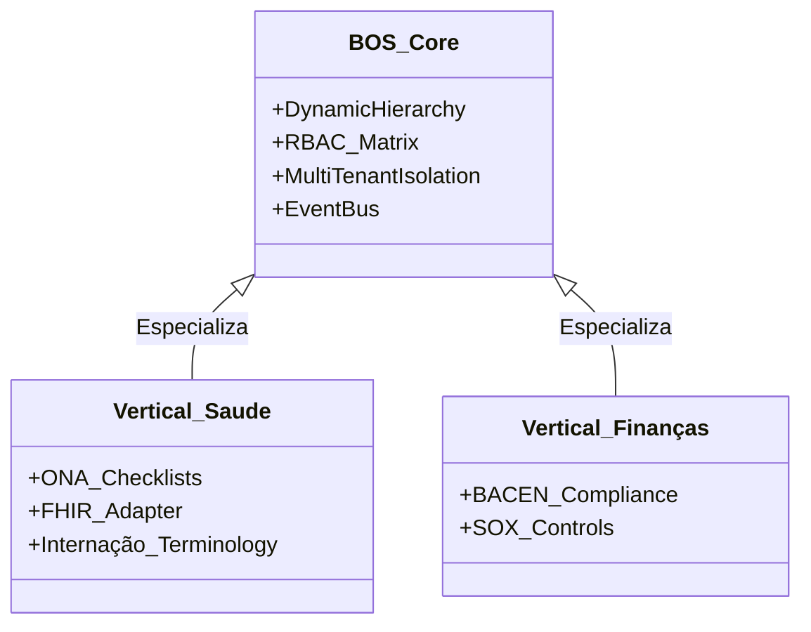
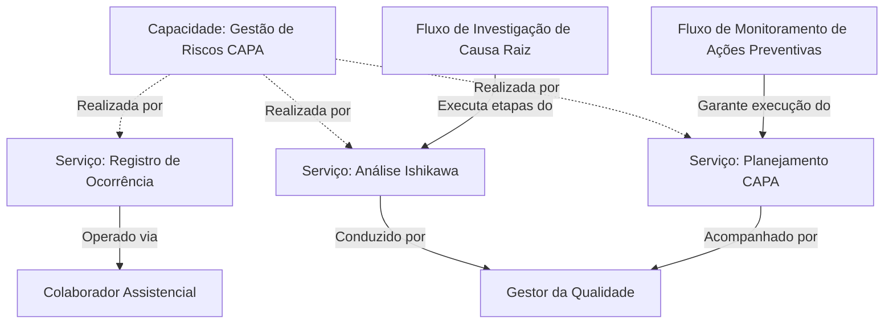
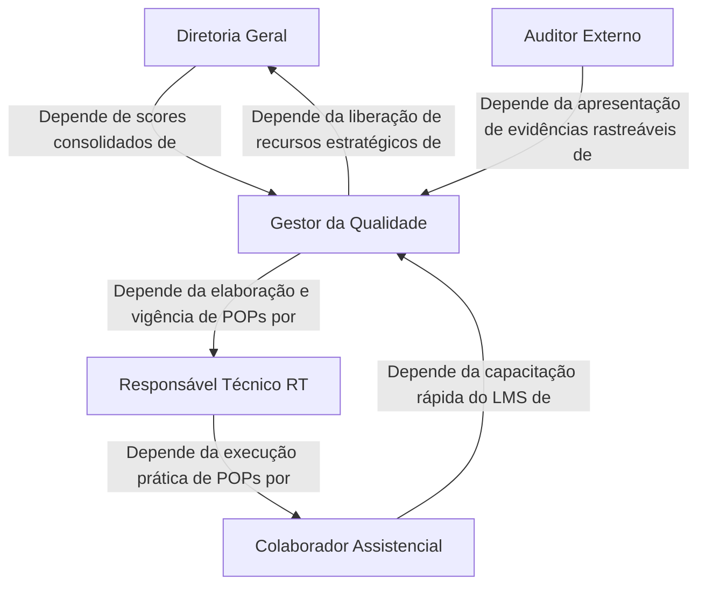

# Business Architecture — QualitiOS

Este documento estabelece a Arquitetura de Negócio (Business Architecture) do **QualitiOS**. Ele detalha os domínios de negócio, catálogo de serviços corporativos, mapeamento de fluxos de valor (Value Streams), modelo operacional de governança e a realização estratégica das capacidades da plataforma.

---

## 1. DOMAIN ARCHITECTURE (Arquitetura de Domínios)

A arquitetura de negócios do QualitiOS está dividida em três níveis de relevância estratégica: Core (Principal), Supporting (Suporte) e Generic (Genérico), orquestrados sob o domínio unificador da **Governança**.

```text
┌────────────────────────────────────────────────────────────────────────┐
│                      CORE DOMAIN: GOVERNANÇA                           │
│  Orquestração, Matriz RBAC, Dinamismo de Setores e Auditoria Global    │
└───────────────────────────────────┬────────────────────────────────────┘
                                    │
       ┌────────────────────────────┼────────────────────────────┐
       ▼                            ▼                            ▼
┌──────────────┐             ┌──────────────┐             ┌──────────────┐
│  ESTRATÉGIA  │             │  COMPLIANCE  │             │  EDUCAÇÃO    │
│  OKRs / KPIs │             │   ONA / ISO  │             │ LMS / Trilhas│
└──────────────┘             └──────────────┘             └──────────────┘
       │                            │                            │
       └────────────────────────────┼────────────────────────────┘
                                    │
       ┌────────────────────────────┼────────────────────────────┐
       ▼                            ▼                            ▼
┌──────────────┐             ┌──────────────┐             ┌──────────────┐
│ CONHECIMENTO │             │  PROCESSOS   │             │ RISCOS (CRM) │
│ Biblioteca   │             │   Workflows  │             │ CAPA / Ishik.│
└──────────────┘             └──────────────┘             └──────────────┘
```

### 1.1. Core Domain: Governança Hospitalar
*   **Papel**: Definir as regras estruturais (cargos, setores) e as permissões de acesso da corporação, além de centralizar as visões executivas de desempenho geral e compliance de auditorias.

### 1.2. Supporting Domains (Domínios de Suporte)
1.  **Estratégia (OKRs & KPIs)**: Alinhamento de metas da alta gestão às coletas diárias da equipe de linha de frente.
2.  **Compliance (Acreditação ONA/ISO)**: Gestão de checklists sanitários, coletas físicas de evidências e auditorias de leito.
3.  **Educação (LMS)**: Matrícula e monitoramento de capacitações obrigatórias corporativas e setoriais.
4.  **Conhecimento (Biblioteca)**: Centralização de referências científicas, manuais e resoluções normativas.
5.  **Processos (BPM Engine)**: Automação e monitoramento de SLAs em rotinas corporativas.
6.  **Documentos (ECM & Contratos)**: Controle do ciclo de vida, versionamento e assinaturas de POPs e contratos.
7.  **Riscos (Gestão de Riscos & CAPA)**: Registro de não conformidades, investigação causa raiz e ações preventivas.

### 1.3. Generic Domains (Domínios Genéricos)
*   **Identidade e Acesso (IAM)**: Autenticação segura, provisionamento e controle de privilégios.
*   **Mensageria e Notificações**: Roteamento de alertas e notificações por SLA via push/e-mail.
*   **Trilha de Auditoria**: Registros de logs indeléveis de ações de usuários (Event Sourcing).

---

## 2. SERVICE ARCHITECTURE (Arquitetura de Serviços de Negócio)

Os domínios de negócio expõem serviços corporativos essenciais que são consumidos pelos diferentes Atores do Ecossistema (Business Actors):

| Domínio de Origem | Serviço de Negócio (Business Service) | Ator Consumidor | Valor Entregue |
| :--- | :--- | :--- | :--- |
| **Governança** | Gestão de Estrutura Organizacional | Diretor Geral | Permite alterar setores, cargos e privilégios dinamicamente. |
| **Governança** | Auditoria Global de Logs | Auditor Interno / Externo | Acesso a logs imutáveis de ações para LGPD e Vigilância Sanitária. |
| **Estratégia** | Monitoramento de OKRs e Metas | Diretor / Coordenador | Visibilidade do progresso estratégico ponderado por área. |
| **Compliance** | Auditoria e Checklist de Leito | Gestor da Qualidade / RT | Avaliação em tempo real da aderência às normas da ONA. |
| **Compliance** | Validação de Evidências Documentais| Gestor da Qualidade / RT | Associação de POPs e certificados para comprovar conformidades. |
| **Educação** | Onboarding Corporativo Automático | Novo Colaborador | Trilha de 72 horas de treinamento de integração e segurança. |
| **Educação** | Gestão de Reciclagens Preventivas | Coordenador de Setor / RT | Recomenda cursos para colaboradores com base em desvios reportados. |
| **Documentos** | Versionamento e Vigência de POPs | Coordenador / RT | Garante a redação, aprovação e circulação do POP ativo. |
| **Processos** | Automação e Escalonamento de SLAs | Diretor / Coordenador | Envio de avisos de estouro de prazo de tarefas regulatórias. |
| **Riscos** | Registro de Incidentes (*Near Miss*) | Colaborador Assistencial | Registro fácil de desvios operacionais para melhoria contínua. |
| **Riscos** | Investigação de Causa Raiz (CAPA) | Gestor da Qualidade | Abertura de Ishikawa e planos de ações estruturais contra falhas. |

---

## 3. VALUE STREAM ARCHITECTURE (Fluxos de Valor)

Os fluxos de valor representam a sequência de atividades de ponta a ponta que geram valor direto para o cliente interno ou externo:

### 3.1. Fluxo de Valor: Integração e Onboarding de Novo Colaborador (SLA 72h)
*   **Gatilho**: Admissão de novo colaborador no sistema de governança.
*   **Objetivo**: Garantir que o colaborador esteja 100% ciente das políticas internas e protocolos de segurança nas primeiras 72 horas pós-admissão.



### 3.2. Fluxo de Valor: Gestão e Publicação de Novo Protocolo Clínico/POP
*   **Gatilho**: Identificação da necessidade de padronização de um novo processo assistencial.
*   **Objetivo**: Elaborar, aprovar, circular e treinar a equipe no novo procedimento sem brechas de conformidade.



### 3.3. Fluxo de Valor: Mitigação de Evento Adverso (Incidente ➔ CAPA)
*   **Gatilho**: Ocorrência de uma não conformidade no setor (ex: erro de medicação).
*   **Objetivo**: Investigar, conter a falha e implantar melhoria contínua para evitar reincidência.



---

## 4. OPERATING MODEL (Modelo Operacional)

O Modelo Operacional do QualitiOS define a mecânica sob a qual a governança atua na plataforma:



1.  **Isolamento Multi-Tenant**: Cada cliente/instituição possui sua própria base lógica de dados, garantindo privacidade, segurança de dados e conformidade com a LGPD.
2.  **Hierarquia Organizacional Dinâmica**: Setores e cargos são parametrizados graficamente no painel. O sistema recalcula automaticamente a barra lateral e os fluxos de aprovação com base nessas definições em tempo real.
3.  **Segregação Contextual baseada em RBAC**: Profissionais de saúde têm acesso restrito aos dados assistenciais pertinentes ao seu setor, enquanto perfis executivos recebem painéis estratégicos globais.
4.  **Automação Reativa Baseada em Eventos**: O núcleo (BOS Core) monitora transições e ações na plataforma por meio de um barramento interno de eventos de negócio, disparando ações em outros módulos (como atualizações no ECM disparando tarefas no LMS).

---

## 5. CAPABILITY REALIZATION MODEL (Modelo de Realização de Capacidades)

Demonstra como as capacidades abstratas de negócios definidas no *Capability Map* são fisicamente materializadas no dia a dia da corporação por meio da união de Atores (Personas), Processos e Serviços de Negócio:



*   **Realização da Capacidade de LMS**: Realizada pelo *Serviço de Onboarding*, operado pelo *Novo Colaborador*, seguindo o *Processo de Treinamento de Integração* e assegurando a evidência de compliance.
*   **Realização da Capacidade de Versionamento**: Realizada pelo *Serviço de Aprovação Documental*, operado pelo *Responsável Técnico (RT)* e coordenadores, mapeando revisões e registrando o histórico de autoria no ECM.

---

## 6. STRATEGIC DEPENDENCY MODEL (Modelo de Dependências Estratégicas)

O modelo abaixo demonstra o encadeamento de dependências entre os principais atores de negócios e os domínios para a realização da conformidade global (Governança):



*   **A Diretoria** depende do **Gestor da Qualidade** para assegurar a acreditação e mitigar perdas financeiras (glosas).
*   **O Gestor da Qualidade** depende do **Responsável Técnico (RT)** para garantir a atualização técnica dos POPs no ECM.
*   **O Responsável Técnico (RT)** depende do **Colaborador Assistencial** para executar os processos conforme o padrão desenhado.
*   **O Colaborador Assistencial** depende do **Gestor da Qualidade** para receber treinamentos objetivos (LMS) e ferramentas claras de registro de desvios (Riscos).
*   **O Auditor Externo** depende do **Gestor da Qualidade** para expor de forma transparente a trilha de auditoria e conformidade de leito e pessoal do hospital.
