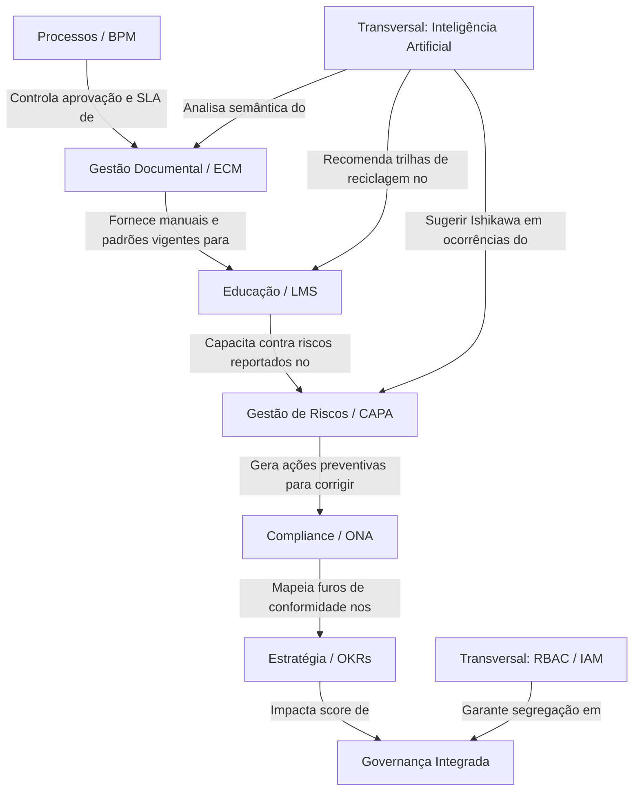

# Capability Map — QualitiOS

Este documento descreve o Mapa de Capacidades de Negócio (Capability Map) do **QualitiOS**, detalhando o que a plataforma é capaz de realizar operacionalmente para entregar valor aos seus usuários e garantir a conformidade institucional.

---

## 1. CORE CAPABILITY (Capacidade Principal)

### Governança Integrada
Orquestração, segregação de acessos, controle analítico estratégico e supervisão global da conformidade corporativa.

*   **Objetivo**: Garantir que a organização opere em estrita conformidade com as diretrizes regulatórias e seus objetivos estratégicos de longo prazo, de forma transparente e auditável.
*   **Responsabilidades**: Mapeamento de papéis e direitos de decisão (RBAC), consolidação de dashboards gerenciais contextualizados por perfil, controle de vigências e auditoria de conformidade em tempo real.
*   **Entradas**: Diretrizes regulatórias, OKRs corporativos, POPs aprovados, registros de não conformidades, relatórios de treinamentos e streams de coletas de indicadores operacionais.
*   **Saídas**: Scores de conformidade da acreditação (ONA/ISO), painéis de OKRs atualizados, relatórios de glosas mitigadas, planos CAPA consolidados e trilhas de auditoria para inspeções externas.

---

## 2. SUPPORTING CAPABILITIES (Capacidades de Suporte)

### 2.1. Estratégia
*   **OKRs**: Criação, desdobramento (Corporativo -> Setorial -> Individual) e cálculo de score ponderado automático de objetivos e Key Results.
*   **KPIs & Indicadores**: Mapeamento, definição de metas e agendamento de coletas diárias ou periódicas de métricas operacionais e assistenciais.
*   **Dashboards**: Exibição centralizada de indicadores e metas em layouts dinâmicos baseados no perfil do usuário conectado.

### 2.2. Compliance
*   **Acreditação**: Matrizes de requisitos de acreditação (ex: ONA Níveis 1, 2 e 3) e diagnósticos de conformidade.
*   **Auditoria**: Agendamento, condução de auditorias internas periódicas e consolidação de scores de conformidade sanitária.
*   **Checklists**: Questionários dinâmicos de verificação e conformidade técnica de leito/setor.
*   **Evidências**: Upload de comprovações documentais (laudos, alvarás, relatórios) atreladas aos requisitos de acreditação.

### 2.3. Educação
*   **LMS (Learning Management System)**: Criação de cursos, catálogo de aulas de treinamento e controle de progresso individual de colaboradores.
*   **Trilhas**: Agrupamento de cursos em jornadas obrigatórias por setor (ex: Integração Institucional com SLA de 72 horas).
*   **Certificações**: Geração de diplomas digitais criptografados com registro permanente no histórico do profissional.
*   **Avaliações**: Quizzes de múltipla escolha com notas de corte configuráveis para verificação de assimilação de conteúdo.

### 2.4. Conhecimento
*   **Biblioteca**: Central de compartilhamento de manuais, diretrizes, tutoriais de conformidade e material educativo.
*   **Busca**: Mecanismo de busca textual e catalogação inteligente para localização imediata de protocolos.
*   **Publicações & Normativos**: Gestão de comunicados internos, circulares e atualizações legislativas relevantes.

### 2.5. Processos
*   **BPM & Workflows**: Modelagem e execução de fluxos de processos (solicitações, aprovações, revisões periódicas).
*   **Aprovações**: Controle de transição de etapas com assinaturas e pareceres formais de gestores.
*   **SLA**: Alocação de prazos limites por etapa do processo, alertas e escalonamento automático em caso de atraso.
*   **Formulários**: Construtor dinâmico de campos eletrônicos (inputs, uploads, datas) para captura padronizada de dados.

### 2.6. Documentos
*   **ECM (Enterprise Content Management)**: Gestão unificada de documentos de qualidade, políticas e guias de conduta.
*   **Versionamento**: Rastreabilidade completa de revisões de POPs, edições pendentes com justificativas e controle de versões ativas e históricas.
*   **Assinaturas**: Validação de assinaturas digitais ou eletrônicas de conformidade jurídica/técnica.
*   **Contratos**: Ciclo de vida de aditivos, credenciamentos de operadoras de saúde e contratos de fornecedores.

### 2.7. Riscos
*   **Incidentes**: Captação e notificação de eventos adversos (quedas, erros de medicação) e quase acidentes (*near misses*).
*   **CAPA (Corrective and Preventive Action)**: Abertura e acompanhamento de planos de ação corretiva baseados nas causas-raiz de falhas.
*   **Ishikawa**: Ferramenta interativa de diagrama de causa e efeito estruturado sob fatores (Mão de Obra, Método, Material, etc.).
*   **Planos de Ação**: Delegação de tarefas preventivas e monitoramento de execução de correções.

---

## 3. TRANSVERSAL CAPABILITIES (Capacidades Transversais)

*   **Inteligência Artificial (IA)**: Extração de metadados via OCR em PDFs, classificação preditiva de gravidade de incidentes, geração de Ishikawa sugerido e recomendação automatizada de trilhas de LMS para mitigar não conformidades setoriais recorrentes.
*   **Analytics**: Agregação de grandes volumes de dados de KPIs, análise de tendências operacionais, identificação precoce de falhas de SLA e relatórios analíticos estratégicos.
*   **Auditoria**: Log imutável (Event Sourcing) para conformidade com a LGPD e regulamentos sanitários, registrando autoria de acessos e modificações.
*   **Integrações**: Sincronização de dados de prontuários de mercado (padrão FHIR R4) e barramentos genéricos de APIs para alimentação automática de KPIs.
*   **Notificações**: Disparos de e-mails, alertas push e avisos internos de prazos críticos de tarefas e metas vencidas.
*   **RBAC (Role-Based Access Control)**: Controle de acesso refinado baseado em cargos e setores dinâmicos configurados no painel.

---

## 4. CAPABILITY HIERARCHY (Hierarquia de Capacidades)

Abaixo está o mapa hierárquico do QualitiOS, com a **Governança** no topo orquestrando as capacidades de suporte:

```text
Governança Integrada
├── 1. Estratégia
│   ├── OKRs (Objetivos e Resultados-Chave)
│   ├── KPIs & Indicadores Operacionais
│   └── Dashboards Contextuais
├── 2. Compliance
│   ├── Requisitos de Acreditação (ONA/ISO)
│   ├── Auditorias Internas/Externas
│   ├── Checklists de Setor/Leito
│   └── Upload e Rastreio de Evidências
├── 3. Educação Corporativa
│   ├── Universidade Corporativa (LMS)
│   ├── Trilhas Setoriais Obligatórias
│   ├── Certificações com Registro Criptográfico
│   └── Quizzes de Avaliação
├── 4. Conhecimento
│   ├── Biblioteca de Diretrizes
│   ├── Busca Semântica
│   └── Publicações & Normativos
├── 5. Processos (BPM)
│   ├── Workflow de Processos Dinâmicos
│   ├── Aprovações Formais de Ações
│   ├── SLA & Escalonamento de Prazos
│   └── Construtor de Formulários Low-Code
├── 6. Gestão Documental (ECM)
│   ├── Gestão de POPs e Manuais
│   ├── Versionamento e Histórico de Revisões
│   ├── Assinaturas Digitais/Eletrônicas
│   └── Gestão de Contratos de Parceiros
└── 7. Gestão de Riscos
    ├── Registro de Incidentes & Near Misses
    ├── Condução de Ishikawa (Causa Raiz)
    ├── Planos CAPA
    └── Controle de Ações Preventivas
```

---

## 5. CAPABILITY DEPENDENCY MAP (Mapa de Dependências)

As capacidades de suporte e transversais apoiam-se mutuamente para retroalimentar o Core Domain (Governança):



*   **Processos (BPM) ➔ Documental (ECM)**: A alteração ou aprovação de qualquer POP requer a orquestração do motor de workflows e controle de SLAs de revisão do BPM.
*   **Documental (ECM) ➔ Educação (LMS)**: Atualizações de POPs no ECM criam automaticamente demandas de reciclagem no LMS para os setores afetados.
*   **Gestão de Riscos ➔ Compliance**: A identificação de incidentes assistenciais (quedas, infecções) alimenta o diagnóstico ONA de conformidade da qualidade.
*   **Educação (LMS) ➔ Governança**: A comprovação de que 100% da equipe concluiu os treinamentos obrigatórios (LMS) é a evidência exigida pela governança para blindar a instituição em auditorias externas.

---

## 6. CAPABILITY MATURITY (Maturidade das Capacidades)

Classificação do nível de maturidade operacional planejado para as capacidades:

| Capacidade | Classificação | Justificativa |
| :--- | :--- | :--- |
| **RBAC e IAM** | **Essencial** | Fornece a segurança básica de multi-tenancy e controle de privilégios. |
| **Gestão de POPs (ECM)** | **Essencial** | A base documental do hospital precisa estar versionada e vigente. |
| **LMS & Trilhas** | **Essencial** | O onboarding de novos funcionários em 72h é crítico para compliance. |
| **Incidentes & CAPA** | **Essencial** | Captar ocorrências básicas e mitigar perdas assistenciais. |
| **OKRs & KPIs** | **Importante** | Permite o desdobramento tático dos indicadores gerais da qualidade. |
| **Aprovação e SLAs (BPM)**| **Importante** | Impõe a velocidade correta de revisão dos procedimentos do hospital. |
| **Interoperabilidade FHIR** | **Importante** | Necessário para coletar dados passivos direto de prontuários eletrônicos. |
| **Checklists ONA** | **Importante** | Substitui planilhas manuais na auditoria de conformidade física do leito. |
| **Inteligência Artificial (IA)**| **Futuro** | Análise preditiva ativa, busca semântica completa e preenchimento autônomo de checklists. |

---

## 7. CAPABILITY GAP ANALYSIS (Análise de Lacunas do Produto)

Avaliação do status atual de entrega de valor do produto QualitiOS, identificando o que está implementado, o que está parcial (opera com restrições ou simulações) e o que está ausente no produto final:

### 7.1. Capacidades Existentes (Implementadas)
*   **Gestão de POPs (ECM)**: Workflow completo de rascunho, edição pendente, aprovação e controle linear de versões vigentes/históricas.
*   **LMS e Trilhas Obrigatórias**: Criação de cursos, lições, quizzes de avaliação, controle de progresso e emissão automatizada de certificados com controle de SLA (onboarding 72h).
*   **OKRs & KPIs**: Motor de cálculo de pontuação ponderada de metas e coletas de indicadores operacionais.
*   **RBAC Dinâmico**: Matriz de privilégios configurada via JSON por cargo e segregação visual de menus.

### 7.2. Capacidades Parciais
*   **Processos (BPM)**: Os fluxos estão modelados em JSON na interface `/bpm`, mas a execução integrada (avançar etapas, travar ações operacionais fora do fluxo) ainda requer orquestração fina manual no backend.
*   **Interoperabilidade (FHIR)**: O manifesto FHIR R4 e os endpoints de pacientes estão expostos, porém os dados retornados são estáticos e não integrados às tabelas vivas de ocorrências/documentos do banco principal.
*   **Ishikawa (Riscos)**: O desenho de causa-raiz é funcional, mas o preenchimento automático das espinhas de peixe por análise cognitiva de texto do incidente é simulado.

### 7.3. Capacidades Ausentes
*   **Inteligência Artificial (RAG/OCR de Evidências)**: A validação inteligente de conformidade documental e as respostas do Copiloto RAG são simuladas através de mapeamento de palavras-chave estáticas. Não há processamento de linguagem natural (LLM) conectado ou motor de vetorização ativado no backend.
*   **Auditoria Preditiva**: O monitoramento proativo de prontuários externos em background para autopreenchimento de checklists da ONA e previsão de falhas de compliance é um conceito de longo prazo sem implementação ativa no produto.
