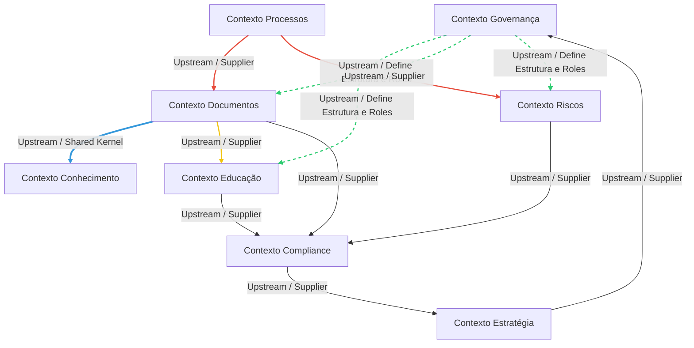
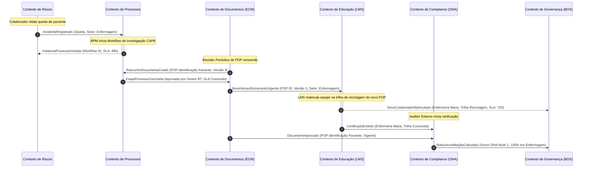

# Context Map — QualitiOS

Este documento descreve o Mapeamento de Contextos (Context Map) e a arquitetura estratégica de negócios do **QualitiOS** com base nos princípios do Domain-Driven Design (DDD). Ele define as fronteiras dos contextos delimitados (Bounded Contexts), o fluxo de eventos de domínio, as relações de dependência (Upstream/Downstream) e a linguagem ubíqua da plataforma.

---

## 1. BOUNDED CONTEXTS & DATA OWNERSHIP

Mapeamos os 8 contextos delimitados de negócio da plataforma, especificando as responsabilidades de cada um e o ciclo de propriedade e intercâmbio de dados:

### 1.1. Contexto de Governança
*   **Responsabilidades**: Orquestrar a estrutura corporativa dinâmica (setores, cargos, menus) e consolidar os indicadores globais de conformidade regulatória e metas.
*   **Dados que Controla (Ownership)**: Estrutura Organizacional (Setores e Cargos), Perfis de RBAC, Configurações de Dashboards Globais.
*   **Dados que Consome**: Scores de Conformidade (Compliance), Desempenho de OKRs (Estratégia), Status de SLAs (Processos), Logs de Event Sourcing (Auditoria).
*   **Dados que Publica**: `EstruturaOrganizacionalModificada`, `PoliticaRBACAtualizada`.

### 1.2. Contexto de Estratégia
*   **Responsabilidades**: Gerenciar o ciclo de vida do planejamento estratégico (OKRs, KRs, metas) e centralizar a medição de KPIs de desempenho setorial.
*   **Dados que Controla (Ownership)**: Ciclos Estratégicos, Definição de OKRs, Metas de Key Results, Lançamento de KPIs.
*   **Dados que Consome**: Metas regulatórias (Compliance), SLA de processos concluídos (Processos), taxas de incidentes (Riscos).
*   **Dados que Publica**: `CicloEstrategicoIniciado`, `KeyResultAtualizado`, `MetaOKRAlcancada`.

### 1.3. Contexto de Compliance
*   **Responsabilidades**: Controlar as matrizes de requisitos de acreditação (ex: ONA Níveis 1, 2 e 3), gerenciar checklists e auditorias internas e externas.
*   **Dados que Controla (Ownership)**: Requisitos Regulatórios, Fichas de Auditoria, Status de Conformidade de Checklist, Vínculos de Evidências.
*   **Dados que Consome**: POPs vigentes (Documentos), Planos de Ação CAPA (Riscos), Certificados emitidos (Educação).
*   **Dados que Publica**: `AuditoriaAgendada`, `ChecklistLeitoRespondido`, `RequisitoConformidadeViolado`, `StatusAcreditaçãoCalculado`.

### 1.4. Contexto de Educação
*   **Responsabilidades**: Gerenciar a Universidade Corporativa (LMS), matrículas, trilhas de treinamento setoriais e emissão de certificados com controle estrito de SLAs.
*   **Dados que Controla (Ownership)**: Cursos, Aulas, Quizzes de Validação, Trilhas Educacionais, Progresso de Aluno, Certificados Criptográficos.
*   **Dados que Consome**: Cadastro de Colaboradores/Cargos (Governança), Atualizações de POPs (Documentos), Reciclagens sugeridas por incidentes (Riscos).
*   **Dados que Publica**: `NovoColaboradorMatriculado`, `TrilhaEducacionalConcluida`, `CertificadoEmitido`, `EstouroSLAOnboardingSinalizado`.

### 1.5. Contexto de Conhecimento
*   **Responsabilidades**: Disponibilizar o repositório público de informações institucionais, comunicados internos e normativos de consulta rápida.
*   **Dados que Controla (Ownership)**: Catálogo da Biblioteca, Tags e Índices de Busca, Comunicados Internos, Links para POPs vigentes.
*   **Dados que Consome**: Cadastro de Setores (Governança), Documentos Aprovados (Documentos).
*   **Dados que Publica**: `BibliotecaAtualizada`, `ComunicadoPublicado`.

### 1.6. Contexto de Processos
*   **Responsabilidades**: Orquestrar a execução de workflows de negócios, gerenciar alertas de SLA das etapas e configurar formulários dinâmicos.
*   **Dados que Controla (Ownership)**: Modelos de Workflow (BPMN), Instâncias de Execução, Transição de Etapas de Processos, SLAs de Prazos de Atividades, Definições de Formulários Low-Code.
*   **Dados que Consome**: Níveis de aprovação por cargo (Governança), Documentos vinculados ao fluxo (Documentos), Incidente gerador do processo (Riscos).
*   **Dados que Publica**: `InstanciaProcessoIniciada`, `EtapaProcessoConcluida`, `EstouroSLAProcessoAlerta`.

### 1.7. Contexto de Documentos (ECM)
*   **Responsabilidades**: Controlar o ciclo de vida completo de documentos da qualidade (POPs, manuais, diretrizes) e contratos da instituição.
*   **Dados que Controla (Ownership)**: Procedimentos Operacionais Padrão (POPs), Versionamento de Arquivos, Rascunhos e Edições Pendentes, Ciclo de Vida de Contratos.
*   **Dados que Consome**: Cargos Aprovadores (Governança), Workflow de aprovação (Processos).
*   **Dados que Publica**: `RascunhoDocumentoCriado`, `EdicaoDocumentoPendente`, `DocumentoAprovado`, `NovaVersaoDocumentoVigente`, `DocumentoRevogado`.

### 1.8. Contexto de Riscos
*   **Responsabilidades**: Registrar não conformidades, gerenciar investigações de causa raiz e acompanhar planos de ação corretiva e preventiva (CAPA).
*   **Dados que Controla (Ownership)**: Registro de Incidentes (Eventos Adversos e *Near Misses*), Diagramas de Causa Raiz (Ishikawa), Ações Preventivas/Corretivas (CAPA).
*   **Dados que Consome**: POPs violados no incidente (Documentos), Setor do incidente (Governança), Execução de ações preventivas (Processos).
*   **Dados que Publica**: `IncidenteRegistrado`, `IshikawaConcluido`, `PlanoCAPAIniciado`, `AcaoPreventivaExecutada`.

---

## 2. CONTEXT RELATIONSHIPS (Relacionamento de Contextos)

Os Bounded Contexts interagem sob diferentes padrões de relacionamento tático, demonstrados no diagrama e detalhados a seguir:

### 2.1. Relacionamento por Compartilhamento (Shared Kernel)
*   **Documentos (ECM) ➔ Conhecimento**: Compartilham um núcleo comum de taxonomia e indexação de arquivos para viabilizar a busca. Alterações na catalogação de categorias de documentos afetam diretamente o índice da biblioteca.

### 2.2. Relacionamento Provedor-Consumidor (Customer-Supplier / Upstream-Downstream)
*   **Processos (BPM) [Upstream/Supplier] ➔ Documentos [Downstream/Customer]**: A engine de BPM fornece a orquestração e prazos de SLA de aprovação. O ECM consome esse fluxo e depende de suas transições para alterar o status do documento de "Rascunho" para "Vigente".
*   **Processos (BPM) [Upstream/Supplier] ➔ Riscos (CAPA) [Downstream/Customer]**: O BPM fornece o workflow padrão de tratativas CAPA. O contexto de riscos consome os prazos e transições de tarefas.
*   **Documentos [Upstream/Supplier] ➔ Educação [Downstream/Customer]**: O ECM publica que um POP foi revisado/atualizado. O contexto do LMS consome esse evento e matricula automaticamente os colaboradores do setor em trilhas de reciclagem.
*   **Riscos [Upstream/Supplier] ➔ Compliance [Downstream/Customer]**: O contexto de Riscos envia o status de conformidade das ações CAPA e estatísticas de incidentes. O contexto de Compliance consome esses dados para calcular o nível de segurança do leito/setor.
*   **Educação [Upstream/Supplier] ➔ Compliance [Downstream/Customer]**: Educação fornece os certificados dos treinamentos obrigatórios como evidência documental para auditorias.

### 2.3. Relação de Conformidade (Conformist / Upstream-Downstream)
*   **Estratégia [Upstream] ➔ Governança [Downstream]**: A Governança consome os scores de OKRs e KRs calculados pela Estratégia sem poder influenciar o algoritmo de cálculo corporativo. Ela aceita o modelo de dados de performance de metas para popular seus painéis gerenciais.

---

## 3. EVENT MAP (Mapa de Eventos de Domínio)

Os fluxos de negócios são disparados por eventos assíncronos gerados pelas interações dos usuários em cada contexto:

### Principais Eventos de Negócio:
1.  `IncidenteRegistrado`: Disparado quando um colaborador reporta um evento adverso assistencial. Consumido pelo BPM para iniciar um plano CAPA.
2.  `DocumentoAprovado`: Disparado quando um POP passa por todas as revisões do workflow e é ativado. Consumido pelo LMS para criar alertas de leitura.
3.  `CertificadoEmitido`: Disparado quando um colaborador conclui um curso obrigatório no LMS. Consumido pelo Compliance como evidência para auditorias regulatórias.
4.  `EstouroSLAOnboardingSinalizado`: Disparado se um colaborador não concluir o treinamento corporativo em 72 horas. Consumido pela Governança para travar permissões ou escalonar alerta à gerência.
5.  `ChecklistLeitoRespondido`: Disparado pelo gestor em auditorias de conformidade do leito. Consumido pelo Compliance para recalcular o score ONA do hospital.

---

## 4. UBIQUITOUS LANGUAGE (Linguagem Ubíqua)

Glossário oficial de termos de negócios padronizados para o QualitiOS, com aplicação obrigatória no código (TypeScript), schemas de banco (DDL) e documentação:

*   **BOS (Business Operating System)**: O Sistema Operacional Corporativo; a espinha dorsal dinâmica multi-tenant do QualitiOS que gerencia a governança.
*   **POP (Procedimento Operacional Padrão)**: O documento de qualidade versionado e aprovado que descreve o fluxo padrão de uma rotina corporativa ou assistencial.
*   **Vigência**: O status de validade e aplicabilidade de um documento ou procedimento institucional. Um POP só pode ter uma versão *Vigente* por setor por vez.
*   **Onboarding**: Trilha curricular educacional e introdutória obrigatória na qual todos os colaboradores são matriculados ao ingressar na organização, com SLA estrito de 72 horas para conclusão.
*   **SLA (Service Level Agreement)**: Prazo máximo estipulado no nível administrativo para execução de uma atividade do processo (revisão de POP, fechamento de CAPA, conclusão de curso).
*   **Incident (Incidente)**: Qualquer desvio das políticas e procedimentos padrão, classificado como *Near Miss* (quase acidente), *Evento Adverso Assistencial* (erro com dano ao paciente) ou *Não Conformidade Operacional*.
*   **CAPA (Corrective and Preventive Action)**: O plano estruturado composto por ações corretivas e preventivas destinadas a sanar a causa raiz de um incidente relatado.
*   **Ishikawa (Diagrama de Causa e Efeito)**: Metodologia estruturada para identificação e categorização das causas raízes de um desvio de qualidade.
*   **Evidência**: O documento, checklist assinado, log imutável ou certificado de treinamento que comprova perante a auditoria que um determinado requisito de compliance foi cumprido.
*   **RBAC (Role-Based Access Control)**: Matriz que governa e restringe o acesso dos usuários com base em sua vinculação a setores e cargos dinâmicos.
