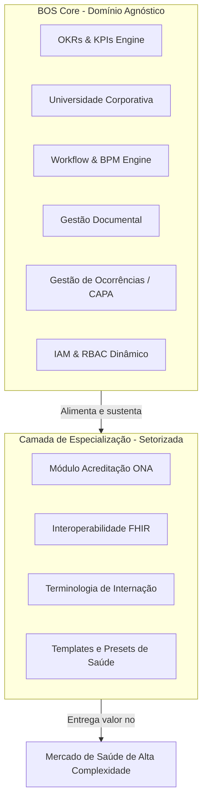

# Alinhamento Estratégico de Produto e Descoberta de Domínio (V2) — QualitiOS

Este documento consolida a revisão estratégica e o refinamento do posicionamento de mercado, escopo de produto, fronteiras de domínios e a estratégia de especialização do **QualitiOS**, definindo o direcionamento tático para futuras decisões arquiteturais.

---

## 1. POSICIONAMENTO E ESCOPO DE MERCADO (MARKET SCOPE)

A definição estratégica do QualitiOS é a de uma **Plataforma de Governança Corporativa com especialização em Saúde (Opção B)**.

### Racional Estratégico:
1. **Dinamismo Arquitetural**: O QualitiOS foi concebido desde a fundação com suporte a setores dinâmicos, menus configuráveis por perfil e RBAC parametrizável em JSON. Torná-lo um produto puramente de saúde (Opção A) enfraqueceria esse motor genérico de alto valor.
2. **Escalabilidade Comercial**: A arquitetura de software baseada em um core agnóstico de governança permite que o QualitiOS atue hoje na saúde (resolvendo a dor crítica de acreditação ONA) e, no futuro, expanda para outros setores altamente regulados (como finanças ou indústria farmacêutica) apenas substituindo a camada de conformidade/acreditação.
3. **Redução de Custo de Engenharia**: A base de código do motor de workflows (BPM), gestão de metas (OKRs) e ensino (LMS) não possui acoplamento com regras clínicas, mantendo o núcleo simples, performático e modular.

---

## 2. ESTRATÉGIA VERTICAL (VERTICAL STRATEGY)

A estratégia de mercado do QualitiOS adota o conceito de **Beachhead Market** (Mercado de Cabeça de Ponte), elegendo a **Saúde de Alta Complexidade (Instituições de Internação)** como primeiro segmento a ser dominado.

### Por que a Saúde?
* **Risco e Penalidade**: A perda de uma acreditação (ONA ou ISO) ou furos em protocolos assistenciais geram riscos jurídicos severos, além de desvalorização institucional e glosas financeiras imediatas por parte de operadoras de saúde. A disposição a pagar (Willingness to Pay) por soluções de conformidade é extremamente alta.
* **Alta Rotatividade de Pessoal (Turnover)**: Hospitais enfrentam rotatividade contínua de equipes de enfermagem e assistência. O LMS integrado do QualitiOS (com trilhas automáticas com SLA de 72 horas) resolve diretamente a dor do onboarding rápido de conformidade regulatória.
* **Complexidade Documental**: Protocolos de segurança do paciente exigem revisões periódicas estritas com controle de autoria e SLAs claros (geridos pelo ECM/BPM do QualitiOS).

---

## 3. FRONTEIRAS DO CORE PLATFORM (CORE PLATFORM BOUNDARIES)

Para assegurar o desacoplamento e a evolução limpa do produto, as fronteiras entre o núcleo agnóstico e a verticalização foram delimitadas na tabela abaixo:

| Componente | Core Platform (Agnóstico) | Vertical de Saúde (Especialização) |
| :--- | :--- | :--- |
| **Gestão Estratégica** | Motor de cálculo de OKRs e Key Results corporativos e individuais. | Integração de KRs a indicadores hospitalares (SLA de atendimento, taxa de reinfecção). |
| **Capacitação** | LMS com vídeos, PDFs, trilhas obrigatórias e quizzes de avaliação. | Conteúdo específico de segurança do paciente, protocolos de identificação e manuais ONA. |
| **Processos (BPM)** | Engine de execução de etapas, controle de transição e gerenciamento de SLA. | Fluxos de aprovação de POPs assistenciais e auditorias clínicas de leito. |
| **Documentos (ECM)** | Versionamento de arquivos, templates low-code, placeholders e controle de assinaturas. | Gestão de POPs assistenciais, termos de consentimento e contratos de credenciamento. |
| **Melhoria Contínua** | Gestão de ocorrências e fluxo de investigação de causa raiz (CAPA / Ishikawa). | Registro de eventos adversos (quedas, erros de medicação) e notificações de *near misses*. |
| **Interoperabilidade** | API REST e Gateway de integração genérico. | Conectores baseados na especificação FHIR R4 para comunicação com prontuários eletrônicos (EHR). |

> [!IMPORTANT]
> A especialização ocorre por meio de **Configurações, Templates, Dicionários de Dados e Conectores de API**, nunca alterando a lógica nativa de controle ou persistência do Core Platform.

---

## 4. SETORES SUPORTADOS (SUPPORTED SECTORS)

O QualitiOS opera sob uma estrutura de **Setores Dinâmicos**. O banco de dados inicializa com as seguintes especialidades e escopos de acesso configurados no painel administrativo:

1. **Diretoria Geral / Gestão**: Visão corporativa total, acesso a painéis de glosas de internação, balanço de OKRs estratégicos globais e logs de auditoria de sistema (LGPD).
2. **Enfermagem**: Perfil focado em conformidade assistencial diária, preenchimento de checklists de segurança na internação, consumo de trilhas do LMS de prevenção de incidentes e consulta a POPs assistenciais.
3. **Medicina**: Perfil focado em protocolos clínicos, diretrizes terapêuticas, fluxos de alta complexidade e revisões de diretrizes de governança clínica.
4. **Farmácia**: Controle de psicotrópicos, protocolos de dispensação segura (LASA/Alta Vigilância) e verificação de SLA de reposição de kits de urgência.
5. **Qualidade e Compliance**: Administradores de conformidade ONA/ISO. Criam e gerenciam as evidências, acompanham auditorias externas e conduzem os planos de ação corretiva (CAPA).
6. **Administrativo / Contratos**: Gestão de contratos de operadoras e fornecedores, monitoramento de SLAs corporativos e compliance financeiro.

---

## 5. ESTRATÉGIA DE EXPANSÃO FUTURA

Após a consolidação no Beachhead Market de saúde, a plataforma poderá expandir para outros mercados verticais regulados utilizando o mesmo BOS Core. 

### Roteiro de Expansão Multissetorial:

* **Vertical 2: Mercado Financeiro & Fintechs**:
  * *Camada de Especialização*: Auditoria de controles internos baseados nas circulares do Banco Central (BACEN), conformidade com a LGPD e COBIT.
  * *Reaproveitamento*: OKRs de metas regulatórias, LMS para certificações obrigatórias de agentes autônomos, BPM para fluxos de crédito.
* **Vertical 3: Indústria Farmacêutica & Biotecnologia**:
  * *Camada de Especialização*: Compliance com normas da ANVISA (Boas Práticas de Fabricação - BPF) e RDC 301.
  * *Reaproveitamento*: ECM para versionamento de fórmulas químicas e procedimentos de manufatura, LMS para controle de treinamento de segurança de laboratório.
* **Vertical 4: Transporte e Logística Regulada**:
  * *Camada de Especialização*: Compliance com normas da ANTT e ISO 39001 (Segurança Viária).
  * *Reaproveitamento*: Gestão de incidentes (CAPA) para sinistros rodoviários, LMS para reciclagem de motoristas de carga perigosa.

---

## 6. REVISÃO DE CAPACIDADES CHAVE

### 6.1. O Papel de Processos e Automação
Os processos dentro da plataforma não se destinam ao desenho técnico de fluxogramas livres. Eles são o **mecanismo de execução da governança**. 
A automação serve para garantir que as políticas corporativas escritas nos POPs sejam efetivamente aplicadas na prática (ex: bloquear a escala de um enfermeiro no sistema caso o seu treinamento obrigatório de integração no LMS passe do SLA de 72 horas, ou disparar um fluxo automático de investigação de causa raiz sempre que um evento adverso assistencial crítico for relatado).

### 6.2. O Papel de BPM (Business Process Management)
O BPM atua como a **orquestração dinâmica de rotinas organizacionais**. Ele provê flexibilidade para os gestores desenharem caminhos de aprovação (workflows) de forma totalmente visual (low-code), sem necessidade de apoio do time de TI. O motor de BPM do QualitiOS monitora ativamente as transições de status de documentos e conformidades, registrando o histórico em tempo real e controlando tempos de ciclo e SLAs críticos.

### 6.3. O Papel de Gestão do Conhecimento (Knowledge Management)
A Gestão do Conhecimento é o **elo de transição entre o Padrão Escrito e a Prática Executada**. 
A plataforma integra o **ECM** (repositório dos POPs vigentes) ao **LMS** (plataforma de ensino). Sempre que um POP crítico sofre revisão ou atualização, o sistema identifica automaticamente os colaboradores afetados e gera um microtreinamento contendo o documento atualizado e um quiz de verificação de leitura. Dessa forma, a governança garante que o conhecimento institucional não fique engavetado, mas sim circulando e assimilado de maneira rastreável e auditável pelas equipes.
