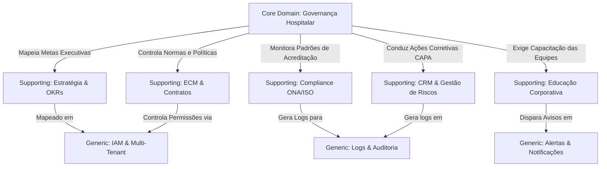

# Alinhamento de Produto e Descoberta de Domínio — QualitiOS (Domain Discovery)

Este documento estabelece a visão estratégica oficial de produto, o mapeamento de domínios (Core, Supporting e Generic), a identificação de personas e o posicionamento de mercado do **QualitiOS**, servindo como diretriz estratégica de negócios para futuras evoluções da plataforma.

---

## 1. PRODUCT VISION

> "O QualitiOS é um **Sistema Operacional Corporativo (BOS)** de governança estratégica, conformidade de internação (ONA/ISO) e educação continuada (LMS), projetado de forma dinâmica e multi-tenant para instituições de saúde de alta complexidade."

---

## 2. PROBLEMAS RESOLVIDOS

A plataforma resolve dores de negócio complexas que impactam a eficiência e a segurança jurídica de instituições hospitalares:

*   **Dificuldade e Burocracia para Obtenção/Manutenção da Acreditação ONA (Nível 1, 2 e 3)**: A coleta manual de evidências e auditorias de conformidade geram gargalos de tempo e risco de perda da certificação. (Classificação: **Crítico**)
*   **Desalinhamento entre a Estratégia Corporativa e a Operação Diária**: Distanciamento entre os objetivos traçados pela alta diretoria (OKRs) e o cumprimento de rotinas e coletas de dados pelas equipes assistenciais. (Classificação: **Crítico**)
*   **Risco Assistencial decorrente de Desatualização de POPs e Protocolos**: Ausência de controle estrito sobre versões vigentes, assinaturas técnicas e circulação de procedimentos operacionais. (Classificação: **Importante**)
*   **Estouro de SLA em Treinamentos Obrigatórios de Integração (Onboarding)**: Falha em garantir que novos colaboradores concluam os módulos críticos de segurança do paciente nas primeiras 72 horas pós-admissão. (Classificação: **Importante**)
*   **Falta de Visibilidade Unificada de Indicadores Assistenciais (KPIs)**: Dispersão de métricas e ausência de semáforos preditivos de não conformidade por setor. (Classificação: **Importante**)
*   **Ausência de Rastreabilidade e Auditoria para LGPD/Compliance**: Falha em mapear quem visualizou, editou ou assinou documentos assistenciais confidenciais. (Classificação: **Secundário**)

---

## 3. PERSONAS

Mapeamos 5 perfis de usuários que interagem com o ecossistema da plataforma:

1.  **Diretoria Geral / CFO (Alta Gestão)**: Acompanha a saúde corporativa global, o benchmarking de mercado, a aderência dos OKRs estratégicos plurianuais e as metas de redução de glosas.
2.  **Gestor da Qualidade e Segurança (Auditor Interno)**: O usuário central do sistema. Configura checklists ONA, analisa notificações de incidentes assistenciais, gerencia planos CAPA (ações corretivas) e consolida evidências.
3.  **Coordenador de Setor / Responsável Técnico (RT)**: Liderança tática. Elabora, revisa e aprova alterações nos POPs de seu setor, monitora coletas de indicadores e valida a conformidade das equipes.
4.  **Colaborador Assistencial (Enfermeiro, Médico, Farmacêutico)**: Equipe de linha de frente. Executa coletas diárias, consome as trilhas curriculares obrigatórias (LMS), consulta protocolos de segurança e relata não conformidades ou near misses.
5.  **Auditor Externo (Auditor ONA)**: Usuário temporário. Acessa a plataforma sob perfil restrito de leitura (Modo Auditoria) para analisar a aderência a requisitos, checklists preenchidos e a rastreabilidade das evidências documentais.

---

## 4. CORE DOMAIN (Domínio Principal)

O domínio central e unificador da plataforma QualitiOS é a **Governança**.

### Justificativa Técnica/Negócio:
A plataforma possui módulos robustos de Estratégia, Educação e Conformidade, mas nenhum deles existe de forma isolada. A proposta de valor de negócio do QualitiOS está na **Orquestração e Controle** de todas as engrenagens organizacionais. 
*   A *Estratégia (OKRs)* define os objetivos.
*   A *Educação (LMS)* garante a capacitação de pessoal.
*   A *Gestão de Documentos (POPs)* registra os padrões.
*   A *Gestão de Incidentes (CRM/CAPA)* corrige os desvios.

O núcleo unificador que garante que estes componentes operem de forma sincronizada para manter o hospital seguro, lucrativo e acreditado é a **Governança**. Ela estabelece a matriz de direitos de decisão, delegação de responsabilidades e conformidade perante órgãos reguladores.

---

## 5. SUPPORTING DOMAINS (Domínios de Suporte)

São os domínios que fornecem capacidades especializadas para viabilizar a Governança:

*   **Estratégia (OKRs & KPIs)**: Permite definir objetivos de longo prazo e desdobrá-los em Key Results associados a coletas assistenciais diárias.
*   **Compliance e Acreditação (ONA / ISO)**: Fornece as matrizes de conformidade, checklists ONA e monitoramento de scores de auditoria.
*   **Educação Corporativa (LMS)**: Módulo de streaming de conhecimento e verificação de aproveitamento das equipes de saúde.
*   **Gestão de Conteúdo (ECM & Contracts)**: Gestão, versionamento e controle do ciclo de vida de documentos, aditivos e contratos.
*   **Gestão de Riscos (CRM / CAPA)**: Captação de não conformidades (CRM) e condução de investigações de causa raiz (diagrama de Ishikawa) e planos corretivos.

---

## 6. GENERIC DOMAINS (Domínios Genéricos)

Serviços reutilizáveis de mercado que dão base técnica à aplicação:

*   **Controle de Identidade (IAM / RBAC / Multi-Tenancy)**: Gerenciamento de credenciais e controle de privilégios.
*   **Mensageria e Notificações**: Disparo de e-mails, alertas push e notificações de escalonamento.
*   **Trilha de Auditoria (Event Sourcing)**: Registro imutável de logs para atendimento às conformidades sanitárias e de proteção de dados (LGPD).
*   **Customização Dinâmica (Dashboard Designer)**: Customização de widgets, menus dinâmicos e visões baseadas no perfil.

---

## 7. DOMAIN MAP (Mapeamento de Relacionamentos)

O mapa a seguir demonstra a centralidade da **Governança** e como os domínios de suporte gravitam ao seu redor:

---

## 8. PAPEL DO BPM

> O BPM no QualitiOS é uma **Capacidade Transversal (Cross-cutting Capability)**.

### Justificativa:
O QualitiOS não é uma ferramenta geral de desenho de processos BPMN voltada para desenvolvimento de software ou automação de escritórios. O gerenciamento de processos de negócio (BPM) existe na plataforma para dar fluidez, automação e impor regras de SLA em fluxos das outras verticais, tais como: condução de uma investigação de incidente, revisão técnica e aprovação de um POP assistencial ou assinatura de um contrato jurídico. Ele atua de forma transversal a todos os domínios de suporte.

---

## 9. PAPEL DA IA

> A IA no QualitiOS é uma **Capacidade Transversal (Cross-cutting Capability)**.

### Justificativa:
A Inteligência Artificial não é vendida como um produto isolado ou um módulo à parte. A IA atua integrada de forma ubíqua na plataforma: extraindo dados OCR de PDFs no ECM, classificando a gravidade e sugerindo Ishikawa em ocorrências do CRM, indicando gaps de conformidade em diagnósticos ONA ou sugerindo reciclagens automatizadas no LMS baseando-se em erros recorrentes das equipes. Ela enriquece os domínios de suporte transversalmente para acelerar e blindar a Governança.

---

## 10. POSICIONAMENTO DE MERCADO

> A categoria de posicionamento de mercado oficial do QualitiOS é: **Sistema Operacional Corporativo (BOS - Business Operating System)**.

### Justificativa:
Posicionar o QualitiOS puramente como uma "Plataforma de Governança" ou "Plataforma de Gestão Estratégica" limita o entendimento do seu dinamismo multi-tenant e de seus motores integrados de LMS e ECM. Como um **Sistema Operacional Corporativo**, o QualitiOS se vende como a espinha dorsal digital na qual o hospital executa suas rotinas assistenciais, treina suas equipes, define seu planejamento de metas e gerencia sua conformidade de forma unificada e parametrizável.

---

## 11. VISÃO DE LONGO PRAZO

A evolução natural do QualitiOS nos próximos anos guiará o produto em duas direções principais:

1.  **Governança Preditiva e Conectada**: Transição da governança puramente reativa (verificação de incidentes passados) para um modelo ativo. A IA atuará monitorando streams de dados e integrando-se via ferramentas MCP a sistemas externos do hospital para prever furos de protocolo assistencial antes mesmo que gerem uma não conformidade física.
2.  **Compliance Auto-Avaliável (Auditoria Autônoma)**: O ecossistema utilizará agentes inteligentes integrados às APIs de prontuários eletrônicos de mercado para coletar evidências clínicas em background, autopreencher os checklists de acreditação ONA e alertar os gestores sobre a conformidade diária do hospital com esforço manual quase nulo.
