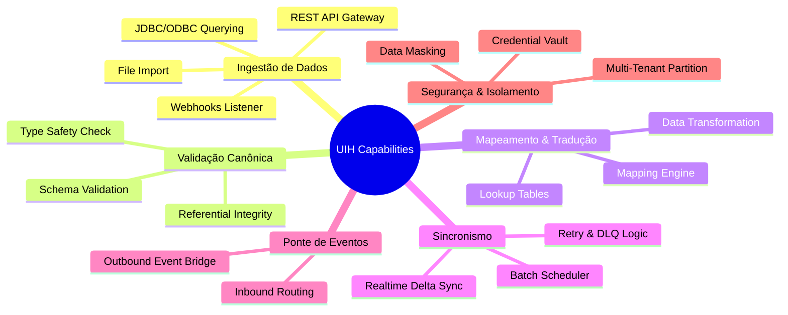

# Item 02 — Capability Map — Universal Integration Hub (UIH)

Este documento especifica o mapa de capacidades lógicas e dependências do **Universal Integration Hub (UIH)**.

---

---

## 1. DETALHAMENTO DAS CAPACIDADES DO UIH

### 1.1. Ingestão de Dados (Data Ingestion)
*   *Descrição*: Capacidade de estabelecer conexão física e ler fluxos de dados do exterior.
*   *Mecanismos*:
    *   **REST API Gateway**: Endpoints HTTPS padronizados para receber dados ativamente.
    *   **Webhooks Listener**: Receptor de notificações reativas acionado por sistemas externos.
    *   **JDBC/ODBC Driver**: Consulta periódica direta a tabelas de bancos legados (PostgreSQL, SQL Server, Oracle).
    *   **Flat File Parser**: Importação estruturada de arquivos CSV, JSON ou XML de pastas compartilhadas (buckets S3/MinIO).

### 1.2. Validação Canônica (Canonical Validation)
*   *Descrição*: Garantir que os dados importados estejam rigorosamente em conformidade com o formato e as regras de negócio internas do QualitiOS antes de inseri-los no banco de dados operacional.
*   *Mecanismos*:
    *   **Schema Validation**: Verificação automática de chaves e campos obrigatórios.
    *   **Type Safety Check**: Conversão e validação de tipos de dados (ex: converter string ISO para timestamp Postgres).

### 1.3. Mapeamento & Tradução (Mapping & Translation)
*   *Descrição*: Converter payloads JSON/XML arbitrários de terceiros para a especificação do Modelo Canônico do QualitiOS.
*   *Mecanismos*:
    *   **Mapping Schema**: Definições baseadas em metadados lógicos (ex: mapear `cod_func` do HIS para `colaborador_codigo` no QualitiOS).
    *   **Lookup Translation**: Tradução de enums dinâmicos (ex: mapear status de ocorrência `'1'` no ERP para `'Aberto'` no QualitiOS).

### 1.4. Sincronismo (Synchronization)
*   *Descrição*: Orquestrar a frequência e a resiliência das cargas de dados.
*   *Mecanismos*:
    *   **Batch Scheduler**: Agendador de tarefas cron para processamento de alto volume (ex: sincronizar cadastro de funcionários às 2h).
    *   **Realtime Sync**: Processamento imediato de eventos (ex: registrar acidente de trabalho e abrir ocorrência em tempo real).
    *   **Retry & Queue Engine**: Barramento de reprocessamento e Dead Letter Queue (DLQ) para reter erros.

### 1.5. Ponte de Eventos (Event Bridge)
*   *Descrição*: Ligar barramentos de mensagens externos ao barramento interno de eventos de domínio do QualitiOS.
*   *Mecanismos*:
    *   **Event Bridge Outbound**: Publicar eventos como `ate.assessment.completed` ou `core.ocorrencia.registrada` para tópicos externos (Kafka, RabbitMQ, Webhooks).
    *   **Event Bridge Inbound**: Escutar tópicos de mensageria de terceiros e convertê-los em eventos internos do sistema.

### 1.6. Segurança & Isolamento (Security & Isolation)
*   *Descrição*: Garantir a proteção dos dados dos tenants e conexões.
*   *Mecanismos*:
    *   **Multi-Tenant Partition**: Segregação de credenciais, chaves e rotas por tenant.
    *   **Credential Vault**: Armazenamento seguro criptografado de tokens, senhas e secrets de sistemas de origem.
    *   **Data Masking**: Mascaramento dinâmico de dados sensíveis na ingestão e auditoria.
