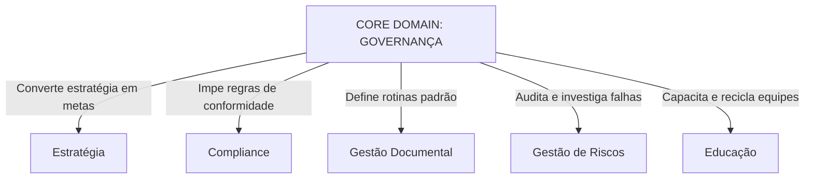
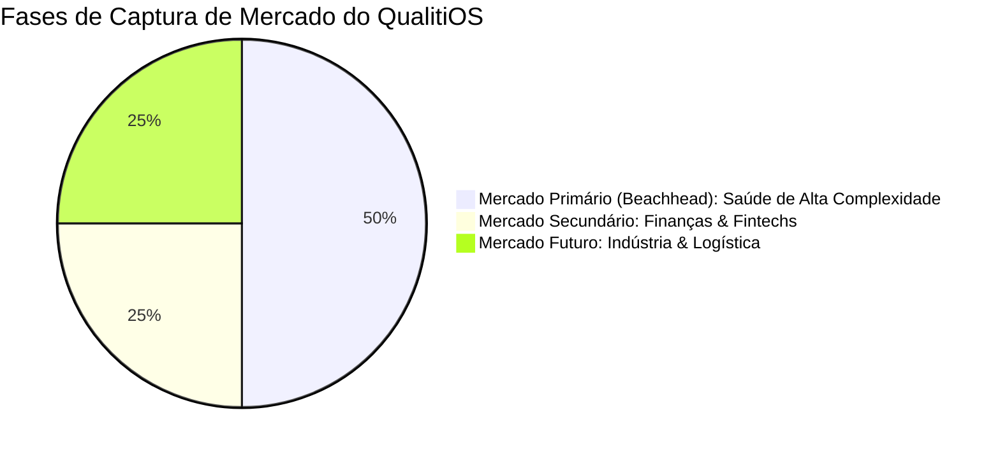

# Product Charter V2 — QualitiOS

Este documento constitui o estatuto oficial e a diretriz estratégica de produto (Product Charter) do **QualitiOS**. Ele estabelece a identidade, missão, visão, modelo de domínios, personas e princípios que devem orientar e pautar qualquer decisão comercial, de engenharia ou de arquitetura da plataforma.

---

## 1. PRODUCT IDENTITY (Identidade do Produto)

*   **Nome Oficial**: QualitiOS
*   **Categoria do Produto**: Sistema Operacional Corporativo (BOS - Business Operating System)
*   **Posicionamento de Mercado**: A espinha dorsal digital e governança integrada para organizações operando em setores altamente regulados.
*   **Proposta de Valor**: Garantir que as diretrizes estratégicas e as normas regulatórias de conformidade sejam convertidas em rotinas operacionais práticas, auditáveis, automatizadas e assimiladas pelas equipes de linha de frente, minimizando riscos operacionais e blindando a conformidade institucional.

> [!NOTE]
> **Definição de Frase Única**:
> "O QualitiOS é um Sistema Operacional Corporativo (BOS) de governança integrada, conformidade regulatória e educação continuada, projetado sob um núcleo dinâmico e multi-tenant para orquestrar e assegurar a conformidade operacional em instituições de alta complexidade."

---

## 2. MISSÃO

A missão do QualitiOS é **traduzir governança em operação cotidiana**. A plataforma visa erradicar a burocracia passiva de manuais e regulamentos estáticos, transformando diretrizes de compliance em processos de negócios executáveis, fluxos monitorados, e aprendizado contínuo aplicado diretamente à rotina dos profissionais.

---

## 3. VISÃO

Consolidar o QualitiOS nos próximos 5 a 10 anos como a **principal referência global em Sistemas Operacionais Corporativos para mercados regulados**, evoluindo de uma plataforma de monitoramento reativo para um ecossistema de **Governança Ativa e Preditiva**, capaz de antecipar furos de conformidade e auto-avaliar evidências operacionais de forma totalmente autônoma e em tempo real.

---

## 4. CORE DOMAIN (Domínio Principal)

O domínio central e integrador do QualitiOS é a **Governança**.

*   **Objetivo**: Servir como o núcleo de orquestração e controle de todas as verticais de suporte do ecossistema corporativo.
*   **Responsabilidades**: Mapear direitos de decisão, consolidar visões táticas e estratégicas (dashboards contextuais), gerenciar permissões dinâmicas (RBAC) e assegurar a aderência global da organização aos seus compromissos regulatórios.
*   **Limites**: A Governança do QualitiOS não se envolve na operação física/técnica de sistemas especialistas (como faturamento ou prontuários de pacientes), mas restringe-se a capturar as métricas, os fluxos de aprovação, a conformidade de dados e as trilhas de auditoria das ações humanas.

---

## 5. SUPPORTING DOMAINS (Domínios de Suporte)

São os domínios que provêm capacidades específicas necessárias para viabilizar e materializar a Governança:

### 5.1. Estratégia (OKRs & KPIs)
*   **Objetivo**: Desdobrar metas corporativas de longo prazo em resultados mensuráveis no nível diário dos setores.
*   **Responsabilidades**: Mapeamento de OKRs nos níveis de Empresa, Área e Colaborador, cálculo de score ponderado automático e integração direta de Key Results com coletas de indicadores (KPIs).
*   **Relação com Governança**: Fornece o norte estratégico e a medição do sucesso corporativo que a Governança deve fiscalizar.

### 5.2. Compliance e Acreditação
*   **Objetivo**: Monitorar a aderência aos padrões de acreditação e conformidades externas (ex: ONA, ISO).
*   **Responsabilidades**: Gestão de checklists regulatórios, autoavaliações setoriais periódicas e consolidação de escores de conformidade.
*   **Relação com Governança**: Representa o conjunto de regras externas que a Governança deve assegurar que a empresa cumpre.

### 5.3. Educação Corporativa (LMS)
*   **Objetivo**: Garantir o alinhamento de conhecimentos e capacidades críticas dos colaboradores em relação às normas corporativas.
*   **Responsabilidades**: Controle e gerenciamento de trilhas curriculares específicas por setor, verificação de aproveitamento (quizzes), monitoramento de prazos de treinamento e emissão de certificados.
*   **Relação com Governança**: Assegura a mitigação do risco de não conformidade assistencial por falta de capacitação técnica.

### 5.4. Conhecimento
*   **Objetivo**: Assegurar a disseminação e a consulta rápida às boas práticas e materiais informativos institucionais.
*   **Responsabilidades**: Catálogo inteligente de biblioteca, busca semântica de termos regulatórios e compartilhamento de diretrizes.
*   **Relação com Governança**: Funciona como a biblioteca de padrões formais exigidos pela governança corporativa.

### 5.5. Processos e Automação
*   **Objetivo**: Garantir que as políticas organizacionais sejam executadas sem desvios humanos.
*   **Responsabilidades**: Execução automatizada de prazos de vigência e encadeamento de ações com base em eventos da plataforma.
*   **Relação com Governança**: É o braço executor que impõe consistência e conformidade sistêmica às decisões da Governança.

### 5.6. Gestão Documental (ECM & Contratos)
*   **Objetivo**: Controlar o ciclo de vida completo dos documentos, diretrizes operacionais e contratos da instituição.
*   **Responsabilidades**: Versionamento, rastreamento de autoria, controle de edições pendentes, aprovações formais e prazos de renovação.
*   **Relação com Governança**: Documenta e formaliza as políticas vigentes (POPs) que descrevem os padrões de governança exigidos.

### 5.7. Gestão de Riscos (CRM & CAPA)
*   **Objetivo**: Captar desvios operacionais e conduzir planos de melhoria contínua.
*   **Responsabilidades**: Registro de ocorrências ou não conformidades, condução de investigação de causa raiz (Diagrama de Ishikawa) e elaboração de planos de ação corretiva e preventiva (CAPA).
*   **Relação com Governança**: Fecha o ciclo de governança, detectando furos nos processos e aplicando ações de correção estrutural.

---

## 6. CAPACIDADES TRANSVERSAIS (CROSS-CUTTING CAPABILITIES)

As capacidades transversais permeiam todos os domínios de suporte para potencializar a entrega de valor da Governança.

### 6.1. BPM (Business Process Management)
*   **Papel**: Orquestrar as transições de fluxos internos de trabalho (aprovação de documentos, tramitação de CAPA, revisões contratuais).
*   **Escopo**: Mapeamento de workflows dinâmicos, controle de SLAs de revisão e transições visuais de status.
*   **Limites**: Não é uma ferramenta de desenvolvimento ou automação geral de sistemas de TI (como barramentos de mensageria). Limita-se a orquestrar fluxos de negócios e auditoria de processos de governança.

### 6.2. Inteligência Artificial (IA)
*   **Papel**: Atuar como agente cognitivo acelerador da análise de conformidade e mitigação de riscos.
*   **Escopo**: Extração de dados via OCR de PDFs, análise semântica de documentos para detecção de gaps regulatórios, sugestão de investigações de causa raiz (Ishikawa) em incidentes e recomendação de trilhas do LMS com base em incidentes históricos do setor.
*   **Limites**: A IA não toma decisões finais de aprovação, conformidade ou punição. Ela serve puramente como um recomendador analítico e assistente operacional do tomador de decisão humano.

### 6.3. Analytics
*   **Papel**: Fornecer visibilidade imediata das tendências operacionais de compliance e performance estratégica.
*   **Escopo**: Agregação de dados históricos de coletas de KPIs, semáforos preditivos de não conformidade por setor e geração de relatórios consolidados para auditoria.
*   **Limites**: Não realiza BI de dados brutos que não tenham relação com processos, OKRs ou conformidades vigentes do QualitiOS.

### 6.4. Auditoria
*   **Papel**: Garantir a rastreabilidade imutável e a conformidade perante auditorias externas e legislações (como a LGPD).
*   **Escopo**: Gravação indelével de logs de ações dos usuários (quem acessou, visualizou, editou ou assinou).
*   **Limites**: Focada exclusivamente em conformidade interna e segurança de dados do portal QualitiOS.

### 6.5. Integrações
*   **Papel**: Estabelecer pontes de dados entre o QualitiOS e sistemas operacionais de mercado.
*   **Escopo**: Interoperabilidade FHIR R4 para coleta passiva de indicadores clínicos na saúde e APIs genéricas para sincronização de cadastros.
*   **Limites**: Não substitui os sistemas de registro principais (como prontuários ou ERPs) e não executa transações fora de sua esfera de governança.

---

## 7. PERSONAS (Atores do Ecossistema)

O QualitiOS é operado e interage com 5 personas principais:

1.  **Diretoria Geral / CFO (Alta Gestão)**: Utiliza a plataforma para visualizar a saúde regulatória do negócio, monitorar o cumprimento das metas estratégicas de longo prazo (OKRs) e avaliar relatórios globais de conformidade financeira e perdas operacionais.
2.  **Gestor da Qualidade e Segurança (Auditor Interno)**: O operador e proprietário funcional do sistema. Cria checklists, configura fluxos regulatórios de auditoria, analisa relatórios de incidentes, supervisiona o fechamento de planos CAPA e prepara o material para auditorias oficiais.
3.  **Coordenador de Setor / Responsável Técnico (RT)**: Liderança operacional de departamento. Responsável por garantir que sua equipe execute os POPs vigentes, gerencia o andamento dos OKRs setoriais, avalia o cumprimento de treinamentos do seu time e aprova modificações nos procedimentos padrão do seu setor.
4.  **Colaborador Assistencial / Operacional (Equipe de Frente)**: O usuário executor. Registra ocorrências ou falhas que presencia no dia a dia, consulta manuais e POPs no PWA e consome obrigatoriamente as trilhas do LMS nos prazos devidos.
5.  **Auditor Externo (Auditor ONA / Certificador)**: Usuário de consulta temporária. Utiliza o modo auditoria com permissões restritas de leitura para verificar evidências de conformidade documental, preenchimento de checklists regulatórios e conformidade histórica de processos.

---

## 8. MERCADO ALVO (TARGET MARKET)

*   **Mercado Primário (Beachhead Market)**: Instituições de saúde de alta complexidade (hospitais com leitos de internação, centros oncológicos e grandes laboratórios clínicos) focados no cumprimento de acreditações nacionais (ONA Níveis 1, 2 e 3) e internacionais (Joint Commission, ISO).
*   **Mercado Secundário**: Instituições financeiras, fintechs e corretoras que necessitam auditar controles internos regulatórios perante diretrizes do Banco Central (BACEN) e regulamentações do COBIT/LGPD.
*   **Mercado Futuro**: Indústrias farmacêuticas (ANVISA RDC 301/BPF) e operadoras de logística de cargas reguladas (ANTT/ISO 39001).

---

## 9. ESTRATÉGIA DE VERTICALIZAÇÃO

O produto é estruturado em duas camadas formais para preservar sua portabilidade comercial:

### 9.1. Core Platform (BOS Agnóstico)
O motor central dinâmico da plataforma. Ele fornece a infraestrutura genérica de governança: o calculador de OKRs, a plataforma de ensino LMS, o motor de BPMN (workflows) e o construtor dinâmico de formulários do ECM. Essa camada desconhece qualquer jargão setorial ou regras específicas de saúde, finanças ou logística.

### 9.2. Verticais Especializadas (Camadas Setoriais)
Camadas configuráveis que especializam o BOS Core para nichos de mercado por meio de pacotes de dados e conectores:
*   **Saúde (Ativa)**: Matriz de checklist ONA, conectores FHIR R4 para prontuários de mercado, biblioteca de POPs assistenciais pré-carregados e nomenclatura orientada a "Internação" e "Equipe Assistencial".
*   **Financeiro (Planejada)**: Matriz de controle BACEN, checklists de auditoria contábil/SOX e templates contratuais corporativos de compliance de crédito.
*   **Indústria Farmacêutica (Planejada)**: Checklists ANVISA RDC 301, logs especiais de rastreabilidade de lotes industriais e templates de Boas Práticas de Fabricação (BPF).
*   **Logística (Planejada)**: Matrizes ISO 39001, checklists de inspeção veicular pré-viagem e trilhas de capacitação para direção defensiva.

---

## 10. DIFERENCIAIS COMPETITIVOS (VALUE DIFFERENTIATORS)

1.  **Governança Ativa vs. Burocracia Passiva**: Diferente de repositórios estáticos de arquivos, o QualitiOS integra o conhecimento escrito (ECM) à verificação de habilidade (LMS) e à execução prática (BPM), garantindo que as diretrizes de governança realmente rodem no dia a dia.
2.  **Segregação Contextual Nativa**: Os colaboradores visualizam apenas o que é estritamente pertinente ao seu setor, reduzindo a sobrecarga cognitiva da equipe de frente e blindando a confidencialidade de dados.
3.  **Low-Code e Autossuficiência**: Toda a hierarquia organizacional, menus de acesso, matriz de cargos, templates de documentos e workflows de processos são configuráveis graficamente por administradores da qualidade, eliminando a dependência do departamento de TI.
4.  **Integração do Aprendizado**: O sistema correlaciona incidentes reais no setor com trilhas de reciclagem de treinamento automáticas, criando uma verdadeira organização que aprende e se auto-corrige de forma contínua.

---

## 11. PRINCÍPIOS DO PRODUTO (PRODUCT PRINCIPLES)

1.  **Governança em Primeiro Lugar**: O valor de qualquer nova funcionalidade é mensurado pela sua contribuição direta à transparência, conformidade, mitigação de riscos ou rastreabilidade da organização.
2.  **Conhecimento Aplicado**: O conhecimento organizacional (manuais, POPs) só tem valor se estiver ativamente integrado à capacitação dos colaboradores (LMS) e se puder ser verificado na rotina prática.
3.  **Evidência Rastreável**: Toda ação de conformidade ou investigação de desvios deve gerar logs indeléveis de auditoria para fins de compliance sanitário e legal.
4.  **Automação Orientada por Políticas**: As automações devem apoiar a imposição de regras institucionais e SLAs regulatórios, agindo como guardiões dos processos definidos pela qualidade.
5.  **IA como Amplificador da Governança**: A inteligência artificial atua estritamente para acelerar processos de verificação de conformidade, extrair metadados e sugerir tratativas analíticas, servindo como assessora do tomador de decisão humano.

---

## 12. CRITÉRIOS DE SUCESSO (SUCCESS CRITERIA / KPIs)

Para avaliar o sucesso do produto em produção, utilizam-se os seguintes indicadores:

*   **Taxa de Conclusão do Onboarding Assistencial (SLA 72h)**: Percentual de novos colaboradores que concluem a trilha crítica dentro do prazo estipulado. (Meta: > 98%).
*   **Conformidade de SLA de Revisão de Documentos**: Percentual de POPs e diretrizes revisados nos prazos sem atrasos por estouro de SLA da engine BPM. (Meta: > 95%).
*   **Tempo Médio de Tratativa de Incidentes (MTTR - CAPA)**: Tempo decorrido desde o registro do incidente até o fechamento de seu plano de ação corretiva correspondente. (Meta: Redução histórica de 30%).
*   **Acurácia das Evidências em Auditoria ONA/ISO**: Percentual de requisitos da acreditação que possuem evidências documentais atualizadas anexadas no prazo correto de auditoria. (Meta: 100%).

---

## 13. NÃO OBJETIVOS (NON-GOALS)

Para blindar o escopo do produto contra desvios de finalidade (*Scope Creep*), o QualitiOS declara que **NÃO** pretende ser:

*   **ERP Corporativo**: A plataforma não gerencia faturamento, contas a pagar/receber, estoques globais de almoxarifado ou compras corporativas.
*   **Prontuário Eletrônico do Paciente (PEP/EHR)**: O QualitiOS não registra a evolução clínica diária de pacientes, prescrições de medicamentos assistenciais individuais ou agendas de consultórios. Ele consome dados desses sistemas (via FHIR) apenas para auditar KPIs e conformidades institucionais.
*   **Sistema de RH/Folha de Pagamento**: O sistema não gerencia controle de horas de trabalho, contratações formais ou holerites.
*   **Ferramenta Geral de Desenho de Processos (BPMN Canvas Geral)**: O QualitiOS não é um concorrente do Bizagi ou Miro para modelagem livre de processos genéricos de engenharia ou TI. Sua engine orquestra especificamente rotinas e compliance de governança de produto.
